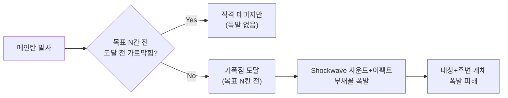
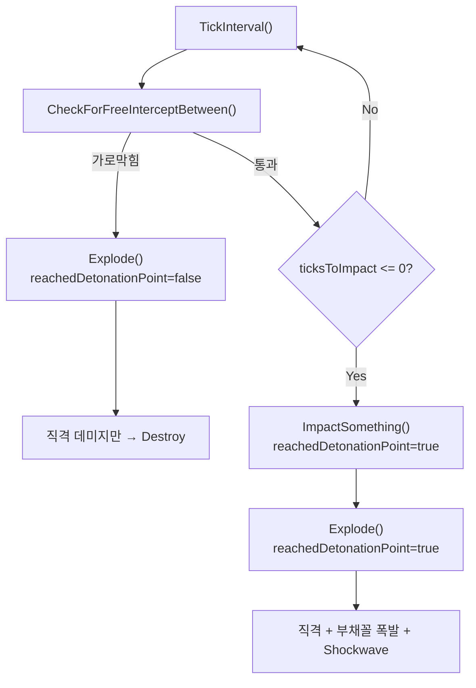

# BFR HE탄 전방 폭발 개선

## 변경 요약

기존 부채꼴 폭발 로직을 **그대로 유지**하면서, 기폭점만 "목표 위치"에서 "목표 N칸 전"으로 앞당기는 단순 개선.




핵심: `GetSectorCells`의 방향이 `(destination - origin)` 이므로, 기폭점이 앞당겨져도 부채꼴은 여전히 목표 방향(전방)을 향함. `sectorRadius`가 `preDetonationDistance` 이상이면 폭발이 대상까지 도달.

## 수정 파일 (2개)

### 1. [Projectile_BFRHE.cs](Project/1.6/Source/BFR/Projectile_BFRHE.cs)

`**ProjectileProperties_BFRHE**` - 속성 1개 추가:

```csharp
public float preDetonationDistance = 0f;  // 0이면 기존 동작(적중 시 폭발)
```

기존 속성 모두 유지: `sectorAngle`, `sectorRadius`, `wallBreachRadius`, `damageAmountDirect`, `damageAmountExplosion`, `damageDefDirect`, `damageDefExplosion`, `armorPenetrationDirect`, `armorPenetrationExplosion`

`**Projectile_BFRHE**` - 메서드 3개 추가/변경:

1. `**Launch()` 오버라이드** (신규):
  - `preDetonationDistance > 0`이면 destination을 목표 N칸 전으로 단축
  - 거리가 `preDetonationDistance` 미만이면 기존 동작 유지 (너무 가까움)

```csharp
public override void Launch(Thing launcher, Vector3 origin, 
    LocalTargetInfo usedTarget, LocalTargetInfo intendedTarget, 
    ProjectileHitFlags hitFlags, bool preventFriendlyFire = false, 
    Thing equipment = null, ThingDef targetCoverDef = null)
{
    // 기폭 거리 계산
    float preDet = BFRProps?.preDetonationDistance ?? 0f;
    if (preDet > 0f)
    {
        Vector3 targetVec = usedTarget.Cell.ToVector3Shifted();
        Vector3 originVec = origin;
        Vector3 dir = (targetVec - originVec).Yto0();
        float dist = dir.magnitude;
        if (dist > preDet + 1f)
        {
            Vector3 detonationPoint = targetVec - dir.normalized * preDet;
            IntVec3 detonationCell = detonationPoint.ToIntVec3();
            usedTarget = new LocalTargetInfo(detonationCell);
        }
    }
    base.Launch(launcher, origin, usedTarget, intendedTarget, 
        hitFlags, preventFriendlyFire, equipment, targetCoverDef);
}
```

1. `**ImpactSomething()` 오버라이드** (신규):

```csharp
private bool reachedDetonationPoint;

protected override void ImpactSomething()
{
    reachedDetonationPoint = true;
    base.ImpactSomething();
}
```

1. `**Explode()` 기존 메서드 수정**:
  - `reachedDetonationPoint == false`이면 직격 데미지만 적용 후 Destroy (가로막힌 경우)
  - `reachedDetonationPoint == true`이면 기존 폭발 로직 실행 (기폭점 도착)

```csharp
protected override void Explode()
{
    // 가로막힌 경우: 직격 데미지만
    if (!reachedDetonationPoint && BFRProps?.preDetonationDistance > 0f)
    {
        Map map = Map;
        if (map != null && BFRProps != null)
            ApplyDirectHitDamage(map, Position, BFRProps);
        Destroy(DestroyMode.Vanish);
        return;
    }
    // 기존 폭발 로직 (변경 없음)
    ...
}
```

### 2. [Weapon_Range.xml](Project/1.6/Defs/ThingsDefs/Weapon_Range.xml) (line 1193-1218)

`Bullet_BFR_HE`에 `preDetonationDistance` 추가 + `sectorRadius` 조정:

```xml
<projectile Class="NewRatkin.ProjectileProperties_BFRHE">
    <damageDef>RangedStab</damageDef>
    <damageAmountBase>18</damageAmountBase>
    <speed>75</speed>
    <alwaysFreeIntercept>true</alwaysFreeIntercept>
    <flyOverhead>false</flyOverhead>
    <soundHitThickRoof>Artillery_HitThickRoof</soundHitThickRoof>
    <soundExplode>Shockwave</soundExplode>
    <soundImpactAnticipate>Flying</soundImpactAnticipate>
    <soundAmbient>MortarRound_Ambient</soundAmbient>
    <!-- 전방 기폭 설정 -->
    <preDetonationDistance>3</preDetonationDistance>
    <sectorAngle>90</sectorAngle>
    <sectorRadius>5</sectorRadius>
    <damageAmountDirect>18</damageAmountDirect>
    <damageAmountExplosion>25</damageAmountExplosion>
</projectile>
```

조정 가능한 값 정리:

- `preDetonationDistance`: 기폭점 거리 (목표로부터 몇 칸 전에 폭발할지)
- `sectorAngle`: 부채꼴 각도 (360이면 원형 폭발)
- `sectorRadius`: 폭발 반지름 (이 값이 preDetonationDistance 이상이어야 대상에 도달)
- `wallBreachRadius`: 벽 관통 거리
- `damageAmountDirect`: 가로막힘 시 직격 데미지
- `damageAmountExplosion`: 폭발 데미지
- `armorPenetrationDirect` / `armorPenetrationExplosion`: 관통력

## 가로막힘 판정 흐름




## 빌드

```powershell
cd Project/1.6/Source; & "C:\Program Files\Microsoft Visual Studio\2022\Community\MSBuild\Current\Bin\MSBuild.exe" NewRatkin.csproj /t:Build /p:Configuration=Debug
```

