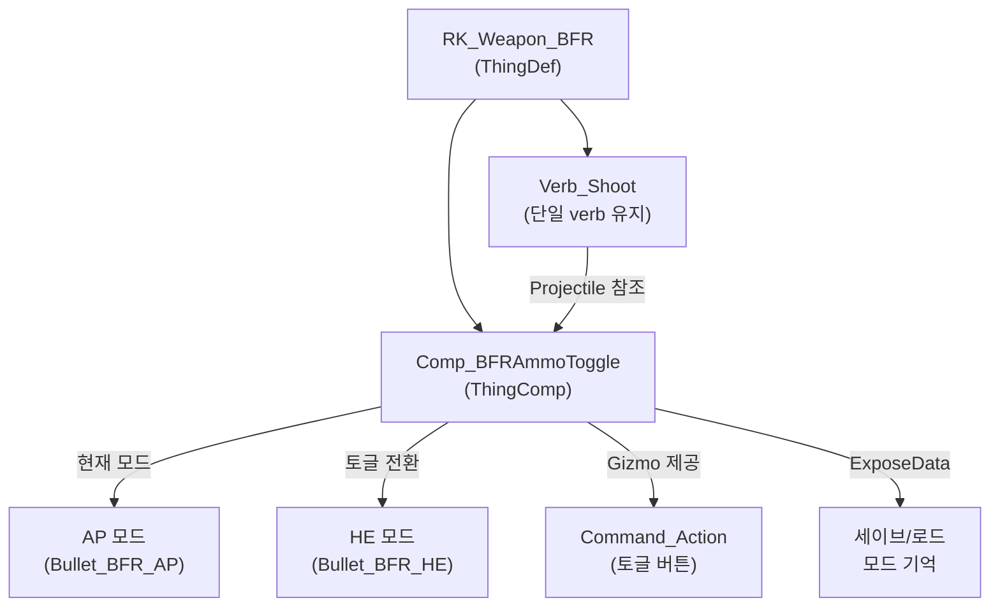

# BFR 3000 탄종 토글 구현 계획

## 현재 상태

- BFR 3000(`RK_Weapon_BFR`)은 단일 verb로 `Bullet_BFR_AP`만 발사
- 주석 처리된 `Bullet_BFR_SC` (폭발탄)와 두 번째 verb가 존재하지만 비활성
- 주석에 `AdditionalVerb.Comp_VerbSaveable` 참조가 있으나 해당 C# 코드는 프로젝트에 없음

## 구현 방식

바닐라의 `CompChangeableProjectile`는 모르타르 전용(쉘 장전 방식)이라 휴대 무기에 부적합합니다. 대신 **커스텀 ThingComp + Gizmo**로 구현합니다.

### 핵심 구조




## 변경 파일 목록

### 1. 새 C# 파일: `Project/1.6/Source/BFR/Comp_BFRAmmoToggle.cs`

**CompProperties_BFRAmmoToggle** (CompProperties)

- `projectileAP`: ThingDef - AP 탄환 Def
- `projectileHE`: ThingDef - 폭발탄 Def
- `iconPathAP`: string - AP 아이콘 텍스처 경로
- `iconPathHE`: string - HE 아이콘 텍스처 경로

**Comp_BFRAmmoToggle** (ThingComp)

- `isHEMode`: bool (기본값 false = AP 모드)
- `CurrentProjectile` 프로퍼티: 현재 모드에 따라 AP 또는 HE ThingDef 반환
- `PostExposeData()`: `Scribe_Values.Look`으로 `isHEMode` 저장/로드
- `CompGetGizmosExtra()`: `Command_Action` 생성
  - 현재 모드에 따라 아이콘/라벨 변경
  - 클릭 시 `isHEMode` 토글
  - 라벨: "AP" / "HE" 표시

### 2. 새 C# 파일: `Project/1.6/Source/BFR/Verb_BFRShoot.cs`

`Verb_LaunchProjectile`를 상속하여 `Projectile` 프로퍼티를 override:

```csharp
public override ThingDef Projectile
{
    get
    {
        var comp = EquipmentSource?.GetComp<Comp_BFRAmmoToggle>();
        if (comp != null)
            return comp.CurrentProjectile;
        return verbProps.defaultProjectile;
    }
}
```

기존 `Verb_Shoot`의 사격 스킬 경험치 로직도 포함해야 합니다.

### 3. Def 변경: [Weapon_Range.xml](Project/1.6/Defs/ThingsDefs/Weapon_Range.xml)

**RK_Weapon_BFR** 수정:

- `<comps>` 블록 주석 해제 및 `Comp_BFRAmmoToggle`으로 변경
- `<verbs>`의 `verbClass`를 `NewRatkin.Verb_BFRShoot`으로 변경

```xml
<comps>
  <li Class="NewRatkin.CompProperties_BFRAmmoToggle">
    <projectileAP>Bullet_BFR_AP</projectileAP>
    <projectileHE>Bullet_BFR_HE</projectileHE>
    <iconPathAP>UI/BFR/BFR_AP</iconPathAP>
    <iconPathHE>UI/BFR/BFR_HE</iconPathHE>
  </li>
</comps>
```

**Bullet_BFR_HE** 신규 추가 (바닐라 폭발탄 스타일):

- `BaseBullet` 상속, 바닐라 `Bullet` thingClass 사용
- `explosionRadius`: 1.7
- `damageDef`: Bomb
- 피격자 기준 8칸 범위

### 4. `Bullet_BFR_AP` 유지

기존 `Bullet_BFR_AP`는 그대로 유지합니다.

## 세이브/로드

`Comp_BFRAmmoToggle.PostExposeData()`에서 `Scribe_Values.Look(ref isHEMode, "isHEMode", false)` 호출로 세이브 파일에 현재 탄종 모드를 기록합니다.

## 텍스처

커스텀 텍스처 경로를 `UI/BFR/BFR_AP`, `UI/BFR/BFR_HE`로 지정해 둡니다. 실제 텍스처 파일은 나중에 추가합니다. 텍스처가 없어도 게임은 fallback 이미지를 표시하므로 기능 테스트에 문제 없습니다.