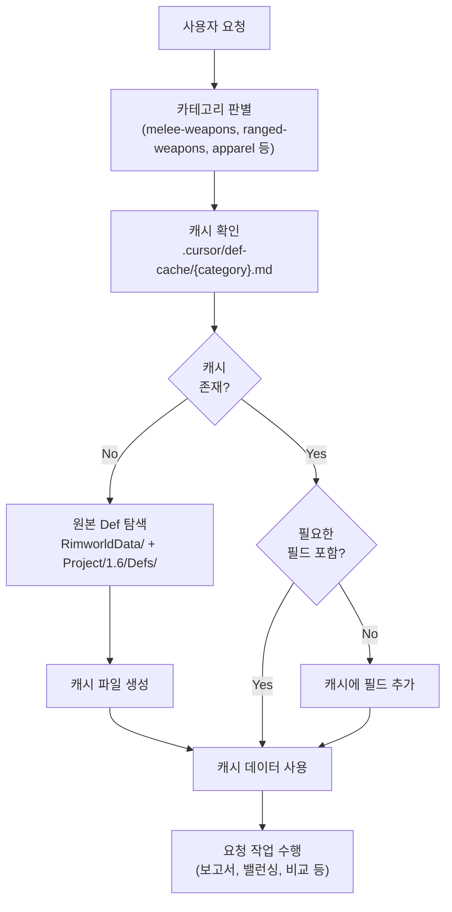

# Def 데이터 캐시 스킬 구축 계획

## 배경 및 목적

밸런싱/분석/비교 작업 시 매번 RimworldData/와 Project/1.6/Defs/를 전체 탐색하면 토큰이 과다 소모된다. **범용 캐시 시스템**을 만들어서, 어떤 종류의 데이터 요청이든 동일한 워크플로우로 처리한다.

**핵심 원칙**: 사용자가 "원거리 무기 cost 비교해줘", "방어구 방어력 정리해줘", "근접 무기 DPS 분석해줘" 등 **아무 요청**을 해도 아래 3단계가 자동으로 동작:

1. **캐시 확인** - 해당 카테고리 캐시가 있는지 확인
2. **데이터 수집/캐싱** - 없으면 원본 Def에서 조사 후 캐시 파일 생성
3. **작업 수행** - 캐시 데이터를 기반으로 보고서/분석/밸런싱 진행

## 구조 설계

### 디렉터리 구조

```
.cursor/skills/def-data-cache/
├── SKILL.md                    # 스킬 메인 지침 (범용 워크플로우)
└── reference.md                # 캐시 포맷 상세, 카테고리별 수집 가이드

.cursor/def-cache/              # 실제 캐시 데이터 저장소
├── melee-weapons.md            # 근접 무기 (예시)
├── ranged-weapons.md           # 원거리 무기 (필요 시 생성)
├── apparel.md                  # 방어구 (필요 시 생성)
├── buildings.md                # 건물 (필요 시 생성)
└── ...                         # 요청에 따라 자동 생성
```

- 스킬 파일(`.cursor/skills/`)과 캐시 데이터(`.cursor/def-cache/`)를 분리
- 캐시 파일은 **요청이 있을 때 자동 생성** (미리 전부 만들지 않음)
- 캐시 파일명은 카테고리 기반 kebab-case (예: `melee-weapons.md`, `ranged-weapons.md`)

### SKILL.md 핵심 워크플로우




### 범용 카테고리 자동 판별

스킬이 사용자 요청에서 카테고리를 자동으로 판별하는 규칙:

- "근접 무기", "melee" -> `melee-weapons.md`
- "원거리 무기", "ranged", "총기" -> `ranged-weapons.md`
- "방어구", "apparel", "갑옷" -> `apparel.md`
- "건물", "building" -> `buildings.md`
- "연구", "research" -> `research.md`
- 기타 -> 사용자에게 카테고리명 확인 후 생성

### 캐시 파일 포맷 (범용)

모든 캐시 파일은 동일한 구조를 따름:

```markdown
---
category: {카테고리명}
last_updated: {날짜}
sources: {탐색한 원본 경로 목록}
scope: {수집 범위 설명}
fields: {수집된 필드 목록}
---

# {카테고리 제목}

## 림월드 (Core + DLC)

| defName | ... 필드들 ... |
|---------|----------------|

## 랫킨

| defName | ... 필드들 ... |
|---------|----------------|
```

- 메타데이터의 `fields`로 현재 캐시에 어떤 필드가 수집되어 있는지 명시
- 새 필드가 필요하면 캐시를 확장 (기존 데이터 유지 + 새 필드 추가)
- 데이터는 항상 **림월드**와 **랫킨** 두 섹션으로 분리

### 캐시 데이터 불변/가변 규칙

- **림월드 데이터**: 불변 (원본 게임 데이터, 절대 수정 불가)
- **랫킨 데이터**: 가변 (컨텐츠 추가/밸런싱 후 갱신 가능)
- **수정 요청 전까지 모든 캐시 데이터는 읽기 전용**으로 취급
- 랫킨 Def가 실제로 변경된 경우에만 해당 캐시 갱신

### 캐시 갱신 트리거

- 사용자가 명시적으로 "캐시 갱신" 요청
- 랫킨 Def 수정 작업 완료 후 (해당 카테고리만 갱신)
- 사용자가 "전체 갱신" 요청 시 모든 캐시 파일 재생성

### 보고서 연계

캐시 데이터를 기반으로 보고서 요청 시:

- 캐시에서 데이터 로드
- `30_Report/` 폴더에 분석 보고서 생성
- 보고서에는 캐시 데이터 출처와 갱신일 명시

### .gitignore 처리

`.cursor/def-cache/` 디렉터리를 `.gitignore`에 추가하여 캐시 데이터가 git에 포함되지 않도록 한다.

## 첫 번째 예시: 근접 무기 캐시

melee-weapons.md에 들어갈 데이터 (이전 조사 결과 기반):

**림월드 (17개)**: Core 8개 + Royalty 9개
**랫킨 (18개)**: Weapon_Melee 9개 + Weapon_Util 5개 + Weapon_DropOnly 1개 + Weapon_HighTech 3개

수집 필드: defName, tool.label, tool.capacities, tool.power, tool.cooldownTime

## 생성할 파일 목록

1. **[.cursor/skills/def-data-cache/SKILL.md](.cursor/skills/def-data-cache/SKILL.md)** - 범용 캐시 워크플로우, 카테고리 판별, 읽기전용 규칙
2. **[.cursor/skills/def-data-cache/reference.md](.cursor/skills/def-data-cache/reference.md)** - 캐시 포맷 상세, Def 구조 참고, 카테고리별 수집 가이드
3. **[.cursor/def-cache/melee-weapons.md](.cursor/def-cache/melee-weapons.md)** - 첫 번째 예시 캐시 (근접 무기 tools 데이터)
4. **[.gitignore](.gitignore)** 수정 - `.cursor/def-cache/` 추가

