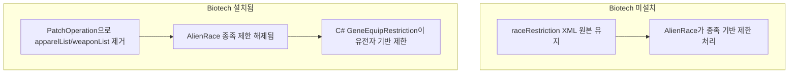

# 랫킨 장비 제한: 종족 기반 → 유전자 기반 전환

## 현재 구조

AlienRace의 `raceRestriction` 시스템이 장비 제한을 담당:
- [Races_Rakinlike.xml](Project/1.6/Defs/ThingDefs_Races/Races_Rakinlike.xml) L222~L329: `apparelList`(55개), `weaponList`(22개) 정의
- AlienRace `HarmonyPatches.cs`가 `EquipmentUtility.CanEquip`, `ApparelProperties.PawnCanWear`, 장비 생성/점수 등 6곳을 패치하여 `RaceRestrictionSettings.CanWear/CanEquip(thingDef, pawnDef)` 호출
- 판정 기준: **pawn.def가 ThingDef_AlienRace인지** (종족 기반)

대상 유전자: `RK_Gene_SmallBody` ([CustomGeneDefs.xml](Project/Biotech/Defs/GeneDefs/CustomGeneDefs.xml) L9~L27)

## 변경 전략

**기본 원칙**: XML 원본(`Races_Rakinlike.xml`)의 `raceRestriction`은 **그대로 유지**. Biotech DLC가 있을 때만 XML PatchOperation으로 리스트를 날리고, C# 유전자 제한 코드가 대신 작동.



## 구현 단계

### 1. C# - DefModExtension 생성

`Project/1.6/Source/GeneEquipRestriction.cs`:

```csharp
public class GeneEquipRestriction : DefModExtension
{
    public List<GeneDef> requiredGenes;
    
    public bool PawnSatisfiesGeneReq(Pawn pawn)
    {
        if (pawn?.genes == null)
            return false;
        return requiredGenes.Any(g => pawn.genes.HasActiveGene(g));
    }
}
```

Biotech 미설치 시 `ModsConfig.BiotechActive` 체크가 불필요 -- PatchOperation이 적용되지 않으므로 modExtension 자체가 장비에 붙지 않고, C# 코드가 호출될 일이 없음.

### 2. C# - Harmony 패치 (CanEquip Postfix)

기존 [EquipmentUtility_CanEquip_Patch.cs](Project/1.6/Source/StaminaShield/EquipmentUtility_CanEquip_Patch.cs)의 `CanEquip_Postfix`에 유전자 체크 추가:

- `thing.def.GetModExtension<GeneEquipRestriction>()` 확인
- extension이 있고 유전자 미보유 → `__result = false`, `cantReason` 설정

### 3. C# - 장비 점수 패치

`JobGiver_OptimizeApparel.ApparelScoreGain` postfix 추가:
- 유전자 미보유 시 점수 -1001 → AI가 해당 장비를 선택하지 않음
- NPC 생성기는 `CanEquip`을 거치므로 2단계 패치로 커버됨

### 4. XML PatchOperation - Biotech 있을 때 raceRestriction 리스트 제거

`Project/Biotech/Patches/` 에 새 패치 파일 생성 (기존 [Scenario_NoBiotech_Patch.xml](Project/Biotech/Patches/Scenario_NoBiotech_Patch.xml)과 같은 패턴):

```xml
<Patch>
  <Operation Class="PatchOperationFindMod">
    <mods><li>Biotech</li></mods>
    <match Class="PatchOperationSequence">
      <!-- apparelList의 모든 li 제거 -->
      <operations>
        <li Class="PatchOperationRemove">
          <xpath>/Defs/AlienRace.ThingDef_AlienRace[defName="Ratkin"]/alienRace/raceRestriction/apparelList/li</xpath>
        </li>
        <li Class="PatchOperationRemove">
          <xpath>/Defs/AlienRace.ThingDef_AlienRace[defName="Ratkin"]/alienRace/raceRestriction/weaponList/li</xpath>
        </li>
      </operations>
    </match>
  </Operation>
</Patch>
```

이렇게 하면:
- **Biotech 없음** → 패치 미적용 → `apparelList`/`weaponList` 원본 유지 → AlienRace 종족 제한 정상 작동
- **Biotech 있음** → 패치 적용 → 리스트 비워짐 → AlienRace가 이 아이템들을 제한하지 않음 → 대신 C# 유전자 체크가 작동

### 5. XML - 각 장비 ThingDef에 modExtensions 추가

77개 아이템에 `GeneEquipRestriction` extension 추가. **abstract 부모**(`RK_ApparelBase`, `RK_MeleeWeapon` 등)에 넣으면 대부분 커버 가능.

추상 베이스에 추가하는 방식:

```xml
<!-- RK_ApparelBase에 추가 -->
<modExtensions>
    <li Class="NewRatkin.GeneEquipRestriction" MayRequire="Ludeon.RimWorld.Biotech">
        <requiredGenes>
            <li>RK_Gene_SmallBody</li>
        </requiredGenes>
    </li>
</modExtensions>
```

`MayRequire="Ludeon.RimWorld.Biotech"` 덕분에 Biotech 없으면 extension 자체가 무시됨.

### 6. csproj 업데이트

[NewRatkin.csproj](Project/1.6/Source/NewRatkin.csproj)에 `GeneEquipRestriction.cs` 등록.

## 핵심 파일 목록

- **신규 C#**: `Project/1.6/Source/GeneEquipRestriction.cs` -- DefModExtension + Harmony 패치
- **C# 수정**: `Project/1.6/Source/StaminaShield/EquipmentUtility_CanEquip_Patch.cs` -- 기존 postfix에 유전자 체크 추가
- **csproj**: [NewRatkin.csproj](Project/1.6/Source/NewRatkin.csproj) -- 새 파일 등록
- **신규 XML**: `Project/Biotech/Patches/RaceRestriction_GeneBased_Patch.xml` -- PatchOperation
- **XML 수정**: 장비 추상 베이스 ThingDef -- modExtensions 추가
  - [Apparel_Various.xml](Project/1.6/Defs/ThingsDefs/Apparel_Various.xml) (`RK_ApparelBase`)
  - [Weapon_Util.xml](Project/1.6/Defs/ThingsDefs/Weapon_Util.xml) (`RK_MeleeWeapon`)
  - 추상 부모를 안 쓰는 개별 아이템들

## 주의사항

- `Races_Rakinlike.xml` 원본은 **수정하지 않음** -- Biotech 없을 때 폴백 역할
- AlienRace 소스 수정 불가 → Harmony 패치로만 동작 변경
- 추상 부모에 extension을 붙이면 하위 아이템 전부에 자동 적용되어 작업량 대폭 감소
