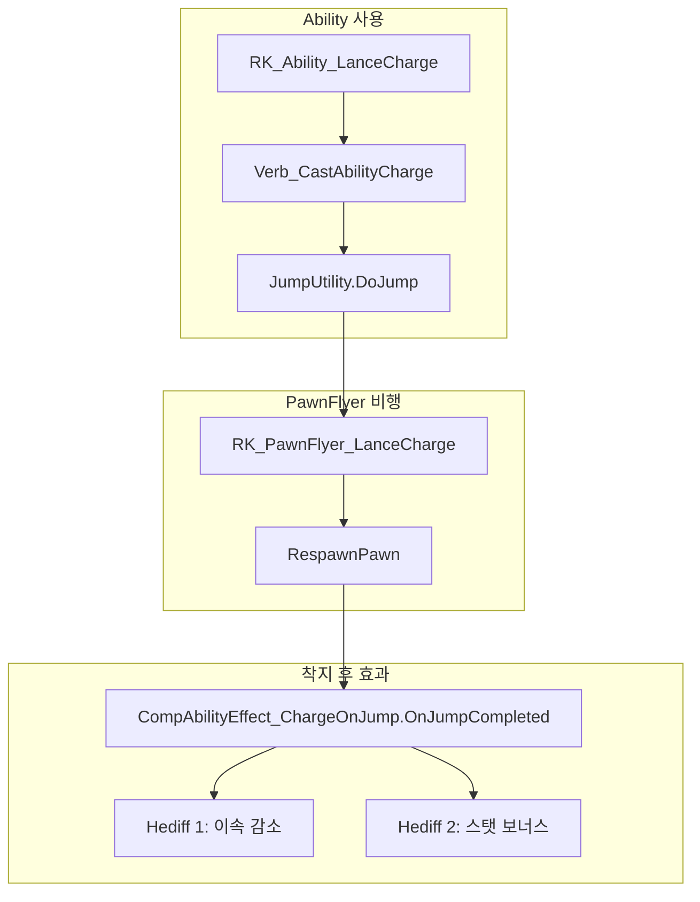

# HeavyLance 돌진 능력 구현 플랜

## 네이밍 규칙 (M-def-naming-rules.mdc 준수)

- **AbilityDef**: `RK_Ability_LanceCharge`
- **ThingDef (PawnFlyer)**: `RK_PawnFlyer_LanceCharge`
- **HediffDef**: `RK_Hediff_LanceChargeExhaustion`, `RK_Hediff_LanceChargeFocus`

---

## 아키텍처 개요




---

## 1. 적용 대상 장비

**RK_HeavyLance만** 적용.

- [Project/1.6/Defs/ThingsDefs/Weapon_Melee.xml](Project/1.6/Defs/ThingsDefs/Weapon_Melee.xml)의 RK_WeaponAttr_HeavyLance (543~634줄) `comps`에 추가:

```xml
<li Class="CompProperties_EquippableAbility">
  <abilityDef>RK_Ability_LanceCharge</abilityDef>
</li>
```

---

## 2. 신규 Def 파일

### 2.1 AbilityDef

`Project/1.6/Defs/AbilityDefs/AbilityDefs.xml` 또는 별도 파일에 추가.

```xml
<AbilityDef>
  <defName>RK_Ability_LanceCharge</defName>
  <label>charge</label>
  <description>...</description>
  <cooldownTicksRange>180~300</cooldownTicksRange>  <!-- 3~5초, 조정 가능 -->
  <ai_IsOffensive>true</ai_IsOffensive>
  <aiCanUse>true</aiCanUse>
  <jobDef>CastJump</jobDef>
  <verbProperties>
    <verbClass>NewRatkin.Verb_CastAbilityCharge</verbClass>
    <range>5.9</range>  <!-- CompProperties에서 override 가능 -->
    <requireLineOfSight>true</requireLineOfSight>
    <warmupTime>0.25</warmupTime>
    <targetParams>
      <canTargetLocations>false</canTargetLocations>
      <canTargetPawns>true</canTargetPawns>
      <canTargetBuildings>false</canTargetBuildings>
      <!-- 기타 targetParams 옵션 (주석 참고) -->
    </targetParams>
  </verbProperties>
  <comps>
    <li Class="NewRatkin.CompProperties_ChargeOnJump">
      <!-- 1번: Flyer 설정 -->
      <pawnFlyerDef>RK_PawnFlyer_LanceCharge</pawnFlyerDef>
      <!-- flightDurationMin, flightSpeed, heightFactor는 PawnFlyer ThingDef에서 설정 -->
      
      <!-- 2번: 이속 감소 Hediff -->
      <exhaustionHediffDef>RK_Hediff_LanceChargeExhaustion</exhaustionHediffDef>
      <exhaustionDurationTicks>300</exhaustionDurationTicks>  <!-- 5초, 600=10초 -->
      
      <!-- 3번: 스탯 보너스 Hediff (범용) -->
      <focusHediffDef>RK_Hediff_LanceChargeFocus</focusHediffDef>
      <focusDurationTicks>1200</focusDurationTicks>  <!-- 20초, 1800=30초 -->
      <!-- focusHediffDef의 stages.statOffsets로 MeleeHitChance 등 원하는 StatDef 지정 -->
      
      <!-- 4번: 타겟 필터 (코드에서 hostile 체크, 기타 옵션은 주석 참고) -->
      <onlyHostilePawns>true</onlyHostilePawns>
    </li>
  </comps>
</AbilityDef>
```

### 2.2 PawnFlyer ThingDef

`Project/1.6/Defs/ThingDefs_Misc/` (신규 또는 기존 Ethereal)에 추가.

```xml
<ThingDef ParentName="PawnFlyerBase">
  <defName>RK_PawnFlyer_LanceCharge</defName>
  <pawnFlyer>
    <!-- 세팅 가능 값들 -->
    <flightDurationMin>0.3</flightDurationMin>  <!-- 최소 비행 시간(초), 기본 0.5 -->
    <flightSpeed>15</flightSpeed>               <!-- 비행 속도(칸/초), 기본 12, 높을수록 빠름 -->
    <heightFactor>0.3</heightFactor>             <!-- 궤적 높이, 0~2, 낮을수록 낮게 도약 -->
    <!-- progressCurve: 상속 시 기본값 사용. (0,0)-(0.1,0.15)-(1,1) 가속 곡선 -->
    <!-- stunDurationTicksRange: 착지 스턴, 0=없음. 예: 60~120 -->
    <!-- workerClass: PawnFlyerWorker 상속으로 커스텀 궤적 가능 (고급) -->
    <!-- shadowTexPath: 그림자 텍스처 (기본 SkyfallerShadowCircle) -->
  </pawnFlyer>
</ThingDef>
```

**PawnFlyerProperties 전체 옵션 (주석용)**:

- `flightDurationMin` (float): 최소 비행 시간(초)
- `flightSpeed` (float): 칸/초
- `heightFactor` (float): 포물선 높이 계수
- `progressCurve` (SimpleCurve): 진행률 커브, 미설정 시 선형
- `stunDurationTicksRange` (IntRange): 착지 스턴
- `workerClass` (Type): PawnFlyerWorker 서브클래스
- `shadowTexPath` (string): 그림자 텍스처

### 2.3 HediffDef 2개

**이속 감소 Hediff** (2번):

```xml
<HediffDef>
  <defName>RK_Hediff_LanceChargeExhaustion</defName>
  <hediffClass>HediffWithComps</hediffClass>
  <comps>
    <li Class="HediffCompProperties_Disappears">
      <disappearsAfterTicks>300</disappearsAfterTicks>  <!-- Comp에서 override -->
      <showRemainingTime>true</showRemainingTime>
    </li>
  </comps>
  <stages>
    <li>
      <statOffsets>
        <MoveSpeed>-0.5</MoveSpeed>  <!-- 50% 감소, 조정 가능 -->
      </statOffsets>
    </li>
  </stages>
</HediffDef>
```

**스탯 보너스 Hediff** (3번, 범용):

```xml
<HediffDef>
  <defName>RK_Hediff_LanceChargeFocus</defName>
  <hediffClass>HediffWithComps</hediffClass>
  <comps>
    <li Class="HediffCompProperties_Disappears">
      <disappearsAfterTicks>1200</disappearsAfterTicks>  <!-- Comp에서 override -->
      <showRemainingTime>true</showRemainingTime>
    </li>
  </comps>
  <stages>
    <li>
      <statOffsets>
        <!-- 원하는 StatDef 지정. 예시: -->
        <MeleeHitChance>0.15</MeleeHitChance>   <!-- +15% 명중 -->
        <!-- MeleeDodgeChance, ShootingAccuracyPawn, MoveSpeed 등 다른 스탯도 가능 -->
      </statOffsets>
    </li>
  </stages>
</HediffDef>
```

---

## 3. 신규 C# 클래스

### 3.1 Verb_CastAbilityCharge

[Verb_CastAbilityConsumeLeap](RimworldSource/RimWorld/Verb_CastAbilityConsumeLeap.cs) 패턴. `Verb_CastAbilityJump` 상속, `JumpFlyerDef`만 오버라이드.

- CompProperties에서 `pawnFlyerDef` 읽어 반환
- `Project/1.6/Source/` 하위에 `HeavyLanceCharge/Verb_CastAbilityCharge.cs`

### 3.2 CompProperties_ChargeOnJump

```csharp
public class CompProperties_ChargeOnJump : CompProperties_AbilityEffect
{
    public ThingDef pawnFlyerDef;           // 사용할 PawnFlyer ThingDef
    public HediffDef exhaustionHediffDef;   // 이속 감소 Hediff
    public int exhaustionDurationTicks;    // 2번 지속 시간
    public HediffDef focusHediffDef;        // 스탯 보너스 Hediff
    public int focusDurationTicks;          // 3번 지속 시간
    public bool onlyHostilePawns = true;    // 4번: 적대만 타겟
    // onlyHostilePawns=false 시 Valid에서 추가 필터 사용 가능
}
```

### 3.3 CompAbilityEffect_ChargeOnJump

`ICompAbilityEffectOnJumpCompleted` 구현.

- `OnJumpCompleted(origin, target)`: 
  - `parent.pawn`에 `exhaustionHediffDef` 추가, `HediffComp_Disappears.ticksToDisappear = exhaustionDurationTicks`
  - `focusHediffDef` 추가, 동일하게 duration 설정
- `Valid(target, throwMessages)`: 
  - `target.Pawn != null`
  - `onlyHostilePawns`면 `target.Pawn.HostileTo(parent.pawn)` 체크
  - `base.Valid(target, throwMessages)` 호출
- `AICanTargetNow(target)`: Valid와 동일 로직

---

## 4. 타겟 필터 옵션 (주석용)

**TargetingParameters (verbProperties.targetParams)**:

- `canTargetPawns`, `canTargetLocations`, `canTargetBuildings`
- `canTargetAnimals`, `canTargetHumans`, `canTargetMechs`, `canTargetSubhumans`
- `canTargetSelf`, `canTargetFires`, `canTargetItems`, `canTargetPlants`
- `canTargetCorpses`, `canTargetBloodfeeders`
- `onlyTargetColonists`, `onlyTargetPrisonersOfColony`, `onlyTargetIncapacitated`
- `neverTargetIncapacitated`, `neverTargetDoors`
- `validator` (Predicate): 커스텀 검사

**CompAbilityEffect.Valid()에서 추가 가능**:

- `HostileTo(caster)`: 적대 여부
- `BodySize`, `Downed`, `Dead` 등 Pawn 상태
- `Faction` 체크
- `RaceProps.Humanlike`, `IsEntity` 등

---

## 5. 파일 목록


| 작업                   | 경로                                                                      |
| -------------------- | ----------------------------------------------------------------------- |
| C# Verb              | `Project/1.6/Source/HeavyLanceCharge/Verb_CastAbilityCharge.cs`         |
| C# CompProperties    | `Project/1.6/Source/HeavyLanceCharge/CompProperties_ChargeOnJump.cs`    |
| C# CompAbilityEffect | `Project/1.6/Source/HeavyLanceCharge/CompAbilityEffect_ChargeOnJump.cs` |
| csproj 수정            | `Project/1.6/Source/NewRatkin.csproj`에 Compile 항목 추가                    |
| AbilityDef           | `Project/1.6/Defs/AbilityDefs/` (기존 또는 신규 XML)                          |
| ThingDef PawnFlyer   | `Project/1.6/Defs/ThingDefs_Misc/` (신규)                                 |
| HediffDef 2개         | `Project/1.6/Defs/HediffDefs/` (신규 또는 기존)                               |
| Weapon comp 추가       | `Project/1.6/Defs/ThingsDefs/Weapon_Melee.xml`                          |


---

## 6. PawnFlyerBase 상속

Core의 `PawnFlyerBase`는 `RimworldData/Core/Defs/ThingDefs_Misc/Ethereal_Various.xml`에 정의됨. 프로젝트 Def에서 `ParentName="PawnFlyerBase"`로 상속하면 `flightDurationMin`, `flightSpeed`, `heightFactor` 등만 오버라이드 가능.

---

## 7. 언어 키

`Project/Contents/Languages/Korean/DefInjected/` 등에:

- `RK_Ability_LanceCharge.label`, `description`
- `RK_Hediff_LanceChargeExhaustion.label`, `description`
- `RK_Hediff_LanceChargeFocus.label`, `description`

