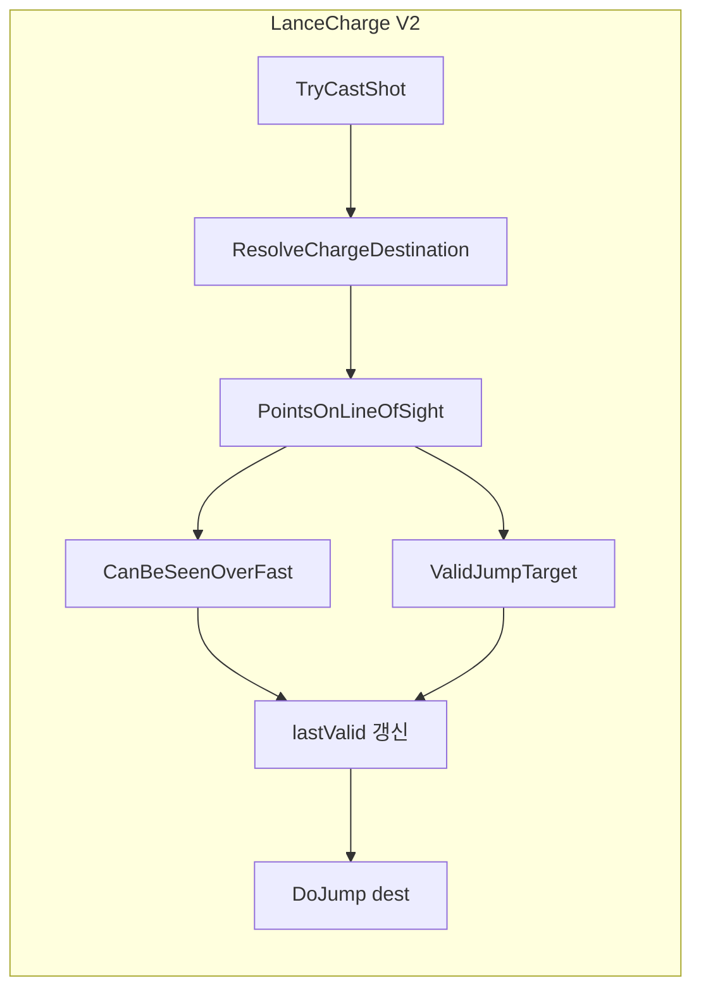

# HeavyLance 돌진 어빌리티 V2 (LOS 기반 목적지 개선) 구현 계획

## 목표

- 기존 점프팩(PawnFlyer) 돌진 방식은 유지
- **목적지 선정만 개선**: 대상과 나 사이 직선 경로 상 LOS가 가로막히는 타일 **직전**까지만 돌진
- **거리 제한**: 최소 3칸, 최대 5칸 (기존 2.9칸 고정 → 3~5칸 범위로 변경)

## 참고 자료

- [Report 114 - LOS LineOfSight Logic Analysis](d:\GitProject\Ratkin\Report\114_LOS_LineOfSight_Logic_Analysis_Report.md): `GenSight.LastPointOnLineOfSight`, `PointsOnLineOfSight`, `CanBeSeenOverFast` 사용법
- [CompAbilityEffect_WyvernFireBurner](d:\GitProject\Ratkin\Project\1.6\Source\WyvernFire\CompAbilityEffect_WyvernFireBurner.cs): `LastPointOnLineOfSight` + `CanBeSeenOverFast` validator 예시
- **최소/최대 거리**: [VerbProperties](d:\GitProject\Ratkin\RimworldSource\Verse\VerbProperties.cs) `minRange`, `range` (최대). [Anomaly Incinerator](d:\GitProject\Ratkin\RimworldData\Anomaly\Defs\ThingDefs_Misc\Weapons\Weapons_Ranged.xml) 208줄: `<minRange>5.9</minRange>`, `<range>15.9</range>`. [JobGiver_AIJumpToJobTarget](d:\GitProject\Ratkin\RimworldSource\RimWorld\JobGiver_AIJumpToJobTarget.cs) 34줄: `verbProps.minRange`, `EffectiveRange` 검사

## 핵심 로직: GenSight 활용

`GenSight.LastPointOnLineOfSight(start, end, validator, skipFirstCell)`는 경로를 순회하다 **validator가 false인 첫 셀**을 반환한다. 즉, **차단 셀**을 반환하므로, 우리가 원하는 "차단 직전 마지막 유효 셀"을 얻으려면 **직접 순회**가 필요하다.

```csharp
// 의사코드: caster → target 직선 경로 순회
IntVec3 lastValid = IntVec3.Invalid;
float maxRangeSq = EffectiveRange * EffectiveRange;  // 5*5
foreach (IntVec3 cell in GenSight.PointsOnLineOfSight(casterPos, targetCell))
{
    if (skipFirstCell && cell == casterPos) continue;
    if ((float)casterPos.DistanceToSquared(cell) > maxRangeSq) break;  // 최대 5칸
    if (cell == targetCell) break;  // 대상 셀에는 착지 불가(Pawn 점유)
    if (!cell.CanBeSeenOverFast(map)) break;  // LOS 차단 → 직전까지가 한계
    if (JumpUtility.ValidJumpTarget(pawn, map, cell))
        lastValid = cell;
}
return lastValid.IsValid ? lastValid : 기존_8인접_폴백;
```

## 구현 범위

### 1. 신규 파일


| 파일                                                                | 용도                                    |
| ----------------------------------------------------------------- | ------------------------------------- |
| `Project/1.6/Source/HeavyLanceCharge/Verb_CastAbilityChargeV2.cs` | LOS 기반 `ResolveChargeDestination` 재정의 |


### 2. 수정 파일


| 파일                                                                                                           | 변경 내용                                                                   |
| ------------------------------------------------------------------------------------------------------------ | ----------------------------------------------------------------------- |
| [AbilityDefs_LanceCharge.xml](d:\GitProject\Ratkin\Project\1.6\Defs\AbilityDefs\AbilityDefs_LanceCharge.xml) | `RK_Ability_LanceChargeV2` 추가, `verbClass` = `Verb_CastAbilityChargeV2` |


### 3. 재사용 (변경 없음)

- `CompAbilityEffect_ChargeOnJump`, `CompProperties_ChargeOnJump`
- `RK_PawnFlyer_LanceCharge`, `RK_Hediff_LanceChargeExhaustion`, `RK_Hediff_LanceChargeFocus`

## Verb_CastAbilityChargeV2 설계

- **상속**: `Verb_CastAbilityCharge` (기존 `TryCastShot`, `ValidateTarget` 등 그대로 사용)
- **오버라이드**:
  1. `ResolveChargeDestination()`: LOS 기반 목적지 선정
  2. `CanHitTargetFrom()`: **minRange 검사 추가** (부모는 `JumpUtility.CanHitTargetFrom`만 사용해 minRange 미검사)
  3. `EffectiveRange` (선택): 무기에 `JumpRange` 스탯이 없으면 `Verb_CastAbilityJump`가 0/-1을 반환할 수 있음. `verbProps.range`(5)를 사용하도록 오버라이드

### ResolveChargeDestination 로직

1. **대상이 이동 중**: 기존과 동일하게 `targetCell` 사용 (직선 경로 상 마지막 유효 셀 계산)
2. **직선 경로 순회**:
  - `GenSight.PointsOnLineOfSight(casterPos, targetCell)`로 caster → target 직선 경로 순회
  - `skipFirstCell: true`로 caster 셀 제외
  - 각 셀에 대해:
    - `targetCell`이면 break (대상 셀에는 착지 불가)
    - `!cell.CanBeSeenOverFast(map)`이면 break (LOS 차단 직전까지가 한계)
    - `JumpUtility.ValidJumpTarget(pawn, map, cell)`이면 `lastValid = cell`
3. **폴백**: `lastValid`가 Invalid이면 기존 `ResolveChargeDestination` 로직(8인접 중 가장 가까운 유효 셀) 사용

### CanHitTargetFrom (minRange/range 검사)

`Verb_CastAbilityCharge`는 `JumpUtility.CanHitTargetFrom`만 호출하여 **minRange를 검사하지 않음**. V2에서 추가:

```csharp
public override bool CanHitTargetFrom(IntVec3 root, LocalTargetInfo targ)
{
    float distSq = (float)root.DistanceToSquared(targ.Cell);
    float minRangeSq = verbProps.minRange * verbProps.minRange;
    if (distSq < minRangeSq) return false;  // 최소 거리 미만
    return base.CanHitTargetFrom(root, targ);  // max + LOS 등
}
```

## Def 추가 (AbilityDefs_LanceCharge.xml)

```xml
<AbilityDef>
  <defName>RK_Ability_LanceChargeV2</defName>
  <label>charge (v2)</label>
  <description>... (기존과 동일, LOS 기반 목적지 개선 설명 추가)</description>
  <verbProperties>
    <verbClass>NewRatkin.Verb_CastAbilityChargeV2</verbClass>
    <range>5</range>
    <minRange>3</minRange>
    <requireLineOfSight>true</requireLineOfSight>
    <warmupTime>0.5</warmupTime>
    <targetParams>...</targetParams>
  </verbProperties>
  <!-- comps, cooldown 등 기존과 동일 -->
</AbilityDef>
```

## 무기 연결

- **RK_HeavyLance**는 현재 `RK_Ability_LanceCharge` 하나만 사용
- V2는 별도 AbilityDef로 추가하며, 테스트 시 [Weapon_Melee.xml](d:\GitProject\Ratkin\Project\1.6\Defs\ThingsDefs\Weapon_Melee.xml)의 `abilityDef`를 `RK_Ability_LanceChargeV2`로 교체하여 사용 가능
- 계획에서는 **AbilityDef만 추가**하고, 무기 연결은 사용자 선택으로 둠

## 데이터 흐름




## 검증 포인트

- **거리**: 3칸 미만 → 타겟 불가(회색), 5칸 초과 → 타겟 불가
- 벽/장애물이 경로 중간에 있을 때: 직선 상 마지막 LOS 유효 셀에서 멈춤
- LOS가 완전히 열려 있을 때: 기존과 동일하게 대상 인접 셀까지 돌진
- 대상이 1칸 거리일 때: 8인접 폴백으로 정상 동작

