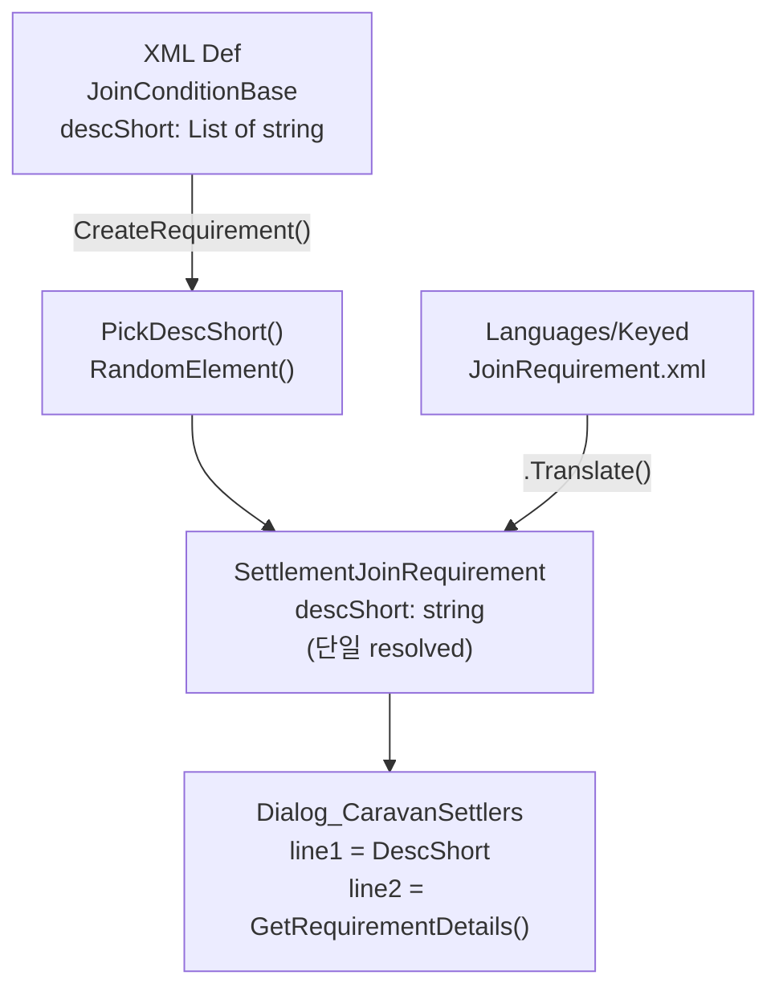

# JoinCondition 번역 및 DescShort 리스트화 개선

## 현재 문제

- `JoinConditionBase.descShort`가 `string` 타입이라 XML에서 `<li>` 리스트를 사용하면 역직렬화 실패
- `RK_JoinReq_*` 번역 키가 **Languages 폴더에 전혀 정의되어 있지 않음** (총 30+개 누락)
- XML Def에서는 번역 키를 참조하지만, 키가 없으므로 인게임에서 키 이름 그대로 노출

## 변경 대상 파일

### C# 소스 (2개)

- [PawnKindDefExtension_WanderingCaravanJoin.cs](Project/1.6/Source/WanderingTrader/PawnKindDefExtension_WanderingCaravanJoin.cs)
- [SettlementJoinRequirement.cs](Project/1.6/Source/WanderingTrader/SettlementJoinRequirement.cs)

### XML Defs (2개)

- [PawnKinds_WanderingTrader.xml](Project/1.6/Defs/WanderingTrader/PawnKinds_WanderingTrader.xml)
- [PawnKinds_Player.xml](Project/1.6/Defs/PawnKindDef_Ratkin/PawnKinds_Player.xml)

### 번역 파일 (2개, 신규 생성 권장)

- `Project/Contents/Languages/English/Keyed/JoinRequirement.xml` (신규)
- `Project/Contents/Languages/Korean/Keyed/JoinRequirement.xml` (신규)

---

## 1단계: C# - JoinConditionBase descShort 리스트화

[PawnKindDefExtension_WanderingCaravanJoin.cs](Project/1.6/Source/WanderingTrader/PawnKindDefExtension_WanderingCaravanJoin.cs) 수정:

```csharp
// Before
public string descShort;

// After
public List<string> descShort;
```

헬퍼 메서드 추가:

```csharp
protected string PickDescShort()
{
    if (descShort == null || descShort.Count == 0) return null;
    return descShort.RandomElement();
}
```

각 `CreateRequirement()` 호출 시 `descShort` 대신 `PickDescShort()` 전달.

---

## 2단계: C# - SettlementJoinRequirement 생성자 정리

[SettlementJoinRequirement.cs](Project/1.6/Source/WanderingTrader/SettlementJoinRequirement.cs) 수정:

- `descShort`는 런타임(`SettlementJoinRequirement`)에서는 `string` 유지 (생성 시점에 이미 1개 선택됨)
- 각 하위 클래스 생성자의 `descShortOverride` 파라미터는 기존대로 `string` 수신
- `ExposeData()` PostLoadInit의 descShort 재번역 로직도 기존대로 유지 (단일 string이므로)

주요 변경: 각 서브클래스에서 `descShortOverride.Translate()`이 아닌 `.Translate(args...)` 호출 시 placeholder 인자 정리. 현재 일부 클래스에서 인자 없이 `.Translate()` 호출하면서 `{0}` placeholder가 있는 키를 사용하면 깨지는 구조.

---

## 3단계: XML Defs - descShort 리스트 형식으로 통일

모든 `<descShort>단일키</descShort>` 를 `<descShort><li>키</li></descShort>` 형식으로 변경.

**PawnKinds_Player.xml** 예시:

```xml
<!-- Before -->
<descShort>RK_JoinReq_StableLife_DescShort</descShort>

<!-- After -->
<descShort>
  <li>RK_JoinReq_StableLife_DescShort1</li>
  <li>RK_JoinReq_StableLife_DescShort2</li>
</descShort>
```

각 조건별로 2~3개의 DescShort 변형을 만들어 다양성 확보.

---

## 4단계: 번역 파일 신규 생성

### 필요한 번역 키 목록 (Def에서 사용)


| 키                                       | 용도                           |
| --------------------------------------- | ---------------------------- |
| RK_JoinReq_StableLife_DescShort1/2      | 안정적인 삶 희망 (ColonyWealth)     |
| RK_JoinReq_StableLife_Desc              | 세부: 정착지 부 {0} 이상             |
| RK_JoinReq_JoinHope_DescShort1/2        | 그냥 합류 희망 (AlwaysMet)         |
| RK_JoinReq_JoinHope_Desc                | 세부: 조건 없음                    |
| RK_JoinReq_NewLife_DescShort1/2         | 새 삶 희망 (ColonyWealth)        |
| RK_JoinReq_NewLife_Desc                 | 세부: 정착지 부 {0} 이상             |
| RK_JoinReq_WindFreedom_DescShort1/2     | 자유 추구 (ThingQuantity)        |
| RK_JoinReq_WindFreedom_Desc             | 세부: 물건 목록                    |
| RK_JoinReq_SeekingMentor_DescShort1/2   | 멘토 탐색 (SkillMentorMulti AND) |
| RK_JoinReq_SeekingMentor_Desc           | 세부: 스킬 목록                    |
| RK_JoinReq_Prepared_DescShort1/2        | 대비 필요 (SkillMentorMulti OR)  |
| RK_JoinReq_Prepared_Desc                | 세부: 스킬 목록                    |
| RK_JoinReq_NobleTired_DescShort1/2      | 귀족 기피 (Backstory)            |
| RK_JoinReq_NobleTired_Desc              | 세부: 백스토리 없어야 함               |
| RK_JoinReq_Priest_Injured_DescShort1/2  | 성직자-부상자 치료 (InjuredPatient)  |
| RK_JoinReq_Priest_Injured_Desc          | 세부: 부상자 {0}명 이상              |
| RK_JoinReq_Priest_Medicine_DescShort1/2 | 성직자-약품 (MedicineQuantity)    |
| RK_JoinReq_Priest_Medicine_Desc         | 세부: 약품 {0}개 이상               |


### C# 폴백 키 (하드코딩)


| 키                                     | 용도                                  |
| ------------------------------------- | ----------------------------------- |
| RK_JoinReq_NeedsInjured               | "부상자 {0}명 필요"                       |
| RK_JoinReq_NeedsMedicine              | "약품 {0}개 필요"                        |
| RK_JoinReq_NeedsWealth                | "정착지 부 {0} 이상 필요"                   |
| RK_JoinReq_NeedsBackstory             | "다음 백스토리 없어야 함: {0}"                |
| RK_JoinReq_NeedsItems                 | "필요 물자: {0}"                        |
| RK_JoinReq_NeedsSilver                | "은 {0}개 필요"                         |
| RK_JoinReq_NeedsSkills                | "필요 스킬: {0}"                        |
| RK_JoinReq_Met                        | "충족"                                |
| RK_JoinReq_NotMet                     | "미충족"                               |
| RK_JoinReq_Silver_Desc/DescShort      | 은 보유량 조건                            |
| RK_JoinReq_SkillMentor_Desc/DescShort | 스킬 멘토 (레거시)                         |
| RK_JoinReq_Item_Desc/DescShort        | 아이템 보유 (레거시)                        |
| 기타 폴백 키들                              | 각 Requirement 타입별 기본 desc/descShort |


---

## 5단계: 번역 내용 작성 (한국어 예시)

### DescShort (분위기/RP 텍스트, 유랑민의 바람)

- `RK_JoinReq_StableLife_DescShort1`: "안정된 삶을 원한다."
- `RK_JoinReq_StableLife_DescShort2`: "떠돌이 생활은 이제 지겹다."
- `RK_JoinReq_JoinHope_DescShort1`: "이곳이 마음에 든다."
- `RK_JoinReq_JoinHope_DescShort2`: "어디든 좋다. 지붕만 있으면."
- `RK_JoinReq_SeekingMentor_DescShort1`: "나보다 강한 자의 명령만을 듣는다."
- `RK_JoinReq_SeekingMentor_DescShort2`: "강자를 찾고 있다. 이곳에는 싸움좀 하는 놈이 있나?"

### Desc (세부 요구사항)

- `RK_JoinReq_StableLife_Desc`: "정착지 자산이 {0} 이상이어야 합니다."
- `RK_JoinReq_JoinHope_Desc`: "특별한 조건이 없습니다."
- 등등

---

## 구조 흐름




