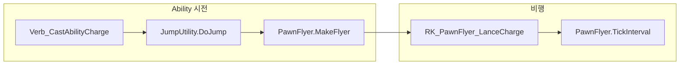

# 랜스 차지 돌진 경로 연기 연출 개선 계획

## 현재 구조




- `RK_PawnFlyer_LanceCharge`는 [AbilityDefs_LanceCharge.xml](Project/1.6/Defs/AbilityDefs/AbilityDefs_LanceCharge.xml) 69~76라인에 정의
- `JumpUtility.DoJump`는 `verbProps.flightEffecterDef`를 PawnFlyer에 전달
- 현재 Lance Charge AbilityDef의 `verbProperties`에는 `flightEffecterDef`가 없음

---

## 방법 A: verbProperties에 flightEffecterDef 추가 (Def 전용, 권장)

**장점**: C# 수정 없음, Def만 수정  
**단점**: Effecter는 비행체에 붙어서 효과를 뿌리므로, "경로에 남는" 느낌은 각도 조정으로 구현

### 구현 절차

1. **EffecterDef 신규 생성** (연기 위주)
  - `Project/1.6/Defs/Effects/` 폴더 생성
  - `Effecter_LanceCharge.xml` 생성
  - `JumpFlightEffect`를 참고해 **연기(JumpSmoke)만** 사용하는 Effecter 작성
  - 예: `SubEffecter_SprayerContinuous` + `fleckDef>JumpSmoke` (불꽃/플래시 제외)
2. **AbilityDef verbProperties 수정**
  - [AbilityDefs_LanceCharge.xml](Project/1.6/Defs/AbilityDefs/AbilityDefs_LanceCharge.xml)의 `RK_Ability_LanceCharge`, `RK_Ability_LanceChargeV2` 둘 다
  - `verbProperties` 블록에 `<flightEffecterDef>RK_LanceChargeFlightEffect</flightEffecterDef>` 추가
3. **(선택) 기존 Effecter 재사용**
  - Royalty/Biotech가 로드된 경우 `JumpFlightEffect` 또는 `JumpMechFlightEffect`를 그대로 사용 가능
  - 다만 점프팩용이라 불꽃/플래시가 포함됨

### EffecterDef 예시 (연기만)

```xml
<EffecterDef>
  <defName>RK_LanceChargeFlightEffect</defName>
  <children>
    <li>
      <subEffecterClass>SubEffecter_SprayerContinuous</subEffecterClass>
      <scale>0.8~1.2</scale>
      <spawnLocType>OnSource</spawnLocType>
      <positionOffset>(0,0,-0.5)</positionOffset>
      <fleckDef>JumpSmoke</fleckDef>
      <ticksBetweenMotes>1</ticksBetweenMotes>
      <maxMoteCount>10</maxMoteCount>
      <speed>4~6</speed>
      <angle>170~190</angle>
      <absoluteAngle>true</absoluteAngle>
    </li>
  </children>
</EffecterDef>
```

- `angle 170~190`: 이동 반대 방향(뒤쪽)으로 연기 뿌림 → 경로에 연기가 남는 느낌
- `OnSource`: PawnFlyer(비행체) 위치에 붙어서 매 틱 연기 생성

---

## 방법 B: 커스텀 PawnFlyer + TickInterval에서 Fleck 생성 (C#)

**장점**: 실제 이동 경로 셀에 연기 생성, 연출 제어 정밀  
**단점**: C# 코드 추가, ThingDef thingClass 변경

### 구현 절차

1. **PawnFlyer_LanceCharge 클래스 생성**
  - `Project/1.6/Source/HeavyLanceCharge/PawnFlyer_LanceCharge.cs`
  - `PawnFlyer` 상속
  - `TickInterval` override: `base.TickInterval` 호출 전에 `IsHashIntervalTick(2)`일 때 현재 `Position`에 `FleckMaker.ThrowSmoke` 호출
2. **ThingDef 수정**
  - [AbilityDefs_LanceCharge.xml](Project/1.6/Defs/AbilityDefs/AbilityDefs_LanceCharge.xml)의 `RK_PawnFlyer_LanceCharge`에 `<thingClass>NewRatkin.PawnFlyer_LanceCharge</thingClass>` 추가

### C# 예시

```csharp
protected override void TickInterval(int delta)
{
    if (this.IsHashIntervalTick(2))
        FleckMaker.ThrowSmoke(this.Position.ToVector3Shifted() + Gen.RandomHorizontalVector(0.5f), base.Map, 1.2f);
    base.TickInterval(delta);
}
```

- `Position`: `RecomputePosition`에서 `groundPos.ToIntVec3()`로 갱신되며, 비행 경로상의 현재 셀
- `IsHashIntervalTick(2)`: 2틱마다 연기 생성 (과도한 Fleck 방지)

---

## 방법 비교


| 항목    | 방법 A (EffecterDef)        | 방법 B (커스텀 PawnFlyer) |
| ----- | ------------------------- | -------------------- |
| 수정 범위 | Def만                      | C# + Def             |
| 연출    | 비행체 뒤쪽으로 연기 분사            | 경로 셀에 연기 생성          |
| 의존성   | Core FleckDef (JumpSmoke) | Core FleckMaker      |
| 유지보수  | Def 조정으로 쉬움               | 코드 수정 필요             |


---

## 권장안

- **방법 A**를 먼저 적용해 연출을 확인하고, 부족하면 **방법 B**로 보강하는 순서를 권장한다.
- 방법 A만으로도 `JumpFlightEffect`와 유사한 "뒤쪽으로 뿌려지는 연기"가 경로를 따라 보이므로, 대부분의 연출 요구를 충족할 수 있다.

