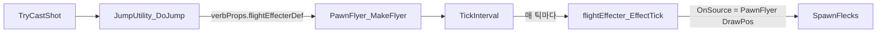

# 랜스 차지 돌진 경로 연기 이펙트 추가

## 현재 구조

랜스 차지는 `PawnFlyer` (바닐라 클래스)를 그대로 사용하며, `heightFactor: 0.0`으로 지면 수준에서 직선 돌진한다. 현재 `verbProperties`에 `flightEffecterDef`가 없어서 비행 중 아무 이펙트도 나오지 않는다.




## 핵심 메커니즘

바닐라 `PawnFlyer.TickInterval()`은 매 틱마다 `flightEffecter.EffectTick(this, ...)` 를 호출한다. `SubEffecter_SprayerContinuous`의 `spawnLocType: OnSource`는 PawnFlyer의 현재 위치(`DrawPos`)에서 Fleck을 생성하므로, **이펙터만 정의하면 경로를 따라 이펙트가 자동 생성된다.** C# 코드 변경 없이 XML만으로 구현 가능하다.

## 구현 방안

### 방안 A: XML만으로 구현 (권장)

C# 수정 없이, 커스텀 EffecterDef를 만들고 verbProperties에 연결한다.

1. **커스텀 EffecterDef 정의** -- 새 XML 파일 또는 기존 `AbilityDefs_LanceCharge.xml`에 추가
  - `DustPuffThick` (먼지) + `DustPuff` (보조 먼지)를 `SubEffecter_SprayerContinuous`로 구성
  - 랜스 돌진은 불꽃이 아닌 **흙먼지 기반** 연출이 적합 (기사가 질주하는 느낌)
  - `ticksBetweenMotes: 1~2` (매 틱~~2틱마다), `speed: 2~~4`, 뒤쪽으로 퍼지는` angle`
2. **verbProperties에 flightEffecterDef 추가** -- [AbilityDefs_LanceCharge.xml](Project/1.6/Defs/AbilityDefs/AbilityDefs_LanceCharge.xml)의 두 AbilityDef 모두
  - `<flightEffecterDef>RK_LanceChargeFlightEffect</flightEffecterDef>` 추가

### EffecterDef 설계 (안)

바닐라 `JumpFlightEffect`를 참고하되, 불꽃 대신 먼지/연기 Fleck 사용:

```xml
<EffecterDef>
  <defName>RK_LanceChargeFlightEffect</defName>
  <children>
    <!-- 주 먼지 트레일 -->
    <li>
      <subEffecterClass>SubEffecter_SprayerContinuous</subEffecterClass>
      <scale>0.6~0.9</scale>
      <spawnLocType>OnSource</spawnLocType>
      <positionOffset>(0,0,-0.3)</positionOffset>
      <fleckDef>DustPuffThick</fleckDef>
      <ticksBetweenMotes>1</ticksBetweenMotes>
      <maxMoteCount>20</maxMoteCount>
      <speed>2~3</speed>
      <angle>160~200</angle>
      <absoluteAngle>true</absoluteAngle>
    </li>
    <!-- 보조 잔먼지 -->
    <li>
      <subEffecterClass>SubEffecter_SprayerContinuous</subEffecterClass>
      <scale>0.3~0.5</scale>
      <spawnLocType>OnSource</spawnLocType>
      <positionOffset>(0,0,-0.2)</positionOffset>
      <fleckDef>DustPuff</fleckDef>
      <ticksBetweenMotes>2</ticksBetweenMotes>
      <maxMoteCount>12</maxMoteCount>
      <speed>3~5</speed>
      <angle>140~220</angle>
      <absoluteAngle>true</absoluteAngle>
    </li>
  </children>
</EffecterDef>
```

- `angle: 160~200` (대략 뒤쪽 방향) -- `absoluteAngle: true`로 고정 방향 사용
- `positionOffset: (0,0,-0.3)` -- 폰 뒤쪽에서 먼지 생성
- `DustPuffThick` 사용으로 먼지가 잠시 남아있다가 사라지는 트레일 효과

### 수정 대상 파일


| 파일                                                                                      | 변경 내용                                                               |
| --------------------------------------------------------------------------------------- | ------------------------------------------------------------------- |
| [AbilityDefs_LanceCharge.xml](Project/1.6/Defs/AbilityDefs/AbilityDefs_LanceCharge.xml) | EffecterDef 추가 + 두 AbilityDef의 verbProperties에 flightEffecterDef 추가 |


### 주의사항

- `absoluteAngle: true`에서 `angle: 180`은 화면상 "아래쪽" 방향 -- 돌진 방향이 동적으로 바뀌므로, 뒤쪽으로 먼지가 퍼지는 것은 `absoluteAngle`로는 완벽히 구현되지 않는다 (항상 고정 방향)
- 돌진이 짧고 빠르므로 (`flightSpeed: 20`, 2~5칸) 이펙트가 과하지 않게 `maxMoteCount`와 `scale` 조절 필요
- 테스트 후 수치 미세조정 필요 (ticksBetweenMotes, scale, speed 등)

### 방안 B: C# 커스텀 PawnFlyer (비권장)

`PawnFlyer`를 상속하여 `TickInterval()`에서 진행 방향의 반대 방향으로 Fleck을 직접 스폰하면 방향 추적이 가능하지만, 방안 A로 충분한 연출이 되므로 불필요한 복잡도 추가다. 방안 A의 결과가 불만족스러운 경우에만 고려한다.