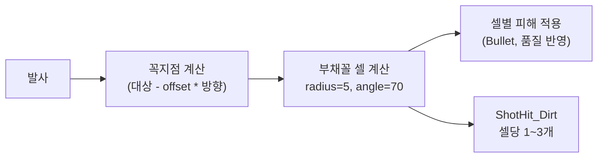

# RK_Rifle_line 부채꼴 Sector Shot 시스템

## 핵심 메커니즘




- **꼭지점**: 대상 위치에서 사수 방향으로 `vertexOffset`칸 이동 (양수 = 사수 방향, 음수 = 반대)
- **부채꼴 방향**: 사수 -> 대상 (발사 방향)
- **타겟팅 최대 거리**: 10칸
- **투사체 없음**: TryCastShot에서 직접 셀 계산 + 피해 적용

## 새 파일 (2개)

### 1. [Project/1.6/Source/SectorShot/VerbProperties_SectorShot.cs](Project/1.6/Source/SectorShot/VerbProperties_SectorShot.cs)

VerbProperties 상속, 부채꼴 피해 설정 전용 속성:

```csharp
public class VerbProperties_SectorShot : VerbProperties
{
    public float sectorRadius = 5f;          // 부채꼴 반경 (꼭지점 기준)
    public float sectorAngle = 70f;          // 전체 각도 (좌우 35도씩)
    public float vertexOffset = 1f;          // 꼭지점 이동량 (양수=사수방향)
    public DamageDef sectorDamageDef;        // null이면 Bullet 사용
    public int sectorDamageAmount = 8;       // 기본 피해량
    public float sectorArmorPenetration = -1f; // -1이면 damage*0.015 자동계산
    public int effectsPerCellMin = 1;        // 셀당 최소 이펙트
    public int effectsPerCellMax = 3;        // 셀당 최대 이펙트
}
```

### 2. [Project/1.6/Source/SectorShot/Verb_SectorShot.cs](Project/1.6/Source/SectorShot/Verb_SectorShot.cs)

Verb 상속 (투사체 생략, 직접 피해 적용):

핵심 로직 순서:

1. `TryFindShootLineFromTo`로 LOS 검증
2. 꼭지점 계산: `vertexCell = targetCell - direction * vertexOffset`
3. 부채꼴 셀 계산: 기존 `[TeleUtils.circularSectorCellsStartedTarget](Project/1.6/Source/Gunlance/Verb_GunlanceFiring.cs)` 패턴 활용하되, vertexCell 기준으로 셀 수집
4. 피해 적용:
  - `weapon.GetStatValue(StatDefOf.RangedWeapon_DamageMultiplier)` 로 품질 반영
  - `sectorArmorPenetration >= 0` 이면 해당 값 사용, 아니면 `finalDamage * 0.015f`
  - `DamageInfo.SetWeaponQuality()` 호출
5. 이펙트: 셀당 `Rand.RangeInclusive(min, max)` 개의 `FleckDefOf.ShotHit_Dirt` 생성 (+-0.3 노이즈)
6. `ShotsFired` 레코드 증가

피해 적용은 BFR HE의 `[DoSectorExplosion](Project/1.6/Source/BFR/Projectile_BFRHE.cs)` 패턴 참고:

- `GenExplosion.DoExplosion` with `overrideCells` 사용
- 또는 셀별 직접 DamageInfo 적용 (각 셀의 Thing 순회)

이펙트는 BFR HE의 `[SpawnSectorCellEffects](Project/1.6/Source/BFR/Projectile_BFRHE.cs)` 패턴 참고 (셀당 1-3개로 변경)

## 수정 파일 (1개)

### [Project/1.6/Defs/ThingsDefs/Weapon_Range.xml](Project/1.6/Defs/ThingsDefs/Weapon_Range.xml) - RK_Rifle_line

변경 전 (라인 745-756):

```xml
<verbs>
    <li>
        <verbClass>Verb_Shoot</verbClass>
        <hasStandardCommand>true</hasStandardCommand>
        <soundCast>FlechetteRifle</soundCast>
        <defaultProjectile>Bullet_RK_Buck</defaultProjectile>
        <warmupTime>0.9</warmupTime>
        <range>10.9</range>
        <burstShotCount>6</burstShotCount>
        <ticksBetweenBurstShots>1</ticksBetweenBurstShots>
    </li>
</verbs>
```

변경 후:

```xml
<verbs>
    <li Class="NewRatkin.VerbProperties_SectorShot">
        <verbClass>NewRatkin.Verb_SectorShot</verbClass>
        <hasStandardCommand>true</hasStandardCommand>
        <warmupTime>0.9</warmupTime>
        <range>10</range>
        <soundCast>FlechetteRifle</soundCast>
        <soundCastTail>GunTail_Heavy</soundCastTail>
        <muzzleFlashScale>4</muzzleFlashScale>
        <!-- Sector Shot 전용 -->
        <sectorRadius>5</sectorRadius>
        <sectorAngle>70</sectorAngle>
        <vertexOffset>1</vertexOffset>
        <sectorDamageAmount>8</sectorDamageAmount>
        <sectorArmorPenetration>-1</sectorArmorPenetration>
        <effectsPerCellMin>1</effectsPerCellMin>
        <effectsPerCellMax>3</effectsPerCellMax>
    </li>
</verbs>
```

- `defaultProjectile`, `burstShotCount`, `ticksBetweenBurstShots` 제거
- `range` 10으로 변경
- 기존 `Bullet_RK_Buck` def는 XML에 유지 (다른 곳에서 참조할 수 있으므로 삭제하지 않음)

## csproj 변경 불필요

`NewRatkin.csproj`는 `**\*.cs` 와일드카드로 모든 C# 파일을 포함하므로 별도 등록 불필요.

## 참고 코드

- **부채꼴 셀 계산**: `[TeleUtils.circularSectorCellsStartedTarget](Project/1.6/Source/Gunlance/Verb_GunlanceFiring.cs)` (라인 318-339) - vertexCell 기준으로 수정하여 사용
- **피해 적용 + 품질**: `[Projectile_BFRHE.DoSectorExplosion](Project/1.6/Source/BFR/Projectile_BFRHE.cs)` 의 GenExplosion 패턴
- **이펙트**: `[Projectile_BFRHE.SpawnSectorCellEffects](Project/1.6/Source/BFR/Projectile_BFRHE.cs)` 의 FleckDefOf.ShotHit_Dirt 패턴
- **품질 반영**: `weapon.GetStatValue(StatDefOf.RangedWeapon_DamageMultiplier)` + `DamageInfo.SetWeaponQuality()`

