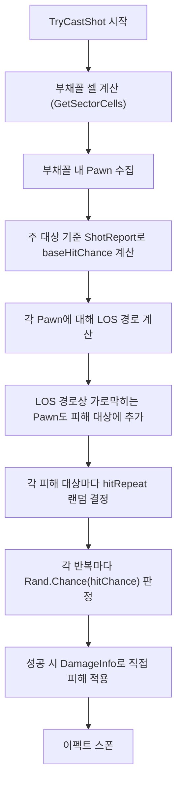

# Rifle Line 명중률 기반 피해 시스템 개선

## 현재 구조

현재 `Verb_SectorShot`는 부채꼴 영역의 모든 셀에 `GenExplosion.DoExplosion(overrideCells)`로 **무조건 피해**를 적용합니다. 명중률 개념이 없고, 부채꼴 안의 모든 대상이 100% 피해를 받습니다.

## 변경 목표

1. **피해 반복 회수**: XML에서 `hitRepeatRange` (min~max)를 정의하고, 각 대상마다 랜덤으로 반복 회수 결정
2. **명중률 기반 히트 확률**: 주 대상(currentTarget)에 대한 ShotReport 명중률을 기준으로, 각 반복마다 확률 판정
3. **실제 피해 대상 선정**: 부채꼴은 조준 방향/범위 서치용으로만 사용하고, 실제 피해 대상은 **사수 -> 부채꼴 내 각 Pawn** 사이 LOS 경로에서 가로막히는 Pawn들

## 핵심 로직 흐름



## 파일별 변경 사항

### 1. [VerbProperties_SectorShot.cs](Project/1.6/Source/SectorShot/VerbProperties_SectorShot.cs)

필드 추가:

```csharp
public int hitRepeatMin = 1;
public int hitRepeatMax = 3;
```

### 2. [Verb_SectorShot.cs](Project/1.6/Source/SectorShot/Verb_SectorShot.cs)

`TryCastShot()` 메서드를 대폭 변경:

- **GenExplosion.DoExplosion 제거** -- 더 이상 폭발 방식으로 피해를 주지 않음
- **명중률 계산**: `ShotReport.HitReportFor(caster, this, currentTarget)`로 주 대상 기준 `AimOnTargetChance_StandardTarget` 획득 (타겟 크기, 포복 등은 개별 대상별로 별도 적용)
- **부채꼴 내 Pawn 수집**: `GetSectorCells()`로 얻은 셀들에서 Pawn이 있는 셀 수집
- **LOS 기반 실제 피해 대상 선정**:
  - 부채꼴 내 각 Pawn에 대해 `GenSight.PointsOnLineOfSight(caster.Position, pawn.Position)` 호출
  - 경로상의 셀에 있는 Pawn들도 피해 대상 HashSet에 추가
- **피해 적용 루프**:
  - 각 피해 대상마다 `Rand.RangeInclusive(hitRepeatMin, hitRepeatMax)`로 반복 회수 결정
  - 각 반복마다 `Rand.Chance(hitChance)` 판정
  - 성공 시 `DamageInfo`를 생성하여 `thing.TakeDamage(dinfo)` 직접 호출
- 기존 이펙트(총구 이펙트, 셀 이펙트)는 유지

### 3. [Weapon_Range.xml](Project/1.6/Defs/ThingsDefs/Weapon_Range.xml)

RK_Rifle_line의 VerbProperties_SectorShot에 새 필드 추가:

```xml
<hitRepeatMin>1</hitRepeatMin>
<hitRepeatMax>3</hitRepeatMax>
```

## 명중률 계산 상세

주 대상 기준 `ShotReport`에서 `AimOnTargetChance_StandardTarget`을 기본 명중률로 사용합니다. 이 값은 다음을 포함합니다:

- 사수 사격 스킬 + 거리 감쇠 (`factorFromShooterAndDist`)
- 무기 정확도 (`factorFromEquipment`)
- 날씨 (`factorFromWeather`)
- 가스 (`factorFromCoveringGas`)
- 어둠 보정 (`offsetFromDarkness`)

개별 대상별로는 `factorFromTargetSize`(체형 크기)를 추가 적용하여 최종 hitChance를 결정합니다.

## 피해 대상 선정 상세

```
사수 ----LOS----> 부채꼴 내 Pawn A
         |
    가로막힌 Pawn B (LOS 경로상에 있음 -> 피해 대상에 추가)
```

- 부채꼴 영역은 "어디를 향해 쏘는가"를 결정
- 실제 피해는 사수와 부채꼴 내 Pawn 사이 LOS 경로에 있는 모든 Pawn에게 적용
- 중복 피해 방지를 위해 HashSet으로 대상 관리
