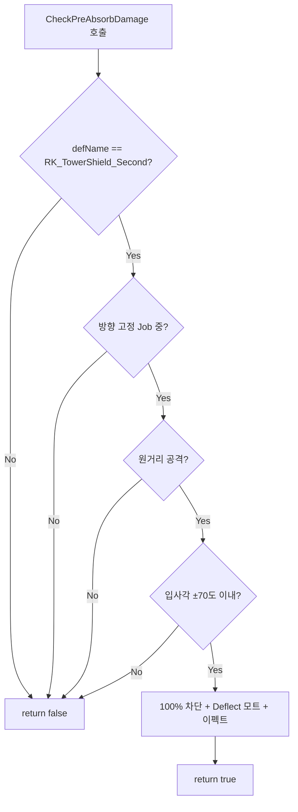

# RK_TowerShield_Second 방향 고정 시 원거리 공격 100% 차단

## 현재 상태 분석

- **RK_TowerShield_Second**: [Apparel_Shield.xml](Project/1.6/Defs/ThingsDefs/Apparel_Shield.xml) - `RK_ApparelAttr_ShieldBase` 상속, `thingClass` 미지정 → 기본 `Apparel` 사용
- **현재**: 방향 고정(CompShieldFaceDirection) 기능만 있고, **데미지 흡수/차단 로직이 없음**
- **Shield 클래스** ([ApparelShield.cs](Project/1.6/Source/ShieldOfRatkinia/ApparelShield.cs)): 확률 기반 차단(140도, melee skill + armor), `CheckPreAbsorbDamage` 오버라이드
- **StaminaShield 계열**(Wooden/Heavy/Tower): `CompStaminaShield`로 데미지 처리, RK_TowerShield_Second는 해당 Comp 없음

## 구현 방향

RK_TowerShield_Second 전용 Apparel 서브클래스를 만들어 `CheckPreAbsorbDamage`를 오버라이드하고, **방향 고정 Job 수행 중일 때만** 원거리 공격을 100% 차단합니다.

## 핵심 로직



- **방향 고정 판정**: `pawn.CurJob?.def == RatkinJobDefOf.RK_Job_ShieldFaceDirection`
- **원거리 판정**: `dinfo.Def.isRanged` (ignoreShields/EMP는 제외)
- **입사각 계산**: [ApparelShield.cs](Project/1.6/Source/ShieldOfRatkinia/ApparelShield.cs)와 동일
  - `attackerAngle = dinfo.Angle + 180` (0~360 정규화)
  - `defenderAngle = pawn.Rotation.AsAngle`
  - 조건: `defenderAngle - attackerAngle` 이 -70 ~ 70 범위

## 수정/추가 파일

### 1. C# 신규: `ApparelShieldTowerSecond.cs`

- 경로: `Project/1.6/Source/ShieldOfRatkinia/ApparelShieldTowerSecond.cs`
- `Apparel` 상속, `CheckPreAbsorbDamage` 오버라이드
- 조건:
  - `def.defName == "RK_TowerShield_Second"`
  - `pawn.CurJob?.def == RatkinJobDefOf.RK_Job_ShieldFaceDirection`
  - `dinfo.Def.isRanged == true`
  - `!dinfo.Def.ignoreShields` 및 `dinfo.Def != DamageDefOf.EMP`
  - 입사각 ±70도 이내
- 차단 시:
  - `MoteMaker.ThrowText(pawn.DrawPos, pawn.Map, "ShieldBlock".Translate(), 1.9f)` (기존 ShieldBlock = "Deflect!")
  - `EffecterDefOf.Deflect_Metal.Spawn().Trigger(...)`
  - `return true`

### 2. Def 수정: [Apparel_Shield.xml](Project/1.6/Defs/ThingsDefs/Apparel_Shield.xml)

- `RK_ApparelAttr_TowerShield_Second`에 `thingClass` 추가:
  ```xml
  <thingClass>NewRatkin.ApparelShieldTowerSecond</thingClass>
  ```

### 3. csproj (필요 시)

- `**\*.cs` 글로브로 자동 포함되므로 별도 수정 없음

## 텍스트 모트

- 기존 `ShieldBlock` 키 사용: EN "Deflect!", KO "튕겨냄!" 등
- 사용자 요청 "Deflect"와 동일한 의미로 사용
- `MoteMaker.ThrowText(..., 1.9f)`로 회피(TextMote_Dodge)와 같은 방식으로 잠깐 표시 후 사라짐

## 예외 처리

- `ignoreShields` 또는 EMP: 차단하지 않음 (CompStaminaShield와 동일)
- 폭발 데미지: `isRanged`가 아니면 이 로직에서 처리하지 않음 (원거리만 대상)
