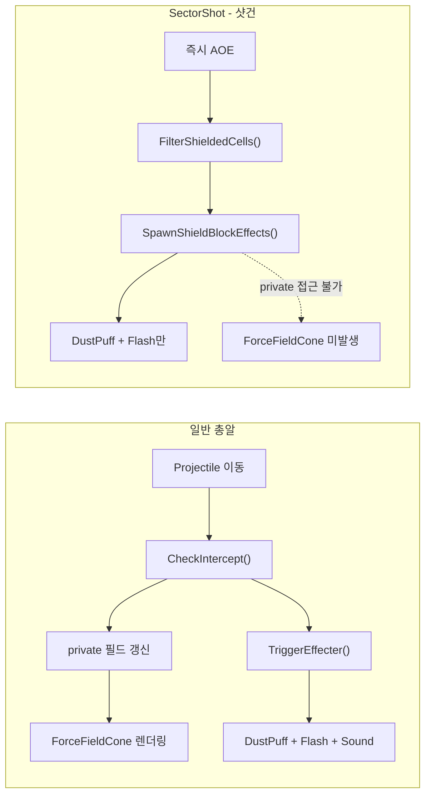

# SectorShot Broadshield 이펙트 수정

## 문제 분석

### 근본 원인 2가지

**1) ForceFieldCone 미발생**

- `CompProjectileInterceptor.PostDraw()`에서 그리는 ForceFieldCone은 3개 private 필드에 의존:
  - `lastInterceptAngle` (float)
  - `lastInterceptTicks` (int)
  - `drawInterceptCone` (bool)
- `CheckIntercept(Projectile)`에서만 갱신됨 → SectorShot에는 Projectile이 없음

**2) 이펙트 위치 오류 (뒷편에 나옴)**

- `SpawnShieldBlockEffects`의 외곽 링 필터가 사수 방향을 고려하지 않음
- 타겟이 돔 중심에 있으면, 외곽 링 셀이 사수 반대편(뒤쪽)에도 존재 → 그쪽에 이펙트 스폰

---

## 수정 계획

### 수정 1: ForceFieldCone 트리거 (Reflection)

[Verb_SectorShot.cs](Project/1.6/Source/SectorShot/Verb_SectorShot.cs)의 `SpawnShieldBlockEffects`에 Reflection으로 private 필드 3개를 설정하는 로직 추가.

- `System.Reflection`의 `FieldInfo.SetValue`로 설정 (Harmony 불필요)
- 프로젝트가 이미 `System.Reflection`을 사용 중 (Comp_PulseRifleFireMode.cs 등)
- `lastInterceptAngle`: 사수 위치 → 쉴드 중심 방향의 AngleFlat
- `lastInterceptTicks`: `Find.TickManager.TicksGame`
- `drawInterceptCone`: `true`
- FieldInfo는 static으로 캐싱하여 매번 조회하지 않도록 함

### 수정 2: 이펙트 위치 보정 (사수 방향 필터)

`SpawnShieldBlockEffects` 내 외곽 링 셀 필터에 **사수 방향 dot product 조건** 추가:

- `dot(cellPos - shieldCenter, casterPos - shieldCenter) > 0` 인 셀만 이펙트 대상
- 이 조건은 사수 쪽 반구에 있는 셀만 통과시킴 → 뒤쪽 이펙트 제거

---

## 수정 파일

- [Verb_SectorShot.cs](Project/1.6/Source/SectorShot/Verb_SectorShot.cs)
  - `SpawnShieldBlockEffects` 메서드 수정 (Reflection + 방향 필터)
  - static FieldInfo 캐시 필드 추가 (클래스 상단)

