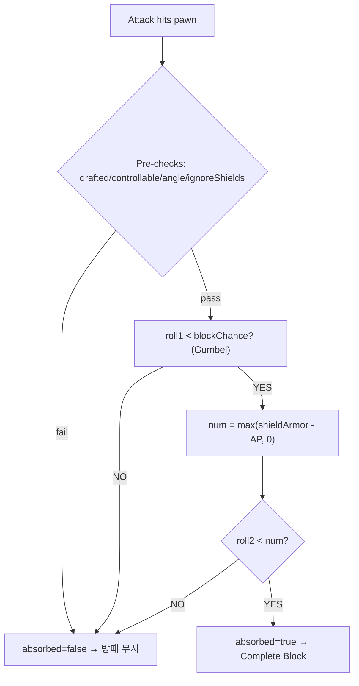

# Shield Block Logic v3: blockChance 게이트 + 2구간 방어

## 구현 방식: Comp 레벨 (Harmony 불필요)

바닐라 에너지쉴드 벨트와 동일한 패턴:
- `Apparel.CheckPreAbsorbDamage` → 내부적으로 comp의 `PostPreApplyDamage(ref dinfo, out absorbed)` 호출
- `absorbed = true` → 완전 블록, `absorbed = false` → 풀 관통
- 반감 구간을 완전 블록으로 병합하므로 dinfo 수정 불필요 → Harmony 없이 comp만으로 완결

## 목표 흐름



바닐라 ApplyArmor 대비:
- `roll < num/2` (완전블록) + `roll < num` (반감) → **병합하여 `roll < num` = 완전블록**
- `roll >= num` → 풀 관통 (그대로)

## 파일 변경

### 1. 신규: `ShieldOfRatkinia/CompShieldDeflect.cs`

```csharp
public class CompProperties_ShieldDeflect : CompProperties
{
    public CompProperties_ShieldDeflect() { compClass = typeof(CompShieldDeflect); }

    // 완전 블록 시 방패 내구도 손상 비율 (데미지 × 이 값)
    public float durabilityDamageOnBlock = 0.0025f;    // 기본값 0.25%

    // 관통 시 방패 내구도 손상 비율 (데미지 × 이 값)
    public float durabilityDamageOnPenetrate = 0.01f;  // 기본값 1%
}

public class CompShieldDeflect : ThingComp
{
    public CompProperties_ShieldDeflect Props => (CompProperties_ShieldDeflect)props;

    public override void PostPreApplyDamage(ref DamageInfo dinfo, out bool absorbed)
    {
        absorbed = false;
        Pawn pawn = (parent as Apparel)?.Wearer;
        if (pawn == null) return;

        // 1. pre-checks
        if (!ShouldTryBlock(pawn, dinfo)) return;

        // 2. blockChance gate (Gumbel)
        var shield = parent as ApparelShieldTowerSecond;
        float armorRating = shield.GetArmorRatingForDamage(dinfo);
        float meleeLevel = pawn.skills?.GetSkill(SkillDefOf.Melee)?.Level ?? 0f;
        float blockChance = ApparelShieldTowerSecond.ComputeBlockChanceForArmorAndMelee(
            armorRating, meleeLevel, dinfo.ArmorPenetrationInt);
        if (Rand.Value >= blockChance) return;

        // 3. armor check (반감 구간 → 완전블록 병합)
        float num = Mathf.Max(armorRating - dinfo.ArmorPenetrationInt, 0f);
        bool blocked = Rand.Value < num;

        // 방패 내구도 손상 (블록/관통 비율 분리)
        float durabilityRatio = blocked ? Props.durabilityDamageOnBlock : Props.durabilityDamageOnPenetrate;
        ApplyDurabilityDamage(dinfo, durabilityRatio);

        if (blocked)
        {
            absorbed = true;
            ShowBlockEffect(pawn, dinfo);
        }
        // else: absorbed=false → 풀 관통
    }
}
```

XML 기본값 예시 (값 생략 시 위 기본값 적용):
```xml
<li Class="NewRatkin.CompProperties_ShieldDeflect">
    <durabilityDamageOnBlock>0.0025</durabilityDamageOnBlock>
    <durabilityDamageOnPenetrate>0.01</durabilityDamageOnPenetrate>
</li>
```

### 2. 수정: [ApparelShieldTowerSecond.cs](Project/1.6/Source/ShieldOfRatkinia/ApparelShieldTowerSecond.cs)

- `CheckPreAbsorbDamage` override **제거** (comp가 대신 처리)
- `GetArmorRatingForDamage` → `internal` 접근자로 변경 (comp에서 호출)
- `PawnCanDeflectWithShield` → `internal static` 유지
- 각도 판정 로직 → `internal static TryGetAngleDiff(...)` 메서드로 추출
- 기존 static 수식 메서드(`ComputeM`, `ComputeBlockChance` 등) 유지

### 3. 수정: [Apparel_Shield.xml](Project/1.6/Defs/ThingsDefs/Apparel_Shield.xml)

각 방패 ThingDef의 `<comps>`에 추가:
```xml
<li Class="NewRatkin.CompProperties_ShieldDeflect" />
```

### 4. StatWorker는 현 단계 변경 없음

## csproj

`**\*.cs` 와일드카드 → 신규 파일 자동 포함, 수정 불필요.