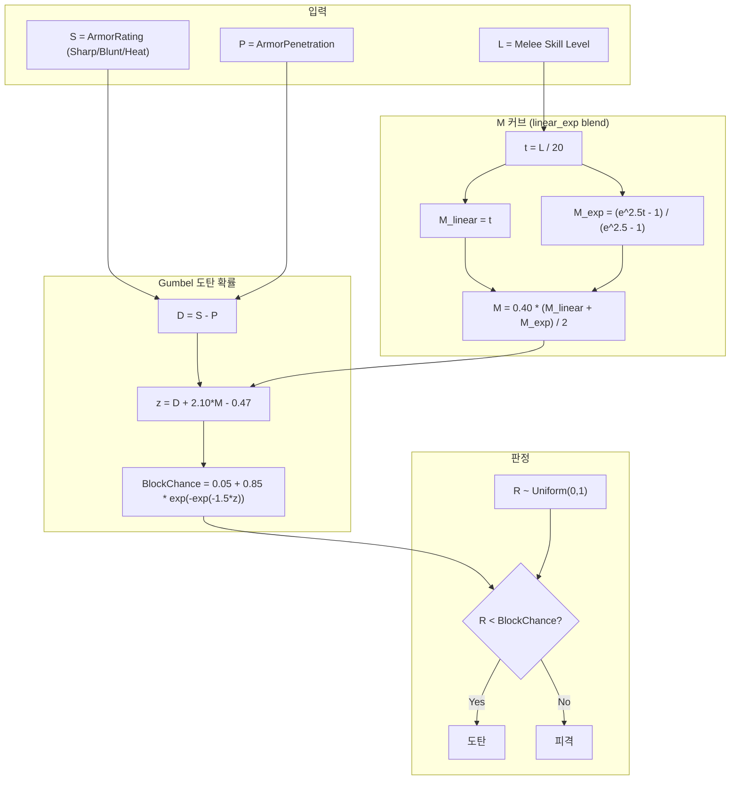

# Shield Deflect V2 공식 적용

## 공식 비교

### 기존 (v1) - 선형

```
deflectPower = ArmorRating + ShieldHandling
deflectRate = deflectPower - AP
deflected = (roll <= deflectRate)
```

### 신규 (v2) - Gumbel형 이중 지수

```
-- 상수 (고정) --
Mmax = 0.40   Lcap = 20   Cmin = 0.05   Cmax = 0.90
k = 1.50      a = 2.10    b = 0.47      kappa = 2.5

-- M 커브 (선형-지수 블렌드) --
L = melee skill (clamped 0~Lcap)
t = L / Lcap
M_linear = t
M_exp = (e^(kappa*t) - 1) / (e^kappa - 1)
M = Mmax * (M_linear + M_exp) / 2

-- 도탄 확률 --
D = S - P          (S = shield ArmorRating, P = attack AP)
z = D + a*M - b
BlockChance = Cmin + (Cmax - Cmin) * exp(-exp(-k*z))

R ~ Uniform(0,1)  ->  R < BlockChance 이면 도탄
```

## 수정 대상 파일

### 1. [ApparelShieldTowerSecond.cs](Project/1.6/Source/ShieldOfRatkinia/ApparelShieldTowerSecond.cs)

핵심 도탄 판정 로직 교체.

- **상수 추가**: `Mmax`, `Lcap`, `Cmin`, `Cmax`, `k`, `a`, `b`, `Kappa` 를 `private const` 로 정의
- **M 커브 메서드 추가**: `ComputeM(float meleeLevel)` -- 선형-지수 블렌드 (linear_exp)
- **BlockChance 메서드 추가**: `ComputeBlockChance(float D, float M)` -- Gumbel 공식
- **`CheckPreAbsorbDamage` 수정**:
  - `shieldHandling` 제거
  - `armorRating` (S)와 `penetration` (P)로 D 계산
  - 근접 스킬 레벨로 M 계산
  - BlockChance 산출 후 `Rand.Value < BlockChance` 로 판정
  - 디버그 로그 포맷 업데이트 (D, M, z, BlockChance 표시)

기존 79~84행 핵심 교체 부분:

```csharp
// 기존
float shieldHandling = pawn.GetStatValue(RatkinStatDefOf.RK_Stat_ShieldHandling);
float deflectPower = armorRating + shieldHandling;
float penetration = dinfo.ArmorPenetrationInt;
float deflectRate = deflectPower - penetration;
float roll = Rand.Value;
bool deflected = roll <= deflectRate;

// 신규
float penetration = dinfo.ArmorPenetrationInt;
float D = armorRating - penetration;
float meleeLevel = pawn.skills?.GetSkill(SkillDefOf.Melee)?.Level ?? 0f;
float M = ComputeM(meleeLevel);
float blockChance = ComputeBlockChance(D, M);
float roll = Rand.Value;
bool deflected = roll < blockChance;
```

참고: `meleeLevel` 변수가 이미 65~70행(각도 계산)에서 선언되므로 재사용.

### 2. [StatWorker_ShieldDeflectChance.cs](Project/1.6/Source/ShieldOfRatkinia/StatWorker_ShieldDeflectChance.cs)

폰 스탯 패널 표시 갱신.

- **`GetValueUnfinalized`**: ShieldHandling 대신 근접 스킬 M 커브로 평균 BlockChance 계산 (Sharp/Blunt/Heat 세 타입의 BlockChance 평균, AP=0 기준)
- **`GetExplanationUnfinalized`**: 표시 항목 변경
  - 방패 방어력 (Sharp/Blunt/Heat 각각)
  - 근접 스킬 레벨 -> M 값
  - D = S - 0 (AP=0 기준 참조값)
  - z, BlockChance 계산 과정
  - ShieldHandling 관련 코드 전체 삭제
- **`AverageOfArmorPlusHandling` 제거** -> 새 메서드로 교체

### 3. [Stats_ShieldDeflect.xml](Project/1.6/Defs/Stats/Stats_ShieldDeflect.xml)

- `RK_Stat_ShieldDeflectChance`: description 업데이트 (새 공식 설명)
- `RK_Stat_ShieldHandling`: StatDef 자체는 유지 (기존 세이브 호환) -- `hideAtValue` 로 인해 사용하지 않으면 자연스럽게 숨겨짐. `showOnPawns`를 false로 변경하여 명시적으로 숨김 처리

### 4. [DefOf.cs](Project/1.6/Source/DefOf.cs) 174행

- `RK_Stat_ShieldHandling` 참조: 삭제하지 않음 (다른 곳에서 참조 가능성). 단, 도탄 관련 코드에서 사용하지 않게 됨

## 미수정 파일 (변경 없음)

- `ShieldDeflectAngleMeleeCurve.cs` - 각도 배율 곡선으로 도탄 확률과 무관, 유지
- `StatWorker_ShieldDeflectAngle.cs` - 각도 표시용, 변경 없음
- `StatWorker_ShieldHandling.cs` - StatDef 유지하므로 코드도 유지
- `Apparel_Shield.xml` - XML 방어 수치 변경 없음

## 다이어그램


