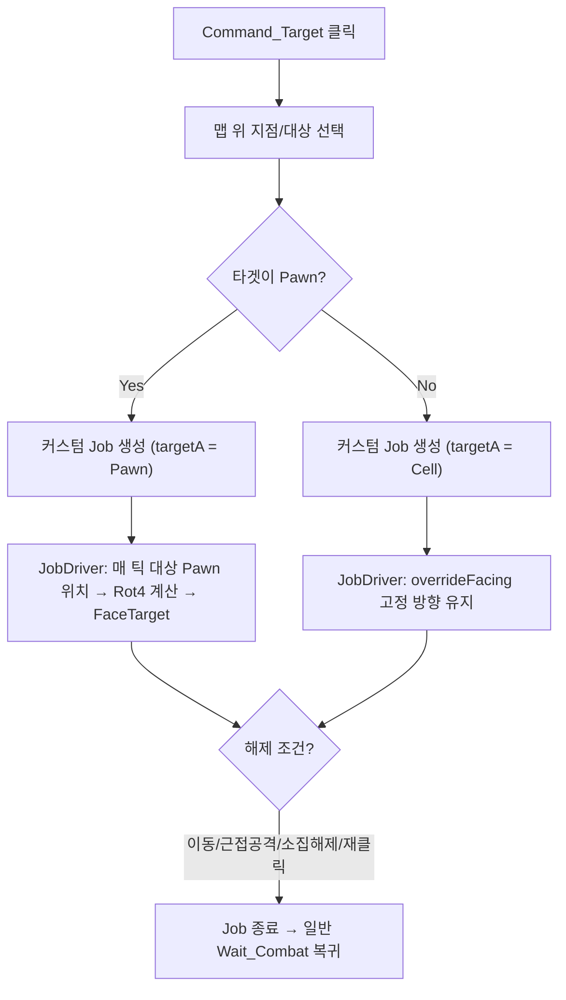

# 방패 방향 고정 커맨드 구현 계획

## 구현 방식 선택: 커스텀 JobDriver (전략 A+B 하이브리드)

### 왜 Ability가 아닌 Command + 커스텀 Job인가

- **Ability 시스템**: AbilityDef → CompAbilityEffect 구조로, Pawn에 직접 부여되는 능력. 방패 **장비 의존적** 기능이므로 Ability보다 **Comp 기반 Command**가 적합
- **바닐라 overrideFacing만으로는 부족**: `Job.overrideFacing`은 `Rot4` 고정값만 지원하여, **움직이는 Pawn을 지속 추적**하는 요구사항을 충족 불가
- **결론**: `CompStaminaShield`에서 `Command_Target` 기즈모를 노출하고, 커스텀 `JobDriver_ShieldFaceDirection`에서 방향/대상 추적 로직을 처리

### 핵심 동작 흐름

## 구현 항목

### 1. 커스텀 JobDef 정의 (XML)

- 파일: [Project/1.6/Defs/JobDefs/Jobs_Shield.xml](Project/1.6/Defs/JobDefs/Jobs_Shield.xml) (신규)
- `RK_Job_ShieldFaceDirection` JobDef 정의
- `driverClass`: `NewRatkin.JobDriver_ShieldFaceDirection`

### 2. JobDriver_ShieldFaceDirection (C#, 신규)

- 파일: [Project/1.6/Source/StaminaShield/JobDriver_ShieldFaceDirection.cs](Project/1.6/Source/StaminaShield/JobDriver_ShieldFaceDirection.cs)
- `JobDriver_Wait` 패턴 기반, 핵심 차이점:
  - `toil.handlingFacing = true` → `UpdateRotation()` 스킵
  - **Cell 타겟**: `tickAction`에서 고정 `Rot4` 방향으로 `FaceTarget` 호출
  - **Pawn 타겟**: `tickAction`에서 `targetA.Thing.Position` 기준으로 매 틱 `Rot4` 재계산 → `FaceTarget` 호출 (움직이는 대상 추적)
  - `initAction`에서 `pawn.pather.StopDead()` 호출 (즉시 정지)
  - `CheckForAutoAttack()` 호출하지 않음 (방향 고정 중 자동 공격 비활성화)
  - `defaultCompleteMode = ToilCompleteMode.Never` (외부 해제까지 유지)

### 3. CompStaminaShield에 Command_Target 기즈모 추가 (C# 수정)

- 파일: [Project/1.6/Source/StaminaShield/CompStaminaShield.cs](Project/1.6/Source/StaminaShield/CompStaminaShield.cs)
- `CompGetWornGizmosExtra()` 또는 `GetGizmos()`에 `Command_Target` 추가
- **활성화 조건**: `pawn.Drafted && !pawn.Dead && !pawn.Downed && !pawn.InMentalState && ShieldState == Active`
- **비활성화 조건**: 기절, 사망, 근접 교전 중 → `DisableReason` 표시
- **쿨다운 5초**: `lastFaceCommandTick` 필드로 관리, `GenTicks.TicksGame - lastFaceCommandTick < 300` 이면 비활성화
- **타겟팅 파라미터**: `canTargetLocations = true`, `canTargetPawns = true`, `canTargetBuildings = true`
- **action 로직**:
  1. 타겟이 Pawn이면 → `Job.targetA = Pawn` (지속 추적)
  2. 타겟이 Cell/Building이면 → 방향 계산 후 `Job.targetA = Cell`
  3. `pawn.jobs.TryTakeOrderedJob(job)` 호출

### 4. DefOf에 JobDef 참조 추가 (C# 수정)

- 파일: [Project/1.6/Source/DefOf.cs](Project/1.6/Source/DefOf.cs)
- `RatkinJobDefOf`에 `RK_Job_ShieldFaceDirection` 추가

### 5. 해제 조건 처리

JobDriver 내부에서 처리:

- **이동**: 다른 Job이 들어오면 자동으로 현재 Job 교체 (바닐라 메커니즘)
- **근접 공격 수신**: `Notify_StanceChanged()` 또는 `Stance_Busy` 진입 시 자동 해제
- **소집 해제**: `tickAction`에서 `!pawn.Drafted` 체크 → `EndJobWith(JobCondition.Succeeded)`
- **커맨드 재클릭**: 새 Job이 `TryTakeOrderedJob`으로 교체
- **다른 능력 사용**: 새 Job이 현재 Job을 교체 (바닐라 메커니즘)

대부분의 해제 조건은 **바닐라 Job 교체 메커니즘**으로 자동 처리됨. 명시적으로 체크해야 할 것은 소집 해제 정도.

### 6. 세이브/로드 호환

- `CompStaminaShield.PostExposeData()`에 `lastFaceCommandTick` 저장
- `JobDriver`는 바닐라 Job 시스템이 자동으로 세이브/로드 처리

## 파일 변경 요약

| 파일                                                                  | 작업                                  |
| ------------------------------------------------------------------- | ----------------------------------- |
| `Project/1.6/Defs/JobDefs/Jobs_Shield.xml`                          | 신규 - JobDef 정의                      |
| `Project/1.6/Source/StaminaShield/JobDriver_ShieldFaceDirection.cs` | 신규 - 커스텀 JobDriver                  |
| `Project/1.6/Source/StaminaShield/CompStaminaShield.cs`             | 수정 - Command_Target 기즈모 + 쿨다운 필드 추가 |
| `Project/1.6/Source/DefOf.cs`                                       | 수정 - RatkinJobDefOf에 JobDef 추가      |

## 질문/확인 사항

1. **커맨드 아이콘**: 별도 텍스처가 필요합니다. 임시로 기존 방패 텍스처를 사용하거나, 바닐라 아이콘을 사용할 수 있습니다. 어떻게 할까요?
2. **방향 고정 중 원거리 자동 공격**: 방향을 고정한 상태에서 원거리 자동 사격(`FireAtWill`)도 비활성화할까요? (현재 계획은 비활성화)
3. **방향 고정 중 시각적 피드백**: 방향 고정 상태임을 나타내는 UI 요소(아이콘 오버레이, 방향 화살표 등)가 필요한가요?

