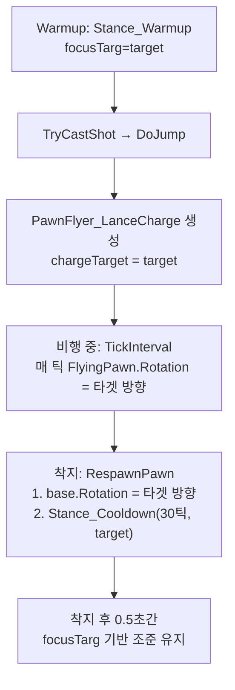

# 랜스 돌진 시 대상 조준 유지 구현

## 문제 분석

돌진 흐름에서 조준이 풀리는 구간:

1. **Warmup 단계** (0.75초): `Stance_Warmup`으로 `focusTarg` 설정 → 정상 조준 유지
2. **TryCastShot → DoJump**: `PawnFlyer.MakeFlyer()`에서 `pawn.DeSpawn()` 호출 → Stance 소멸
3. **비행 중**: Pawn이 `innerContainer`에 들어가 있으므로 `Pawn_RotationTracker`가 동작하지 않음. 비행 시작 시점의 `Rotation`으로 고정됨 → 대상이 피격/이동으로 위치 변하면 조준 방향 불일치
4. **착지 (RespawnPawn)**: `flyingThing.Rotation = base.Rotation` → 비행 시작 시 고정 회전값 복원. Stance_Busy 없이 Job 복원만 → 타겟 방향 조준 연출 없음

**핵심**: 비행 중에는 Pawn의 `Rotation`이 갱신되지 않고, 착지 후에도 대상을 향한 Stance_Busy가 설정되지 않아 다른 곳을 바라보게 됨.

## 구현 전략

커스텀 PawnFlyer 서브클래스 `PawnFlyer_LanceCharge`를 만들어 두 가지를 처리:

### 1. 비행 중 타겟 방향 회전 유지

`PawnFlyer`는 `DynamicDrawPhaseAt`에서 `FlyingPawn.DynamicDrawPhaseAt(phase, effectivePos)`를 호출하는데, 이때 Pawn의 `Rotation`이 사용됨. 비행 시작 시 `pawnFlyer.Rotation = pawn.Rotation`으로 고정되지만, 대상이 이동하면 방향이 안 맞음.

- `TickInterval` 오버라이드에서 매 틱 `FlyingPawn.Rotation`을 타겟 방향으로 갱신

### 2. 착지 후 타겟 방향 조준 Stance 설정

`RespawnPawn` 오버라이드에서 착지 후 짧은 `Stance_Cooldown`을 설정하여 `focusTarg`를 타겟으로 지정 → 착지 직후 무기가 타겟을 향해 조준된 상태 연출.

## 변경 파일

### 새 파일: `Project/1.6/Source/HeavyLanceCharge/PawnFlyer_LanceCharge.cs`

```csharp
using RimWorld;
using UnityEngine;
using Verse;

namespace NewRatkin
{
    public class PawnFlyer_LanceCharge : PawnFlyer
    {
        private LocalTargetInfo chargeTarget;

        protected override void TickInterval(int delta)
        {
            // 비행 중 매 틱 Pawn Rotation을 타겟 방향으로 갱신
            if (FlyingPawn != null && chargeTarget.IsValid)
            {
                Vector3 targetPos = chargeTarget.HasThing 
                    ? chargeTarget.Thing.DrawPos 
                    : chargeTarget.Cell.ToVector3Shifted();
                Vector3 direction = targetPos - DrawPos;
                if (direction.MagnitudeHorizontalSquared() > 0.001f)
                {
                    FlyingPawn.Rotation = Pawn_RotationTracker.RotFromAngleBiased(direction.AngleFlat());
                }
            }
            base.TickInterval(delta);
        }

        protected override void RespawnPawn()
        {
            // 착지 시 타겟 방향으로 Rotation 설정 후 기본 처리
            if (chargeTarget.IsValid)
            {
                Vector3 targetPos = chargeTarget.HasThing 
                    ? chargeTarget.Thing.DrawPos 
                    : chargeTarget.Cell.ToVector3Shifted();
                Vector3 dir = targetPos - DestinationPos;
                if (dir.MagnitudeHorizontalSquared() > 0.001f)
                {
                    base.Rotation = Pawn_RotationTracker.RotFromAngleBiased(dir.AngleFlat());
                }
            }
            base.RespawnPawn();

            // 착지 후 짧은 Stance_Cooldown으로 타겟 조준 유지
            Pawn pawn = FlyingPawn; // RespawnPawn 후에는 null일 수 있으므로 사전 저장 필요
            // → base.RespawnPawn()이 innerContainer에서 drop하므로 이 시점에서 FlyingPawn은 null
            // → 사전에 pawn 참조를 저장해야 함
        }

        public override void ExposeData()
        {
            base.ExposeData();
            Scribe_TargetInfo.Look(ref chargeTarget, "chargeTarget");
        }
    }
}
```

실제 구현에서는 `RespawnPawn` 내 pawn 참조 타이밍을 주의:

```csharp
protected override void RespawnPawn()
{
    Pawn pawn = FlyingPawn;
    LocalTargetInfo savedTarget = chargeTarget;

    if (savedTarget.IsValid)
    {
        Vector3 targetPos = savedTarget.HasThing 
            ? savedTarget.Thing.DrawPos 
            : savedTarget.Cell.ToVector3Shifted();
        Vector3 dir = targetPos - DestinationPos;
        if (dir.MagnitudeHorizontalSquared() > 0.001f)
        {
            base.Rotation = Pawn_RotationTracker.RotFromAngleBiased(dir.AngleFlat());
        }
    }

    base.RespawnPawn();

    if (pawn != null && pawn.Spawned && savedTarget.IsValid)
    {
        int cooldownTicks = 30; // 0.5초 정도 조준 유지
        pawn.stances.SetStance(new Stance_Cooldown(cooldownTicks, savedTarget, null));
    }
}
```

### 수정: `Verb_CastAbilityCharge.cs` - DoJump 호출 시 target 정보 전달

현재 `JumpUtility.DoJump`의 `target` 매개변수로 `effectiveTarget`을 전달하고 있음 → `PawnFlyer.MakeFlyer`에서 `pawnFlyer.target = target`으로 저장됨. 그러나 `target`은 `PawnFlyer`의 `private` 필드.

**접근 방안**: `PawnFlyer.target` 필드는 `private`이므로 서브클래스에서 접근 불가. 대안으로:

- `PawnFlyer_LanceCharge`에서 `SpawnSetup` 시 Reflection 또는 다른 방법으로 target을 가져오기
- 또는 `MakeFlyer` 후 스폰 전에 chargeTarget을 설정하는 방식

기존 코드를 보면 `JumpUtility.DoJump`에서 `PawnFlyer.MakeFlyer(..., target)` → `pawnFlyer.target = target`으로 저장. `target` 필드가 `private`이므로 Reflection이 필요하나, 더 깔끔한 방법:

`**Verb_CastAbilityCharge.TryCastShot`에서 DoJump 대신 직접 MakeFlyer를 호출**하여 `PawnFlyer_LanceCharge`에 `chargeTarget`을 설정하는 방식. 하지만 이는 큰 변경이므로, Harmony 패치나 Reflection으로 target을 읽는 것이 더 간단.

**최종 선택**: `SpawnSetup`에서 Reflection으로 `base.target`을 읽어 `chargeTarget`에 복사.

### 수정: `AbilityDefs_LanceCharge.xml` - ThingDef 변경

```xml
<ThingDef ParentName="PawnFlyerBase">
    <defName>RK_PawnFlyer_LanceCharge</defName>
    <thingClass>NewRatkin.PawnFlyer_LanceCharge</thingClass>  <!-- 추가 -->
    <pawnFlyer>
        <flightDurationMin>0.3</flightDurationMin>
        <flightSpeed>20</flightSpeed>
        <heightFactor>0.0</heightFactor>
    </pawnFlyer>
</ThingDef>
```

### 수정: `NewRatkin.csproj` - 새 파일 추가

```xml
<Compile Include="HeavyLanceCharge\PawnFlyer_LanceCharge.cs" />
```

## 흐름 요약




