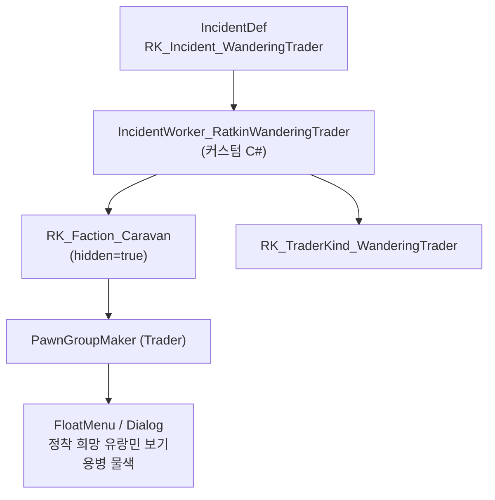

# 랫킨 유랑 상인 구현 계획

## 핵심 구조

기존 `RK_Faction_Caravan` (hidden=true) FactionDef를 확장하여 유랑 상인 전용으로 사용합니다. hidden faction이므로 `HasGoodwill=false`가 되어 공격해도 우호도가 변하지 않습니다.

단, `IncidentWorker_NeutralGroup.FactionCanBeGroupSource`에서 **hidden faction은 거부**되므로, 커스텀 `IncidentWorker`를 만들어 직접 faction을 지정해야 합니다.




## 파일 구성

**모든 Def를 하나의 파일에 통합**: `Project/1.6/Defs/WanderingTrader/RK_WanderingTrader.xml`

## 1단계: Def 파일 생성 (XML)

### 1-1. 새 PawnKindDef 4종 (판매용 pawn)


| defName                        | label                      | 컨셉     | backstory                      | 의상                      |
| ------------------------------ | -------------------------- | ------ | ------------------------------ | ----------------------- |
| RK_PawnKind_Gypsy              | ratkin gypsy               | 집시/유랑민 | RatkinWanderer (신규)            | RK_Cardigan, RK_Muffler |
| RK_PawnKind_WanderingSlave     | ratkin refugee slave       | 노예/피난민 | RatkinWanderer (신규)            | 최소한의 의상                 |
| RK_PawnKind_WanderingRefugee   | ratkin refugee             | 피난민    | RatkinWanderer (신규)            | RK_ApronSkirt           |
| RK_PawnKind_WanderingMercenary | ratkin wandering mercenary | 용병     | RatkinViolence, RatkinMerchant | RK_Combatant 계열         |


### 1-2. 새 BackstoryDef (유년기 1개 + 성인기 4개)

- **유년기**: `RK_Backstory_WandererChild` - 떠돌이 아이
- **성인기**:
  - `RK_Backstory_Gypsy` - 집시/유랑 예능인 (Social, Artistic 높음)
  - `RK_Backstory_RefugeeSlave` - 도망친 노예 (Mining, Plants)
  - `RK_Backstory_WanderingRefugee` - 전쟁 피난민 (Construction, Cooking)
  - `RK_Backstory_WanderingMercenary` - 떠돌이 용병 (Shooting, Melee 높음)

spawnCategories에 `RatkinWanderer` 추가하여 PawnKindDef와 매칭.

### 1-3. TraderKindDef

`RK_TraderKind_WanderingTrader`: 은화 + 기본 물자 + 잡화 소량. pawn 판매는 StockGenerator가 아닌 커스텀 대화 UI로 처리.

### 1-4. RK_Faction_Caravan 확장

기존 `RK_Faction_Caravan`의 `caravanTraderKinds`를 `RK_TraderKind_WanderingTrader`로 변경하고, `pawnGroupMakers`에 유랑 상인 전용 Trader 그룹 추가.

### 1-5. IncidentDef

`RK_Incident_WanderingTrader`: DevMode에서 수동 발동 가능 (`baseChance=0`).

## 2단계: C# 코드 (커스텀 IncidentWorker + 대화 UI)

### 2-1. IncidentWorker_RatkinWanderingTrader

`[Project/1.6/Source/WanderingTrader/IncidentWorker_RatkinWanderingTrader.cs](Project/1.6/Source/WanderingTrader/IncidentWorker_RatkinWanderingTrader.cs)`

- `IncidentWorker` 직접 상속 (NeutralGroup 우회)
- `TryExecuteWorker`에서:
  1. `RK_Faction_Caravan` faction 직접 참조
  2. `PawnGroupMakerUtility.GeneratePawns`로 상인+호위병 생성
  3. 판매용 pawn 별도 생성 (RK_PawnKind_Gypsy, WanderingSlave, WanderingRefugee, WanderingMercenary 중 랜덤 3~6명)
  4. `LordJob_TradeWithColony`로 무역 행동 부여
  5. 편지 발송

### 2-2. 커스텀 대화 UI (FloatMenuMakerMap 패치 또는 CompTrader 확장)

`[Project/1.6/Source/WanderingTrader/Dialog_WanderingTrader.cs](Project/1.6/Source/WanderingTrader/Dialog_WanderingTrader.cs)`

상인 pawn과 대화 시 FloatMenu에 추가 옵션:

- **[정착 희망 유랑민 보기]**: 판매용 pawn 목록을 보여주는 창. 선택하면 은화를 지불하고 해당 pawn이 플레이어 faction의 colonist로 합류. 가격은 `PawnKindDef`의 `combatPower` 기반으로 설정하되 나중에 조정 가능하도록 설정값으로 분리.
- **[용병 물색]**: 클릭 시 대화창 닫기 + 디버그 메시지 "조건에 맞는 대상을 찾기 시작했습니다." 출력.

### 2-3. NewRatkin.csproj 업데이트

새 C# 파일들을 `<Compile Include>` 항목에 추가.

## 3단계: 우호도 불변 검증

`RK_Faction_Caravan`은 이미 `hidden=true`이므로:

- `Faction.HasGoodwill` = false (hidden이면)
- `Faction.CanChangeGoodwillFor` = false
- `Faction.TryAffectGoodwillWith` = false
- `Faction.Notify_MemberStripped` = early return

공격 시 해당 pawn들은 적대 반응(반격)하지만, 주 세력(Rakinia)의 우호도는 영향 없음.

## 가격 시스템 설계

```csharp
// DefModExtension으로 가격 설정
public class WanderingTraderSettings : DefModExtension
{
    public float basePawnPrice = 500f;
    public float combatPowerPriceMultiplier = 5f;
    // 최종 가격 = basePawnPrice + (combatPower * multiplier)
}
```

이렇게 하면 나중에 XML에서 가격 조정이 가능합니다.