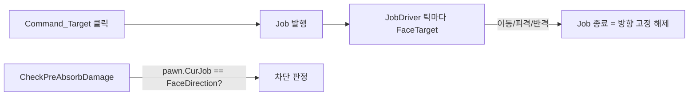
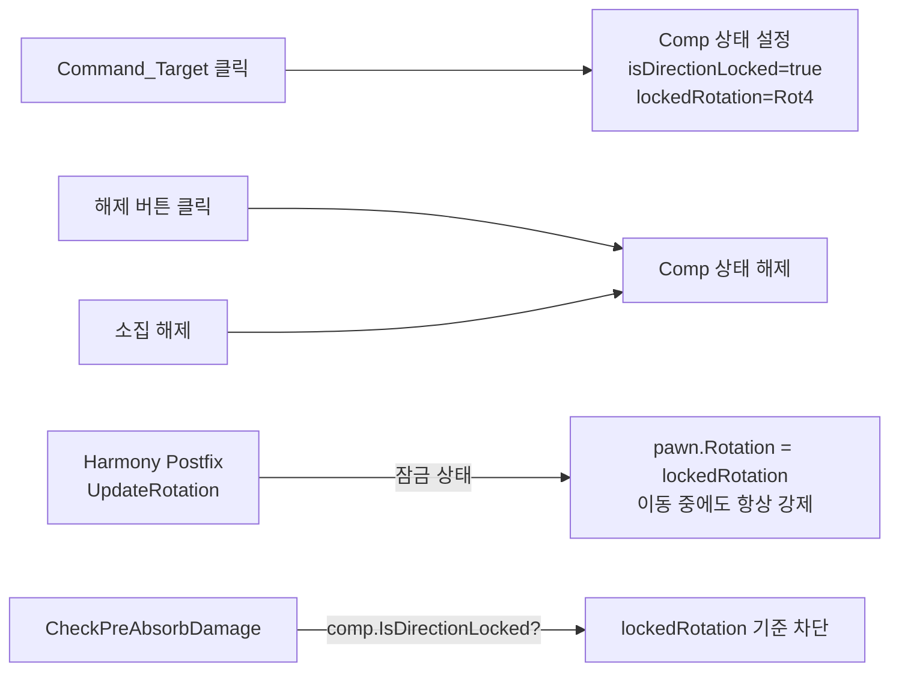

# 방향 고정 - Job 기반에서 Comp 상태 기반으로 전환

## 현재 구조의 문제

현재 방향 고정은 **Job(`RK_Job_ShieldFaceDirection`)** 기반입니다:



림월드에서 **Job은 한 번에 하나만 실행** 가능하므로, 이동(Goto Job), 반격(AttackMelee Job) 등 다른 행동 시 방향 고정 Job이 대체되어 해제됩니다. 추가로 `JobDriver_ShieldFaceDirection`에서 근접 피격/근접 위협 시 명시적으로 `EndJobWith`를 호출합니다.

## 개선 구조

방향 고정 상태를 **Comp에 직접 저장**하고, Job에 의존하지 않도록 변경합니다:



핵심 변경: **보호 방향 + 시각적 회전 모두 항상 `lockedRotation` 기준** (이동 중에도 뒷걸음질/옆걸음 효과)

## 수정 대상 파일

### 1. [CompShieldFaceDirection.cs](Project/1.6/Source/ShieldFaceDirection/CompShieldFaceDirection.cs) - 상태 관리 추가

- `bool isDirectionLocked`, `Rot4 lockedRotation` 필드 추가
- `PostExposeData`에 save/load 추가
- 기즈모 변경:
  - 잠금 해제 상태: 기존 Command_Target (방향 지정 + 잠금)
  - 잠금 상태: 해제용 Command_Action 추가 표시 + 방향 재설정용 Command_Target 유지
- 공개 API: `IsDirectionLocked`, `LockedRotation`, `Lock(Rot4)`, `Unlock()`
- 커맨드 action에서 Job 발행 대신 comp 상태만 설정

```csharp
// 핵심 추가 필드
private bool isDirectionLocked;
private Rot4 lockedRotation;

public bool IsDirectionLocked => isDirectionLocked;
public Rot4 LockedRotation => lockedRotation;

public void Lock(Rot4 rot) { isDirectionLocked = true; lockedRotation = rot; }
public void Unlock() { isDirectionLocked = false; }
```

### 2. [ApparelShieldTowerSecond.cs](Project/1.6/Source/ShieldOfRatkinia/ApparelShieldTowerSecond.cs) - 판정 로직 변경

- `pawn.CurJob?.def == RK_Job_ShieldFaceDirection` 대신 `comp.IsDirectionLocked` 체크
- `pawn.Rotation.AsAngle` 대신 `comp.LockedRotation.AsAngle` 사용 (이동 중에도 보호 방향 유지)

```csharp
// Before
if (pawn.CurJob?.def != RatkinJobDefOf.RK_Job_ShieldFaceDirection) return false;
float defenderAngle = pawn.Rotation.AsAngle;

// After
var comp = this.GetComp<CompShieldFaceDirection>();
if (comp == null || !comp.IsDirectionLocked) return false;
float defenderAngle = comp.LockedRotation.AsAngle;
```

### 3. 신규: `ShieldFaceDirectionPatch.cs` - Harmony 회전 강제 패치

- `Pawn_RotationTracker.UpdateRotation()` Postfix
- 잠금 상태: 이동 중이든 정지 중이든 **항상** `pawn.Rotation = lockedRotation` 강제
- 이동 시 뒷걸음질/옆걸음 시각 효과 (스프라이트는 잠금 방향, 물리적 이동은 경로대로)
- 소집 해제 감지 시 자동 unlock

```csharp
[HarmonyPostfix]
static void UpdateRotation_Postfix(Pawn ___pawn)
{
    if (___pawn?.Dead != false || ___pawn.Downed) return;
    var comp = GetCompFromPawn(___pawn);
    if (comp == null || !comp.IsDirectionLocked) return;

    if (!___pawn.Drafted) { comp.Unlock(); return; }
    ___pawn.Rotation = comp.LockedRotation; // 항상 강제 - 이동 중에도 뒷걸음질 효과
}
```

### 4. [NewRatkin.csproj](Project/1.6/Source/NewRatkin.csproj) - 새 파일 등록

- `ShieldFaceDirectionPatch.cs`에 대한 `<Compile Include>` 추가

### 5. 기존 파일 보존

- [JobDriver_ShieldFaceDirection.cs](Project/1.6/Source/ShieldFaceDirection/JobDriver_ShieldFaceDirection.cs) - 삭제하지 않음 (미사용 상태로 유지)
- [Jobs_Shield.xml](Project/1.6/Defs/JobDefs/Jobs_Shield.xml) - JobDef 유지 (호환성)

## 동작 요약

| 상황         | 현재       | 개선 후                                  |
| ---------- | -------- | ------------------------------------- |
| 이동 명령      | 방향 고정 해제 | **유지** (보호 방향 + 시각 방향 모두 고정, 뒷걸음질 효과) |
| 근접 피격      | 방향 고정 해제 | **유지**                                |
| 반격 (근접 위협) | 방향 고정 해제 | **유지**                                |
| 소집 해제      | 방향 고정 해제 | 방향 고정 해제 (동일)                         |
| 토글(해제 버튼)  | 없음       | **신규 해제 버튼**                          |
