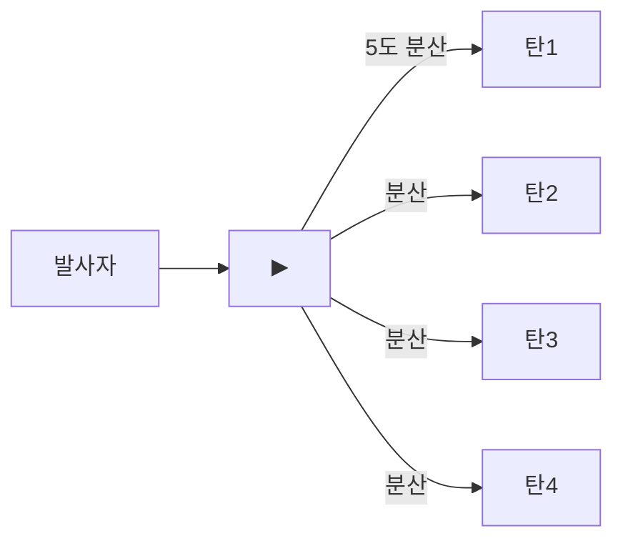

# RK_Rifle_line 산탄총 동시발사 구현 계획

## 현재 상태 분석

**현재 방식** (`Verb_Shoot` + burst):

- `burstShotCount=6`, `ticksBetweenBurstShots=1` -> 6발을 1틱 간격으로 순차 발사
- 탄환: `Bullet_RK_Buck` (5 damage, 0.45 AP)
- Raw DPS: ~14.4, Adjusted DPS: ~12.21

**목표 방식** (동시 산탄):

- 4발을 **한 틱에 동시 발사**
- 5도 분산각: 원뿔형 분산 패턴
- 근거리: 분산 수렴 (자연스럽게 1칸으로 모임)
- 원거리: 분산 확대 (range 13.9에서 tan(2.5deg)*13.9 = 약 +-0.6셀)

## 분산 시각화




- **근거리 (3칸)**: spread +-0.13셀 -> 모든 탄 같은 셀 명중
- **중거리 (7칸)**: spread +-0.3셀 -> 대부분 같은 셀, 일부 인접 셀
- **최대거리 (13.9칸)**: spread +-0.6셀 -> 1-2셀 범위로 분산

## 구현 파일

### 1. 새 파일: `Project/1.6/Source/Shotgun/VerbProperties_ShotgunBlast.cs`

VerbProperties 확장 클래스 (XML에서 설정 가능):

- `pelletCount` (int) = 4 : 산탄 수
- `spreadAngleDeg` (float) = 5.0 : 분산각(도)

기존 패턴 참고: [VerbProperties_RatHolicGun.cs](Project/1.6/Source/RatHolicGun/VerbProperties_RatHolicGun.cs)

### 2. 새 파일: `Project/1.6/Source/Shotgun/Verb_ShotgunBlast.cs`

`Verb_Shoot`를 상속하는 커스텀 Verb:

- `ShotsPerBurst` override -> `1` 반환 (버스트 시스템 비활성화)
- `TryCastShot()` override:
  1. 기본 유효성 검증 (맵, 프로젝타일, LOS 체크)
  2. 장비 Comp 처리 (CompChangeableProjectile 등)
  3. 발사자-타겟 방향벡터 계산
  4. **pelletCount만큼 루프**:
    - `Rand.Range(-spreadAngle/2, +spreadAngle/2)` 로 각도 오프셋 산출
    - `Quaternion.Euler(0, offset, 0) * direction * distance` 로 분산 목표 셀 계산
    - 프로젝타일 스폰 및 Launch
    - 각 탄환에 개별 명중 판정 (ShotReport) 적용
  5. ShotsFired 기록

**핵심 로직** (분산 목표 계산):

```csharp
Vector3 direction = (targetPos - origin).normalized;
float angleOffset = Rand.Range(-spreadAngleDeg / 2f, spreadAngleDeg / 2f);
Vector3 rotated = Quaternion.Euler(0, angleOffset, 0) * direction;
IntVec3 pelletCell = (origin + rotated * distance).ToIntVec3();
```

### 3. 수정: [Weapon_Range.xml](Project/1.6/Defs/ThingsDefs/Weapon_Range.xml) (라인 740-752)

기존:

```xml
<verbs>
  <li>
    <verbClass>Verb_Shoot</verbClass>
    ...
    <burstShotCount>6</burstShotCount>
    <ticksBetweenBurstShots>1</ticksBetweenBurstShots>
  </li>
</verbs>
```

변경:

```xml
<verbs>
  <li Class="NewRatkin.VerbProperties_ShotgunBlast">
    <verbClass>NewRatkin.Verb_ShotgunBlast</verbClass>
    ...
    <burstShotCount>1</burstShotCount>
    <ticksBetweenBurstShots>0</ticksBetweenBurstShots>
    <pelletCount>4</pelletCount>
    <spreadAngleDeg>5</spreadAngleDeg>
  </li>
</verbs>
```

### 4. csproj 변경 불필요

와일드카드 패턴 `<Compile Include="**\*.cs" .../>` 사용 중이므로 자동 포함됨.

## DPS 영향 분석


| 항목      | 현재 (6발 버스트) | 변경 후 (4발 동시) | 변화    |
| ------- | ----------- | ------------ | ----- |
| 탄환 수    | 6           | 4            | -33%  |
| 탄환 데미지  | 5           | 5 (유지)       | 0%    |
| 총 데미지   | 30          | 20           | -33%  |
| 사이클 시간  | ~2.28s      | ~2.2s        | -3.5% |
| Raw DPS | ~14.4       | ~9.1         | -37%  |


**참고**: DPS가 크게 하락하므로, 이후 탄환 데미지 조정이 필요할 수 있음 (예: 5 -> 7~8로 증가). 단, 현 계획에서는 기존 값 유지.

## 유니크 버전 영향

`RK_Rifle_line_Unique`는 `ParentName="RK_WeaponAttr_Rifle_line"`으로 상속하므로 verb 변경이 자동 전파됨. 별도 수정 불필요.