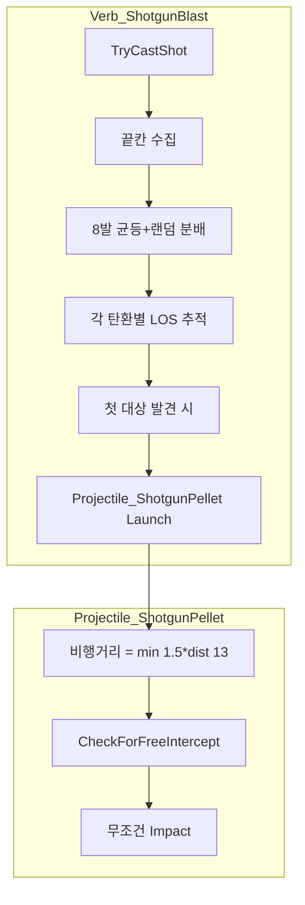

# 샷건 기능 수정 계획

## 요구사항 정리

| 항목        | 내용                                    |
| --------- | ------------------------------------- |
| 1. 끝칸 획득  | 최대 사거리 13, 좌우 각 35° (총 70°) 부채꼴 내 끝칸들 |
| 2. 탄환 분배  | 8발을 끝칸들에 균등 분배, 남는 탄은 랜덤 할당           |
| 3. LOS 적중 | LOS 경로상 만나는 첫 번째 대상에게 무조건 적중 (명중률 무시) |
| 4. 비행거리   | min(대상과의 거리 × 1.5, 13)                |

## 아키텍처

## 수정 대상 파일

### 1. [Verb_ShotgunBlast.cs](Project/1.6/Source/Shotgun/Verb_ShotgunBlast.cs)

**변경 내용:**

- 기존: `EffectiveRange`까지 분산 발사, `ShotReport` 기반 확률적 명중
- 신규:
  1. **끝칸 수집**: `circularSectorCellsStartedCaster` 또는 직접 구현으로 거리 13, 70° 부채꼴 내 셀 + LOS 필터
  2. **균등+랜덤 분배**: 끝칸 N개에 8발 배정. `floor(8/N)`씩 균등, 나머지 `8 - N*floor(8/N)`은 랜덤
  3. **LOS 첫 대상 탐색**: `GenSight.PointsOnLineOfSight(origin, endCell)` 순회 → 각 셀의 `GetThingList`에서 `CanHit` 가능한 첫 Thing 탐색
  4. **비행거리 계산**: `travelDist = Mathf.Min(distanceToFirstTarget * 1.5f, 13f)`
  5. **커스텀 프로젝타일 사용**: `Projectile_ShotgunPellet` 스폰 및 Launch (destination = 비행거리 지점)

**끝칸 수집 로직 (참고: [Verb_GunlanceFiring.cs](Project/1.6/Source/Gunlance/Verb_GunlanceFiring.cs) TeleUtils):**

- `GenRadial.RadialCellsAround(center, 12.5f, 13.5f)` 또는 `RadialPattern` + `RadialPatternRadii`로 거리 12.5~13.5 셀만 추출
- `Vector3Utility.AngleFlat`로 중심선 기준 ±35° 필터
- `GenSight.LineOfSight(center, cell, map, true)` 적용

### 2. 신규: `Project/1.6/Source/Shotgun/Projectile_ShotgunPellet.cs`

**역할:** LOS 경로상 첫 대상에 **무조건 적중**하는 프로젝타일.

- `Projectile` 상속
- `CheckForFreeIntercept` 또는 `CheckForFreeInterceptBetween` 오버라이드: 기존 `Rand.Chance(num2)` 대신, `CanHit(thing)`이면 **즉시 Impact** (100% 적중)
- 또는 `TickInterval` 오버라이드로 매 틱 LOS 경로 상 첫 대상 검사 후 즉시 Impact

**참고:** [Projectile.cs](RimworldSource/Verse/Projectile.cs) 401~486행 `CheckForFreeIntercept`에서 `Rand.Chance(num2)`가 명중 확률을 결정함. 이를 1.0으로 고정하면 무조건 적중.

### 3. [VerbProperties_ShotgunBlast.cs](Project/1.6/Source/Shotgun/VerbProperties_ShotgunBlast.cs)

**추가 필드:**

- `maxRange` (float) = 13
- `spreadAngleDeg` (float) = 70 (총합)
- `pelletCount` (int) = 8
- `travelDistanceMultiplier` (float) = 1.5

### 4. [Weapon_Range.xml](Project/1.6/Defs/ThingsDefs/Weapon_Range.xml)

**verb 수정 (라인 740~754):**

- `range` = 13
- `pelletCount` = 8
- `spreadAngleDeg` = 70
- `maxRange` = 13
- `travelDistanceMultiplier` = 1.5

**Bullet_RK_Buck 프로젝타일 클래스 지정:**

- `Bullet_RK_Buck`의 `projectile`에 `projectileClass` 추가하여 `Projectile_ShotgunPellet` 사용
- 또는 verb에서 `defaultProjectile`을 새로 만든 `Bullet_RK_Buck_Shotgun`으로 변경하고, 해당 ThingDef에 `projectileClass` 지정

### 5. Def 수정 (프로젝타일 클래스)

**옵션 A:** `Bullet_RK_Buck`에 `projectileClass` 추가

- 샷건 전용 탄환이면 `projectileClass="NewRatkin.Projectile_ShotgunPellet"` 지정
- 단, 다른 무기에서 `Bullet_RK_Buck`을 쓰면 문제 가능

**옵션 B:** 샷건 전용 탄환 `Bullet_RK_Buck_Shotgun` 생성

- `ParentName="Bullet_RK_Buck"` 상속
- `projectileClass="NewRatkin.Projectile_ShotgunPellet"` 지정
- verb의 `defaultProjectile`을 `Bullet_RK_Buck_Shotgun`으로 변경

**권장:** 옵션 B (샷건 전용 탄환 분리)

## 구현 순서

1. `Projectile_ShotgunPellet` 생성 (무조건 적중 로직)
2. `Bullet_RK_Buck_Shotgun` ThingDef 추가
3. `VerbProperties_ShotgunBlast`에 새 필드 추가
4. `Verb_ShotgunBlast.TryCastShot` 전면 수정 (끝칸 수집 → 균등+랜덤 분배 → LOS 추적 → Launch)
5. `Weapon_Range.xml` verb 및 projectile Def 수정
6. csproj에 `Projectile_ShotgunPellet.cs` 포함 확인 (와일드카드면 자동)

## 주의사항

- `preventFriendlyFire` 유지: 아군은 `CanHit`에서 제외
- `CompUniqueWeapon` 등 기존 `ApplyCompUniqueWeapon` 로직 유지
- `GenSight.PointsOnLineOfSight`는 Bresenham 경로만 제공. 벽/건물 차단은 `CanBeSeenOverFast`로 `LineOfSight` 호출 시 자동 반영되므로, **끝칸 수집 시 LOS 필터**와 **경로상 첫 대상 탐색 시** 각각 적용 필요
- 끝칸이 0개인 경우(벽에 완전 차단 등): 8발을 중심선 방향으로 균등 각도 분배하는 폴백 처리

