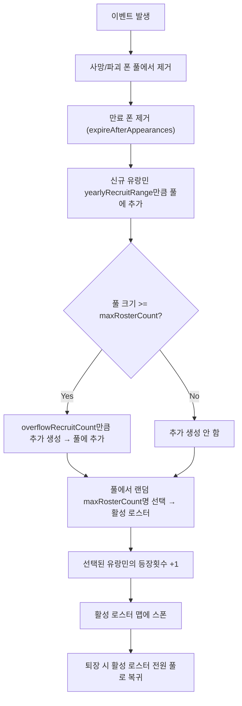

# 유랑민 합류 조건 + 풀 시스템

## 핵심 개념: 풀(Pool)과 로스터(Roster) 분리

- **전체 풀 (settlerPool)**: 지금까지 생성된 모든 유랑민이 저장되는 곳. 합류하지 않은 유랑민은 여기에 영구 보존.
- **활성 로스터 (rosterSettlers)**: 매년 방문 시 풀에서 랜덤으로 max명을 뽑아 구성. 실제로 맵에 스폰되는 유랑민.
- 합류 조건은 풀에 저장된 유랑민에게 영속적으로 부착. 풀에서 로스터로 뽑혀도 동일 조건 유지.

```mermaid
flowchart TD
    subgraph pool ["전체 풀 (settlerPool)"]
        PA["유랑민A (조건: 은 5000)"]
        PB["유랑민B (조건: 스킬 멘토)"]
        PC["유랑민C (조건: 건빵 1000)"]
        PD["유랑민D (조건: 약초 200)"]
        PE["유랑민E (조건: 은 3000)"]
        PF["유랑민F (조건: 컴포넌트 50)"]
    end

    subgraph yearly ["매년 방문 시"]
        SelectRoster["풀에서 랜덤 max(5)명 선택"]
        NewRecruit["신규 유랑민 생성 (yearlyRecruitCount)"]
        OverflowRecruit["로스터 초과 시 추가 생성 (overflowRecruitCount)"]
    end

    subgraph roster ["활성 로스터 (맵 스폰)"]
        RA["유랑민A"]
        RB["유랑민B"]
        RC["유랑민C"]
        RD["유랑민D"]
        RE["유랑민E"]
    end

    pool --> SelectRoster
    NewRecruit --> pool
    OverflowRecruit --> pool
    SelectRoster --> roster
    roster --> MapSpawn["맵에 스폰"]
    MapSpawn --> ExitMap["퇴장 → 전원 풀로 복귀"]
end
```


## XML 설정: IncidentDefExtension_WanderingCaravan

[IncidentDefExtension_WanderingCaravan.cs](Project/1.6/Source/WanderingTrader/IncidentDefExtension_WanderingCaravan.cs) 및 [Incident_WanderingTrader.xml](Project/1.6/Defs/WanderingTrader/Incident_WanderingTrader.xml) 수정:

```xml
<li Class="NewRatkin.IncidentDefExtension_WanderingCaravan">
  <initialSettlerCount>3</initialSettlerCount>
  <maxRosterCount>5</maxRosterCount>
  <yearlyRecruitRange>1~2</yearlyRecruitRange>
  <overflowRecruitCount>1</overflowRecruitCount>
  <maxPoolSize>-1</maxPoolSize>
  <expireAfterAppearances>-1</expireAfterAppearances>
</li>
```


| 필드                     | 기본값 | 설명                                         |
| ---------------------- | --- | ------------------------------------------ |
| initialSettlerCount    | 3   | 첫 방문 시 생성되는 유랑민 수                          |
| maxRosterCount         | 5   | 매년 방문 시 데리고 오는 최대 유랑민 수                    |
| yearlyRecruitRange     | 1~2 | 매년 풀에 추가되는 신규 유랑민 수                        |
| overflowRecruitCount   | 1   | 풀이 maxRosterCount 이상일 때 추가 생성 수            |
| maxPoolSize            | -1  | 전체 풀 최대 크기 (-1 = 무제한)                      |
| expireAfterAppearances | -1  | N번 로스터에 뽑혀 등장했는데 선택 안 되면 풀에서 제거 (-1 = 무제한) |


## 매년 방문 로직 흐름




## 핵심 변경 사항

### 1. 새 파일: `SettlementJoinRequirement.cs`

합류 조건의 기반 추상 클래스 + 3가지 구체 구현. `IExposable`을 구현하여 세이브/로드 가능.

- **SettlementJoinRequirement** (abstract, IExposable)
  - `string desc` - 조건 설명 (긴 텍스트, "이 유랑민은 부유한 곳에 합류를 희망합니다.")
  - `string descShort` - 조건 요약 (짧은 텍스트, "은 5000 이상 보유")
  - `abstract bool IsMet(Map map)` - 조건 충족 여부 판정
  - `virtual void ExposeData()` - Scribe 직렬화
  - `static SettlementJoinRequirement GenerateRandom()` - 팩토리 메서드
- **SilverJoinRequirement** : 정착지 은 보유량 조건
  - `int requiredAmount` (2000~8000 랜덤)
  - `IsMet`: 맵 내 Silver 총량 >= requiredAmount
- **SkillMentorJoinRequirement** : 특정 스킬 멘토 보유 조건
  - `SkillDef skillA`, `SkillDef skillB`, `int minLevel` (6~10 랜덤)
  - `IsMet`: 플레이어 폰 중 두 스킬 모두 minLevel 이상인 폰 존재
- **ItemJoinRequirement** : 특정 아이템 보유량 조건
  - `ThingDef thingDef`, `int requiredCount`
  - 아이템 풀: 건빵(RK_Food_Hardtack), 약초(MedicineHerbal), 컴포넌트(ComponentIndustrial) 등
  - `IsMet`: 맵 내 해당 아이템 총량 >= requiredCount

직렬화: `Scribe_Deep.Look`으로 다형성 자동 처리 (림월드 기본 지원).

### 2. 수정 파일: [IncidentDefExtension_WanderingCaravan.cs](Project/1.6/Source/WanderingTrader/IncidentDefExtension_WanderingCaravan.cs)

기존 2개 필드를 6개로 확장:

```csharp
public int initialSettlerCount = 3;
public int maxRosterCount = 5;
public IntRange yearlyRecruitRange = new IntRange(1, 2);
public int overflowRecruitCount = 1;
public int maxPoolSize = -1;
public int expireAfterAppearances = -1;
```

기존 `maxSettlerCount` → `maxRosterCount`로 이름 변경.

### 3. 수정 파일: [GameComponent_WanderingCaravan.cs](Project/1.6/Source/WanderingTrader/GameComponent_WanderingCaravan.cs) (대폭 수정)

**새 필드:**

- `List<Pawn> settlerPool` - 전체 유랑민 풀 (합류 안 한 모든 유랑민)
- `Dictionary<Pawn, SettlementJoinRequirement> settlerRequirements` - 폰별 합류 조건
- `Dictionary<Pawn, int> settlerAppearanceCount` - 폰별 로스터 등장 횟수

**기존 필드 변경:**

- `rosterSettlers` → 활성 로스터 (매년 풀에서 뽑힌 유랑민, 스폰용 임시 리스트)

**핵심 메서드:**

- `AddToPool(Pawn, SettlementJoinRequirement)` - 풀에 유랑민+조건 추가
- `SelectRosterFromPool(int maxRosterCount)` - 풀에서 랜덤 max명 선택, 등장횟수 증가
- `ReturnRosterToPool()` - 퇴장 시 활성 로스터 전원 풀로 복귀
- `RemoveExpiredFromPool(int expireAfter)` - 등장횟수 초과 유랑민 풀에서 영구 제거
- `GetRequirement(Pawn)` - 폰의 합류 조건 조회
- `OnSettlerAccepted(Pawn)` - 합류 시 풀+조건+등장횟수 모두에서 제거
- `RefillPool(...)` - 매년 신규 유랑민 생성하여 풀에 추가

**ExposeData:**

- settlerPool: `Scribe_Collections.Look` (LookMode.Reference)
- settlerRequirements: Pawn 키 리스트 + Requirement 값 리스트 분리 저장
- settlerAppearanceCount: Pawn 키 리스트 + int 값 리스트 분리 저장

### 4. 수정 파일: [IncidentWorker_RatkinWanderingTrader.cs](Project/1.6/Source/WanderingTrader/IncidentWorker_RatkinWanderingTrader.cs)

`TryExecuteWorker` 로직 변경:

- 첫 방문: `initialSettlerCount`명 생성 → 풀에 추가 (조건 부여) → 풀에서 로스터 선택
- 재방문: 사망자 정리 → 만료자 제거 → 신규 충원 → overflow 충원 → 풀에서 랜덤 로스터 선택
- 기존 `maxSettlerCount` 참조를 `maxRosterCount`로 변경
- 기존 `yearlyRecruitRange` 참조 유지

### 5. 수정 파일: [Dialog_CaravanSettlers.cs](Project/1.6/Source/WanderingTrader/Dialog_CaravanSettlers.cs)

- `CanAcceptPawn(Pawn)`: GameComponent에서 조건 조회 → `IsMet(map)` 반환
- UI 레이아웃:
  - 이름 아래에 합류 조건 텍스트 표시 (기존 backstory/skill 영역 활용)
  - `desc` (긴 설명) + `descShort` (조건 요약) 표시
  - 충족 시 초록색, 미충족 시 빨간색
  - 버튼 비활성화는 기존 `GUI.enabled` 로직 그대로 활용

### 6. 번역 키 추가

[English/Keyed/Misc_Gameplay.xml](Project/Contents/Languages/English/Keyed/Misc_Gameplay.xml) / [Korean/Keyed/Misc_Gameplay.xml](Project/Contents/Languages/Korean/Keyed/Misc_Gameplay.xml):

- `RK_JoinReq_Silver_Desc` / `RK_JoinReq_Silver_DescShort`
- `RK_JoinReq_SkillMentor_Desc` / `RK_JoinReq_SkillMentor_DescShort`
- `RK_JoinReq_Item_Desc` / `RK_JoinReq_Item_DescShort`
- `RK_JoinReq_Met` / `RK_JoinReq_NotMet`

### 7. XML 수정: [Incident_WanderingTrader.xml](Project/1.6/Defs/WanderingTrader/Incident_WanderingTrader.xml)

기존 `maxSettlerCount`, `yearlyRecruitRange`를 새 6개 필드로 교체.

## 확장성 설계

- `SettlementJoinRequirement` 상속 클래스 추가만으로 조건 타입 확장
- `GenerateRandom()` 팩토리에 새 타입 등록 → 자동으로 랜덤 풀 포함
- XML에서 `expireAfterAppearances`, `maxPoolSize` 등 밸런스 조절 가능
- 직렬화는 `Scribe_Deep`으로 다형성 자동 처리

