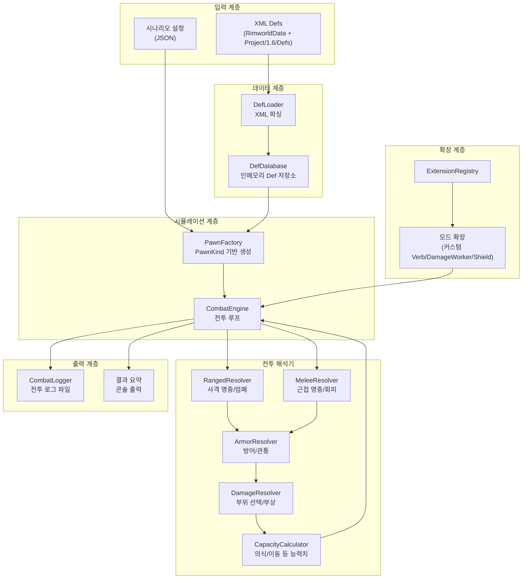

# 전투 시뮬레이션 시스템 (Combat Simulator)

## 핵심 설계 방향

- **독립 실행형 C# 콘솔 앱** (.NET Framework 4.7.2)
- .NET Framework 4.7.2를 사용하는 이유: 모드 DLL(NewRatkin.dll)과 동일 프레임워크 → Phase 2에서 모드 어셈블리 직접 로드 가능
- 바닐라 전투 공식을 수학적으로 정확하게 재현
- XML Def 데이터는 매 실행마다 `RimworldData/` + `Project/1.6/Defs/`에서 직접 파싱 (캐시 없음, 항상 최신)
- 모드 전용 로직은 확장 포인트(Extension) 시스템으로 플러그인 형태로 등록

---

## 아키텍처 개요




---

## 폴더 구조

```
Game Simulation/
├── CombatSimulator.csproj          # .NET Framework 4.7.2 콘솔 앱
├── CombatSimulator.sln
├── Program.cs                      # 진입점
│
├── Config/
│   ├── SimulationConfig.cs         # 설정 모델 (JSON 역직렬화)
│   ├── PathConfig.cs               # Def 경로 설정
│   └── Scenarios/
│       ├── melee_1v1.json          # 예제: 근접 1:1
│       └── ranged_cover.json       # 예제: 원거리 + 엄폐
│
├── Data/
│   ├── DefLoader.cs                # XML 파서 (System.Xml.Linq)
│   ├── DefDatabase.cs              # defName 기반 조회
│   ├── DefResolver.cs              # 상속(ParentName/Abstract) 해석
│   └── Models/
│       ├── ThingDef.cs             # 무기/방어구/종족 공통
│       ├── ProjectileDef.cs        # 투사체 정보
│       ├── PawnKindDef.cs
│       ├── BodyDef.cs              # 신체 트리
│       ├── BodyPartDef.cs          # 부위 정의
│       ├── DamageDef.cs
│       ├── StatDef.cs
│       └── StuffDef.cs             # 소재 정보
│
├── Simulation/
│   ├── SimPawn.cs                  # 폰 상태 (체력, 장비, 스탯)
│   ├── SimBody.cs                  # 신체 부위 트리 + 부상 추적
│   ├── SimHealth.cs                # 건강/부상/의식/사망 판정
│   ├── SimEquipment.cs             # 무기 + 의복 장착
│   ├── SimStats.cs                 # 스탯 계산 (스킬/장비/상태 반영)
│   │
│   ├── Combat/
│   │   ├── CombatEngine.cs         # 메인 전투 루프
│   │   ├── RangedResolver.cs       # 원거리: 명중률, 강제반경, 와일드미스
│   │   ├── MeleeResolver.cs        # 근접: 명중/회피/피해
│   │   ├── ArmorResolver.cs        # 방어: 관통/반사/감소
│   │   ├── DamageResolver.cs       # 피해: 부위 선택, 부상 적용
│   │   ├── CoverSystem.cs          # 엄폐: 차단 확률 계산
│   │   └── CapacityCalculator.cs   # 능력치: 의식/이동/조작 계산
│   │
│   └── Extensions/
│       ├── IVerbExtension.cs       # 커스텀 Verb 인터페이스
│       ├── IDamageExtension.cs     # 커스텀 DamageWorker 인터페이스
│       ├── IShieldExtension.cs     # 커스텀 방패 인터페이스
│       └── ExtensionRegistry.cs    # 확장 등록/조회
│
├── Logging/
│   ├── CombatLogger.cs             # 로그 기록
│   └── LogFormatter.cs             # 형식화 (틱별 이벤트)
│
├── Logs/                           # 자동 생성, 로그 출력 디렉토리
│   └── (sim_2026-03-27_143052_v1.log 등)
│
└── Utils/
    ├── SimRandom.cs                # 시드 기반 난수 (재현 가능)
    └── MathHelper.cs               # 보간, 클램프 등
```

---

## 핵심 전투 공식 (재현 범위)

### 1. 원거리 명중률

[RimworldSource/Verse/ShotReport.cs](RimworldSource/Verse/ShotReport.cs) 기반:

```
TotalHitChance = AimOnTargetChance * PassCoverChance

AimOnTargetChance = factorFromShooter * factorFromEquipment * factorFromTarget * factorFromWeather * ...
factorFromShooter = Pow(ShootingAccuracyPawn, distance)  (최소 0.0201)
factorFromEquipment = VerbProperties.GetHitChanceFactor(distance)  (무기 Accuracy 4구간 보간)
PassCoverChance = 1 - coversOverallBlockChance
```

- 엄폐 계산: [RimworldSource/Verse/CoverUtility.cs](RimworldSource/Verse/CoverUtility.cs) - 인접 셀 방향 기반 차단 확률 누적
- 강제 반경 미스: `ForcedMissRadius` 보유 무기(박격포 등)는 별도 처리

### 2. 근접 전투

[RimworldSource/RimWorld/Verb_MeleeAttack.cs](RimworldSource/RimWorld/Verb_MeleeAttack.cs) 기반:

```
1) 명중 판정: rand < NonMissChance (= MeleeHitChance 스탯)
   실패 → 미스
2) 회피 판정: rand < DodgeChance (= MeleeDodgeChance 스탯)
   성공 → 회피
3) 피해 적용: power * rand(0.8~1.2)
```

- 기습/고정 대상: 명중 100%, 회피 0%
- 비근접 stance 중인 대상: 회피 0%

### 3. 방어/관통

[RimworldSource/Verse/ArmorUtility.cs](RimworldSource/Verse/ArmorUtility.cs) 기반, 캐시 [armor-rating-formula.md](.cursor/def-cache/armor-rating-formula.md):

```
effectiveArmor = max(armorRating - armorPenetration, 0)
rand < effectiveArmor * 0.5 → 완전 무효화
rand < effectiveArmor      → 피해 50% + Sharp→Blunt 전환
그 외                       → 방어 실패 (피해 100%)

최종방어력 = (BaseArmor + StuffEffectMultiplierArmor * StuffPower) * QualityFactor
```

- 의복 순차 적용 (바깥 레이어부터) → 자연 방어 순

### 4. 부위 선택

[RimworldSource/Verse/HediffSet.cs](RimworldSource/Verse/HediffSet.cs):

```
가중치 = coverageAbs * BodyPartDef.GetHitChanceFactorFor(damageDef)
가중 랜덤으로 부위 선택
```

- 높이/깊이 필터 (DamageWorker별 다름)
- Stab: 외부 부위 선택 후 내부 관통 확률 적용

### 5. 능력치(Capacity) 영향

[RimworldSource/Verse/PawnCapacityUtility.cs](RimworldSource/Verse/PawnCapacityUtility.cs):

- 부상/hediff에 따라 의식(Consciousness), 이동(Moving), 조작(Manipulation) 등 변동
- 의식 → 명중률/회피율에 곱셈 영향
- 의식 0 이하 → 쓰러짐(Downed)

### 6. 품질/소재 계수

캐시 [combat-coefficients.md](.cursor/def-cache/combat-coefficients.md) 기반:

- 근접 피해: `power * StuffDamageMultiplier * QualityDamageMultiplier`
- 원거리 피해: `damageAmountBase * QualityRangedDamageMultiplier`
- 무기 정확도: `Accuracy * QualityAccuracyMultiplier`

---

## 시나리오 설정 (JSON)

```json
{
  "name": "Steel Longsword vs Plasteel Plate",
  "combatType": "melee",
  "rounds": 100,
  "seed": 12345,
  "environment": {
    "coverType": "none",
    "distance": 0,
    "darkness": false
  },
  "pawnA": {
    "pawnKindDef": "RK_Ratkin_Fighter",
    "weapon": { "defName": "RK_MeleeWeapon_Longsword", "stuff": "Steel", "quality": "Normal" },
    "apparel": [
      { "defName": "RK_Plate", "stuff": "Plasteel", "quality": "Good" },
      { "defName": "RK_PlateHelm", "stuff": "Steel", "quality": "Normal" }
    ],
    "skills": { "melee": 10, "shooting": 6 }
  },
  "pawnB": {
    "pawnKindDef": "Colonist",
    "weapon": { "defName": "Gun_AssaultRifle", "quality": "Normal" },
    "apparel": [
      { "defName": "Apparel_FlakVest", "quality": "Normal" }
    ],
    "skills": { "melee": 8, "shooting": 10 }
  }
}
```

원거리 시나리오에서는 `environment.distance`와 `coverType` (`sandbags`, `wall_corner`, `chunk` 등)으로 엄폐 설정.

---

## 전투 로그 형식

파일명: `sim_{날짜}_{시간}_v{버전}.log`

```
=== Combat Simulation Log ===
Version: 1.0.0
Timestamp: 2026-03-27 14:30:52
Scenario: Steel Longsword vs Plasteel Plate
Seed: 12345

--- Round 1/100 ---

[Tick 1] PawnA attacks PawnB (Melee: Longsword - Cut)
  Hit roll: 0.72 vs threshold 0.85 → HIT
  Dodge roll: 0.31 vs threshold 0.22 → DODGE FAILED
  Damage: 18.4 (base 20 * stuff 1.0 * quality 1.0 * rand 0.92)
  Target part: Torso (coverage weight: 0.40)
  Armor check: effectiveArmor = max(0.82 - 0.30, 0) = 0.52
    Roll 0.18 < 0.26 → FULLY BLOCKED
  Final damage: 0

[Tick 2] PawnB attacks PawnA (Melee: Fists - Blunt)
  Hit roll: 0.55 vs threshold 0.78 → HIT
  ...

--- Round Summary ---
PawnA wins: 62/100 (62%)
PawnB wins: 38/100 (38%)
Avg ticks to resolve: 14.3
PawnA avg HP remaining: 67%
PawnB avg HP remaining: 54%
```

---

## 모드 확장 시스템 설계

### Phase 1 (현재 구현): Extension Interface

```csharp
public interface IVerbExtension
{
    string VerbClass { get; }  // "Verb_HalberdCleave" 등
    CombatResult Execute(SimPawn attacker, SimPawn target, CombatContext ctx);
}

public interface IDamageExtension
{
    string WorkerClass { get; }  // "DamageWorker_ChainSword" 등
    DamageResult Apply(DamageInfo info, SimPawn target);
}

public interface IShieldExtension
{
    string CompClass { get; }
    ShieldResult TryBlock(DamageInfo info, SimPawn wearer, float angle);
}
```

- `ExtensionRegistry`에 defName 또는 클래스명으로 등록
- 시뮬레이터가 해당 Verb/Worker를 만나면 확장 호출
- 미등록 시 바닐라 기본 로직 fallback

### Phase 2 (추후): 모드 DLL 직접 로드

- `Assembly.LoadFrom("NewRatkin.dll")` 로 모드 어셈블리 로드
- 리플렉션으로 커스텀 Verb/DamageWorker 인스턴스화
- RimWorld 런타임 의존성 해결을 위한 심(shim) 레이어 제공
- .NET Framework 4.7.2 타겟이므로 DLL 호환성 보장

---

## 기술 스택


| 항목      | 선택                          | 근거                           |
| ------- | --------------------------- | ---------------------------- |
| 언어      | C#                          | 기존 모드/게임 소스와 동일, 공식 직접 이식 가능 |
| 프레임워크   | .NET Framework 4.7.2        | 모드 DLL과 동일 타겟, Phase 2 호환    |
| XML 파싱  | System.Xml.Linq (XDocument) | 추가 의존성 없음                    |
| JSON 설정 | Newtonsoft.Json (NuGet)     | 시나리오 파일 파싱                   |
| 빌드      | MSBuild (기존 환경 동일)          | 추가 SDK 불필요                   |
| 난수      | System.Random (시드 기반)       | 재현 가능한 시뮬레이션                 |


---

## 구현 순서 (Phase 1)

단계별로 빌드 가능한 상태를 유지하며 진행:

1. 프로젝트 세팅 + XML 데이터 로더
2. 신체 트리 + 폰 모델
3. 근접 전투 엔진 (명중/회피/방어/피해)
4. 원거리 전투 엔진 (정확도/엄폐/방어)
5. 능력치(Capacity) 피드백 루프
6. 전투 로그 시스템
7. 시나리오 러너 (JSON 기반, 다회차 실행)
8. 확장 포인트 인터페이스 + 예제 확장

