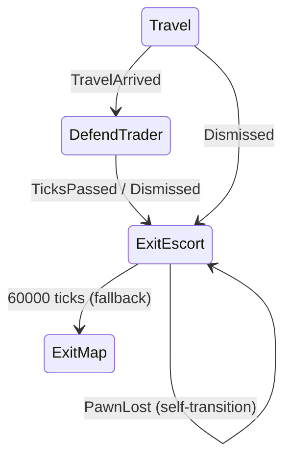
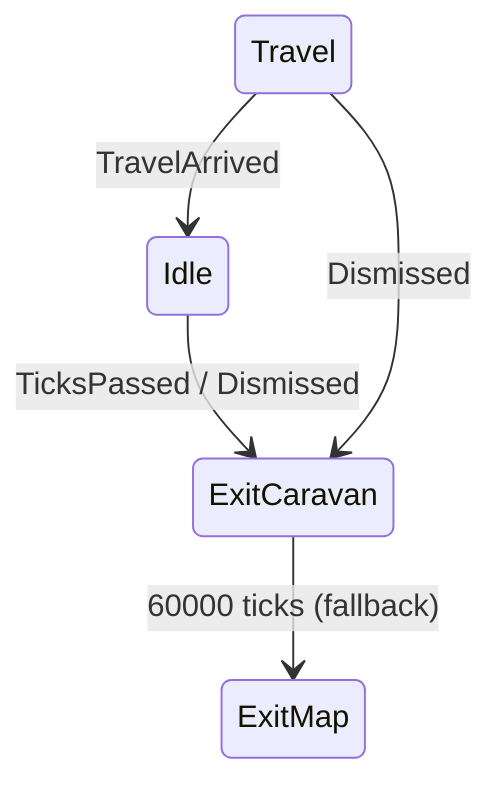

# 유랑단 캐러반 돌려보내기 로직 개선

## 바닐라 vs 현재 코드 비교 분석

### 바닐라 `LordJob_TradeWithColony` 상태 흐름




### 현재 `LordJob_WanderingCaravan` 상태 흐름




---

## 버그 #1: Travel 중 돌려보내기해도 마을까지 온 다음에야 퇴장

### 원인

바닐라 dismiss transition (transition11)에는 `TransitionAction_EndAllJobs`가 있어 전환 시 모든 pawn의 현재 Job을 강제 종료합니다. 현재 코드의 dismiss 전환들(`toExitDismissed`, `toExitDismissedFromTravel`)에는 이것이 **누락**되어 있습니다.

**바닐라** ([LordJob_TradeWithColony.cs](RimworldSource/RimWorld/LordJob_TradeWithColony.cs) 147-148행):

```csharp
transition11.AddPostAction(new TransitionAction_WakeAll());
transition11.AddPostAction(new TransitionAction_EndAllJobs());
```

**현재 코드** ([LordJob_WanderingCaravan.cs](Project/1.6/Source/WanderingTrader/LordJob_WanderingCaravan.cs) 72-76행):

```csharp
toExitDismissedFromTravel.AddPostAction(new TransitionAction_WakeAll());
// TransitionAction_EndAllJobs 누락!
```

`EndAllJobs` 없이는 Travel Job이 자연 완료될 때까지 계속 실행되므로, 캐러반이 chillSpot까지 도착한 뒤에야 ExitMap duty가 적용됩니다.

### 수정

- `toExitDismissed` (Idle -> exitCaravan): `TransitionAction_EndAllJobs` 추가
- `toExitDismissedFromTravel` (Travel -> exitCaravan): `TransitionAction_EndAllJobs` 추가

---

## 버그 #2: 맵 끝에서 계속 대기 (집결지처럼 멈춤)

### 원인

바닐라에는 `exitCaravan` 상태에서 **자기 자신으로의 self-transition** (transition12)이 있습니다:

```csharp
Transition transition12 = new Transition(exitCaravan, exitCaravan, true, true);
transition12.canMoveToSameState = true;
transition12.AddTrigger(new Trigger_PawnLost(PawnLostCondition.Undefined, null));
```

이 self-transition의 역할:

1. 리더가 맵 끝에 도달하여 ExitMap하면 `Trigger_PawnLost`가 발동
2. self-transition이 `UpdateAllDuties()`를 다시 호출
3. 리더가 이미 despawn되었으므로 fallback 로직이 작동 -> 나머지 pawn 전원에 `ExitMapBest` duty 할당
4. 나머지 pawn들이 개별적으로 맵 끝으로 이동하여 퇴장

현재 코드에는 이 self-transition이 **완전히 누락**되어 있어, 리더가 먼저 퇴장하면 나머지 pawn들의 Escort/Follow duty 타겟(리더)이 사라진 채 방치됩니다.

### 수정

[LordJob_WanderingCaravan.cs](Project/1.6/Source/WanderingTrader/LordJob_WanderingCaravan.cs)에 self-transition 추가:

```csharp
Transition exitCaravanSelfUpdate = new Transition(exitCaravan, exitCaravan, true, true);
exitCaravanSelfUpdate.canMoveToSameState = true;
exitCaravanSelfUpdate.AddTrigger(new Trigger_PawnLost(PawnLostCondition.Undefined, null));
stateGraph.AddTransition(exitCaravanSelfUpdate, false);
```

---

## 수정 대상 파일

- **[LordJob_WanderingCaravan.cs](Project/1.6/Source/WanderingTrader/LordJob_WanderingCaravan.cs)** - 2건의 수정
  1. Dismiss 전환들에 `TransitionAction_EndAllJobs` 추가 (65행, 75행 부근)
  2. `exitCaravan` self-transition 추가 (124행 부근, exitCaravanToIndividual 앞)

