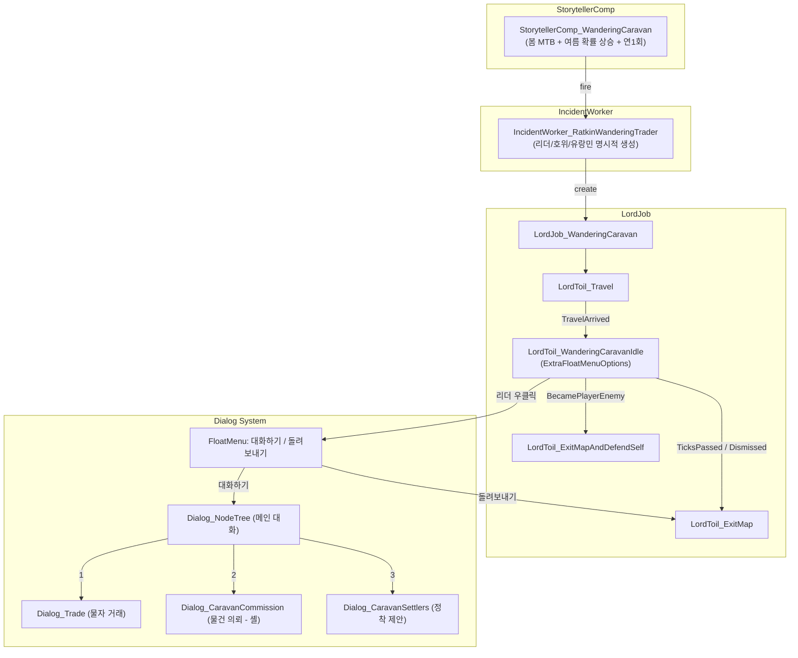

# 랫킨 캐러반 시스템 리워크 구현 계획

## 현재 상태 요약

- 4개 C# 파일: `IncidentWorker`, `FloatMenuOptionProvider`, `Dialog_WanderingTraderSettlers`, `WanderingTraderSettings`
- 바닐라 `LordJob_TradeWithColony` 사용 (구분 불가)
- "리더" 개념 없음, FloatMenu 우클릭 의존
- `baseChance=0`으로 DevMode에서만 발동
- **버그**: [DefOf.cs](Project/1.6/Source/DefOf.cs) L79의 `RK_PawnKind_WanderingMercenary`가 XML의 `RK_PawnKind_Wanderer`와 불일치

## 핵심 아키텍처




---

## Phase 1: Def 기반 작업 + DefOf 네이밍 수정

### 1-1. 네이밍 불일치 수정

- [DefOf.cs](Project/1.6/Source/DefOf.cs) L79: `RK_PawnKind_WanderingMercenary` -> `RK_PawnKind_Wanderer`
- [IncidentWorker_RatkinWanderingTrader.cs](Project/1.6/Source/WanderingTrader/IncidentWorker_RatkinWanderingTrader.cs) L22: 동일 수정
- [FloatMenuOptionProvider_WanderingTrader.cs](Project/1.6/Source/WanderingTrader/FloatMenuOptionProvider_WanderingTrader.cs) L20: 동일 수정 (Phase 6에서 파일 삭제 예정이지만 순서상 먼저 수정)

### 1-2. 새 PawnKindDef 추가

[PawnKinds_WanderingTrader.xml](Project/1.6/Defs/WanderingTrader/PawnKinds_WanderingTrader.xml)에 추가:

- `**RK_PawnKind_CaravanLeader**`: `RKBasePawnKind` 기반, Social/Intellectual 높음, `RK_Backstory_CaravanLeader` 카테고리, 교역용 의상
- `**RK_PawnKind_CaravanGuard**`: `RKCombatantBase` 기반, 경무장 근접 위주, 기존 호위병 스타일

### 1-3. 새 BackstoryDef 추가

[RK_WanderingTrader.xml](Project/1.6/Defs/WanderingTrader/RK_WanderingTrader.xml)에 추가:

- `**RK_Backstory_CaravanLeader**`: 성인기, Social 4 / Intellectual 3 / Crafting 2, spawnCategories에 `RK_Backstory_CaravanLeader` 포함

### 1-4. IncidentDef 수정

같은 파일의 IncidentDef에서:

- `baseChance`: `0` -> `1` (StorytellerComp가 제어하므로)
- `minRefireDays`: `45` 추가

### 1-5. TraderKindDef 수정

희귀 물자 StockGenerator 추가 (임시 구성):

```xml
<li Class="StockGenerator_Tag">
  <tradeTag>ExoticMisc</tradeTag>
  <countRange>1~3</countRange>
</li>
```

---

## Phase 2: 커스텀 StorytellerComp

### 2-1. 새 파일 생성

- `Project/1.6/Source/WanderingTrader/StorytellerComp_WanderingCaravan.cs`
- `Project/1.6/Source/WanderingTrader/StorytellerCompProperties_WanderingCaravan.cs`

기존 [StorytellerComp_RK_PriestJoin.cs](Project/1.6/Source/Priest/StorytellerComp_RK_PriestJoin.cs) 패턴 참고.

**핵심 로직**:

- 봄(Aprimay, 0~15일): MTB 3일 (높은 확률)
- 여름(Jugust, 0~15일): MTB 1.5일 (점차 상승)
- 여름 이후: MTB 0.5일 (거의 확정)
- `lastFireTicks`로 연 1회 제한 (60일 = 1쿼드럼 경과 체크)
- `minRefireDays` 45일로 중복 방지

### 2-2. Storyteller XML 추가

[Storytellers.xml](Project/1.6/Defs/Storytellers/Storytellers.xml)에 comp 추가:

```xml
<li Class="NewRatkin.StorytellerCompProperties_WanderingCaravan">
  <incident>RK_Incident_WanderingTrader</incident>
  <minDaysPassed>30</minDaysPassed>
  <springMtbDays>3</springMtbDays>
  <summerMtbDays>1.5</summerMtbDays>
  <fallbackMtbDays>0.5</fallbackMtbDays>
  <minRefireDays>45</minRefireDays>
</li>
```

---

## Phase 3: LordJob + LordToil

### 3-1. `LordJob_WanderingCaravan`

새 파일: `Project/1.6/Source/WanderingTrader/LordJob_WanderingCaravan.cs`

바닐라 `LordJob_TradeWithColony` 패턴 기반:

- **필드**: `Pawn leader`, `IntVec3 chillSpot`, `bool dismissed`
- **ExposeData**: Scribe_References(leader), Scribe_Values(chillSpot, dismissed)
- **CreateGraph 상태 그래프**:

```
LordToil_Travel(chillSpot)
  │
  ├─ Trigger_Memo("TravelArrived")
  ▼
LordToil_WanderingCaravanIdle
  │  - ExtraFloatMenuOptions: 대화하기, 돌려보내기
  │
  ├─ Trigger_TicksPassed(27000~45000) → 시간 초과 퇴장
  ├─ Trigger_Memo("CaravanDismissed") → 돌려보내기 퇴장
  ├─ Trigger_BecamePlayerEnemy → 적대 전환
  ├─ Trigger_PawnHarmed → 방어 모드
  └─ Trigger_PawnExperiencingDangerousTemperatures → 즉시 퇴장
  ▼
LordToil_ExitMap (퇴장)
  또는
LordToil_ExitMapAndDefendSelf (적대 시)
```

### 3-2. `LordToil_WanderingCaravanIdle`

새 파일: `Project/1.6/Source/WanderingTrader/LordToil_WanderingCaravanIdle.cs`

- `LordToil` 상속
- `UpdateAllDuties()`: 리더 Defend(chillSpot), 호위 Defend(chillSpot), 유랑민 Wander
- `**ExtraFloatMenuOptions(Pawn clickedPawn, Pawn forPawn)**` 오버라이드:
  - `clickedPawn != leader` -> yield break
  - **"대화하기"**: Dialog_NodeTree 메인 대화 오픈
  - **"돌려보내기"**: `lord.ReceiveMemo("CaravanDismissed")`

---

## Phase 4: Dialog 시스템

### 4-1. 메인 대화 (Dialog_NodeTree)

`LordToil_WanderingCaravanIdle` 내부 메서드로 구성. 별도 클래스 불필요:

```csharp
private Dialog_NodeTree CreateMainDialog(Pawn leader, Pawn colonist) {
    DiaNode root = new DiaNode("리더 인사 메시지");
    // 1. 물자 거래 -> Dialog_Trade(colonist, leader)
    // 2. 물건 의뢰 -> Dialog_CaravanCommission(leader)
    // 3. 정착 제안 -> Dialog_CaravanSettlers(leader, settlers)
    // 4. 대화 마치기 -> resolveTree
    return new Dialog_NodeTree(root, delayInteractivity: true, radioMode: false, title: "유랑단 리더");
}
```

### 4-2. `Dialog_CaravanSettlers` (리팩터링)

기존 [Dialog_WanderingTraderSettlers.cs](Project/1.6/Source/WanderingTrader/Dialog_WanderingTraderSettlers.cs)를 리팩터링:

**변경 사항**:

- 클래스명: `Dialog_WanderingTraderSettlers` -> `Dialog_CaravanSettlers`
- 가격 계산 변경: `basePawnPrice + combatPower * multiplier` -> `**MarketValue / 2`**
- 표시 정보 추가:
  - 전신 포트레이트 (기존 유지)
  - **성인기 Backstory만 공개** (`pawn.story.adulthood`)
  - **가장 높은 스킬 2가지** (열정 포함 표시)
- `WanderingTraderSettings` 의존 제거

### 4-3. `Dialog_CaravanCommission` (빈 셸)

새 파일: `Project/1.6/Source/WanderingTrader/Dialog_CaravanCommission.cs`

- `Window` 상속
- "물건 의뢰 - 준비 중" 안내 텍스트 + 닫기 버튼만
- 추후 확장 가능한 구조

---

## Phase 5: IncidentWorker 수정

[IncidentWorker_RatkinWanderingTrader.cs](Project/1.6/Source/WanderingTrader/IncidentWorker_RatkinWanderingTrader.cs) 전면 수정:

- **리더 생성**: `RK_PawnKind_CaravanLeader`로 1명 명시적 생성, `wantsToTradeWithColony = true` + TraderKind 설정
- **호위 생성**: `RK_PawnKind_CaravanGuard`로 2~4명 명시적 생성
- **유랑민 생성**: 기존 SalePawnKinds(Nomad, Wanderer)에서 3~6명 유지
- **LordJob 변경**: `LordJob_TradeWithColony` -> `LordJob_WanderingCaravan(leader, chillSpot)`
- **Letter 변경**: "유랑단이 도착했습니다. 리더에게 말을 걸어보세요"
- **PawnGroupMakerUtility 제거**: 더 이상 자동 그룹 생성 사용 안 함

---

## Phase 6: 정리 + 언어 키

### 6-1. FloatMenuOptionProvider 삭제

[FloatMenuOptionProvider_WanderingTrader.cs](Project/1.6/Source/WanderingTrader/FloatMenuOptionProvider_WanderingTrader.cs) 파일 삭제 (사용자 승인 후)

- LordToil.ExtraFloatMenuOptions에서 처리하므로 불필요

### 6-2. DefOf 업데이트

[DefOf.cs](Project/1.6/Source/DefOf.cs):

- `RK_PawnKind_WanderingMercenary` -> `RK_PawnKind_Wanderer` (Phase 1에서 처리)
- `RK_PawnKind_CaravanLeader` 추가
- `RK_PawnKind_CaravanGuard` 추가

### 6-3. 언어 키 추가

[English/Keyed/Misc_Gameplay.xml](Project/Contents/Languages/English/Keyed/Misc_Gameplay.xml), [Korean/Keyed/Misc_Gameplay.xml](Project/Contents/Languages/Korean/Keyed/Misc_Gameplay.xml):

새 키:

- `RK_WanderingCaravan_TalkToLeader` / `RK_WanderingCaravan_DismissCaravan`
- `RK_WanderingCaravan_TradeGoods` / `RK_WanderingCaravan_Commission`
- `RK_WanderingCaravan_SettleProposal` / `RK_WanderingCaravan_EndDialog`
- `RK_WanderingCaravan_LeaderGreeting` / `RK_WanderingCaravan_ArrivalLetter`
- `RK_WanderingCaravan_CommissionPlaceholder`

### 6-4. WanderingTraderSettings 보존

- 파일 삭제하지 않음 (추후 의뢰 기능에서 활용 가능)
- TraderKindDef의 modExtensions는 유지

---

## 파일 변경 요약

- **수정**: DefOf.cs, IncidentWorker_RatkinWanderingTrader.cs, Dialog_WanderingTraderSettlers.cs (-> Dialog_CaravanSettlers), PawnKinds_WanderingTrader.xml, RK_WanderingTrader.xml, Storytellers.xml, 언어 키 2개
- **신규**: LordJob_WanderingCaravan.cs, LordToil_WanderingCaravanIdle.cs, Dialog_CaravanCommission.cs, StorytellerComp_WanderingCaravan.cs, StorytellerCompProperties_WanderingCaravan.cs
- **삭제**: FloatMenuOptionProvider_WanderingTrader.cs (사용자 승인 후)
- **보존**: WanderingTraderSettings.cs

