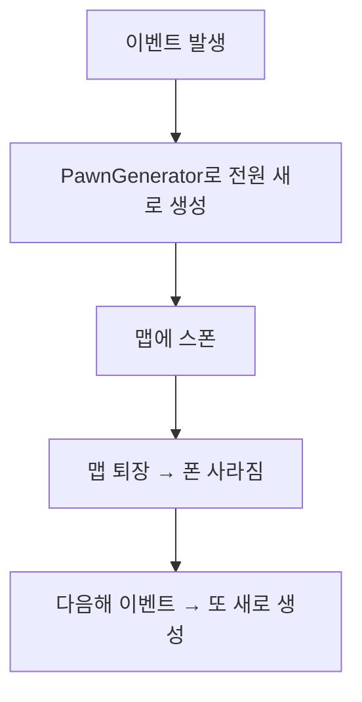
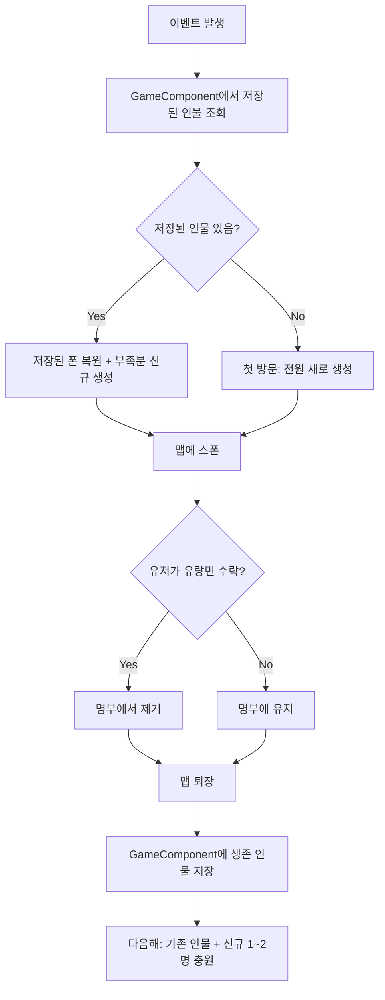

# 캐러반 영속 인물 시스템 구현 계획

## 현재 구조

현재 `IncidentWorker_RatkinWanderingTrader.TryExecuteWorker`에서는 이벤트 발생 시마다 리더/호위/유랑민을 **매번 새로 생성**하고, 이벤트 종료 후 맵에서 사라지면 데이터가 유실됩니다.




## 변경 후 구조




## 핵심 변경 사항

### 1. 새 파일: `GameComponent_WanderingCaravan.cs`

RimWorld의 `GameComponent`를 상속하여 세이브/로드 간 영속되는 캐러반 인물 명부를 관리합니다.

- **저장 데이터**:
  - `List<Pawn> rosterLeader` - 리더 (1명)
  - `List<Pawn> rosterGuards` - 호위 목록
  - `List<Pawn> rosterSettlers` - 유랑민 목록
  - `int currentYear` - 마지막 방문 연도 (연 단위 증원 판단용)
- **ExposeData**: `Scribe_Collections.Look`으로 폰 리스트 직렬화
- **핵심 메서드**:
  - `GetOrCreateRoster(map)` - 명부 조회, 없으면 초기 생성
  - `OnSettlerAccepted(pawn)` - 유저가 유랑민 수락 시 명부에서 제거
  - `OnCaravanExited()` - 퇴장 시 사망/소멸 인물 정리
  - `RefillRoster(map)` - 새해 방문 시 사망/빠진 인물 충원 (연간 증원량 제한)
  - `CleanupDeadPawns()` - 사망/파괴된 폰을 명부에서 제거 (유랑민 포함, 유저 수락 여부 무관)

### 2. 수정 파일: `IncidentDefExtension_WanderingCaravan.cs`

- `salePawnCountRange` 제거 (또는 이름 유지하되 의미 변경)
- 추가 필드:
  - `int maxSettlerCount = 5` - 유랑민 최대 수
  - `IntRange yearlyRecruitRange = new IntRange(1, 2)` - 매년 충원되는 유랑민 수 범위

### 3. 수정 파일: `IncidentWorker_RatkinWanderingTrader.cs`

`TryExecuteWorker` 로직을 다음과 같이 변경:

1. `GameComponent_WanderingCaravan`에서 명부 조회
2. 새해 여부 판단 → 사망/빠진 인물 자리를 `yearlyRecruitRange`만큼 충원 (최대 `maxSettlerCount`까지)
3. 명부의 인물들을 `WorldPawnGC` 보호 상태에서 꺼내 맵에 스폰
4. 리더/호위가 사망한 경우 새로 생성하여 교체

### 4. 수정 파일: `Dialog_CaravanSettlers.cs`

- `AcceptPawn` 시 `GameComponent_WanderingCaravan.OnSettlerAccepted(pawn)` 호출하여 명부에서 제거

### 5. 수정 파일: `LordJob_WanderingCaravan.cs`

- 캐러반이 맵을 퇴장할 때(`Cleanup` 또는 상태 전환 시) `GameComponent_WanderingCaravan.OnCaravanExited()` 호출
- 생존 인물들을 WorldPawn으로 보존 처리

### 6. 수정 파일: `Incident_WanderingTrader.xml`

```xml
<modExtensions>
  <li Class="NewRatkin.IncidentDefExtension_WanderingCaravan">
    <maxSettlerCount>5</maxSettlerCount>
    <yearlyRecruitRange>1~2</yearlyRecruitRange>
  </li>
</modExtensions>
```

### 7. csproj 등록

- `NewRatkin.csproj`에 `GameComponent_WanderingCaravan.cs` 추가

## 세부 설계: 영속 인물 라이프사이클


| 상황         | 처리                                                                 |
| ---------- | ------------------------------------------------------------------ |
| 첫 방문       | 리더 1 + 호위 2~~4 + 유랑민 1~~2명 생성, 명부에 저장                              |
| 다음해 방문     | 명부에서 사망자 제거 → yearlyRecruitRange만큼 신규 충원 (maxSettlerCount 한도) → 스폰 |
| 유저가 유랑민 수락 | 명부에서 제거 → 다음해에 빈자리 충원                                              |
| 유랑민 사망/소멸  | **유저 수락 여부와 무관하게** 명부에서 제거 → 다음해에 빈자리 충원                           |
| 리더/호위 사망   | 새로 생성하여 교체                                                         |
| 세이브/로드     | GameComponent.ExposeData로 명부 직렬화                                   |


**명부 제거 조건**: 유랑민이 죽거나 사라지면(파괴, 맵 이탈 등) 반드시 명부에서 제거된다. 유저가 수락하지 않았더라도 동일하다.

## WorldPawn 관리

맵 퇴장 시 `Find.WorldPawns.PassToWorld(pawn, PawnDiscardDecideMode.KeepForever)`로 보존하여, 다음 이벤트 때까지 GC에 의해 제거되지 않도록 합니다. 스폰 시에는 `Find.WorldPawns.RemovePawn(pawn)` 후 맵에 `GenSpawn.Spawn`합니다.