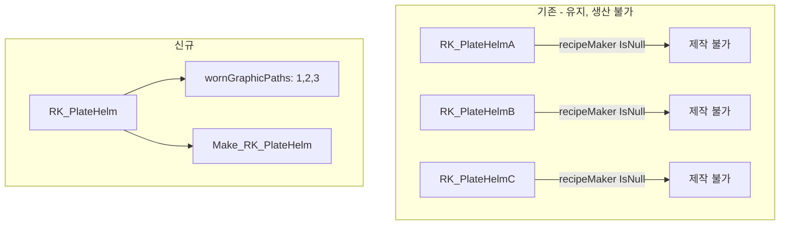

# 판금 투구 텍스처 바리에이션 통합 계획 (수정)

## 핵심 원칙

- **기존 아이템 유지**: RK_PlateHelmA, RK_PlateHelmB, RK_PlateHelmC defName 변경 없음 → 세이브 호환
- **신규 아이템 추가**: RK_PlateHelm (wornGraphicPaths로 3종 텍스처 바리에이션)
- **기존 3종 생산 중단**: recipeMaker `IsNull="True"`로 제작 불가, recipeUsers·researchPrerequisite 제거

---

## 조사 결과 요약

### 림월드 랜덤 텍스처 출력 방법 (2가지)


| 방식                   | 적용 대상       | 동작                                                | 바닐라 예시                          |
| -------------------- | ----------- | ------------------------------------------------- | ------------------------------- |
| **wornGraphicPaths** | 착용 그래픽      | `thingIDNumber % paths.Count`로 아이템별 고정 변형         | VisageMask, SliceCap (Ideology) |
| **Graphic_Random**   | 지면/인벤토리 아이콘 | 폴더 내 여러 텍스처, `thingIDNumber % subGraphics.Length` | 식물, 무기, 건물 등                    |


### 핵심 발견

1. **ApparelGraphicRecordGetter** ([RimworldSource/RimWorld/ApparelGraphicRecordGetter.cs](d:/GitProject/Ratkin/RimworldSource/RimWorld/ApparelGraphicRecordGetter.cs) 42행)는 worn 그래픽을 **항상 Graphic_Multi**로 로드함. `wornGraphicPath` 자체는 Graphic_Random을 지원하지 않음.
2. **wornGraphicPaths** (복수형)가 정답: [Apparel.cs](d:/GitProject/Ratkin/RimworldSource/RimWorld/Apparel.cs) 49-51행에서 `thingIDNumber % wornGraphicPaths.Count`로 경로를 선택. 각 아이템이 생성될 때 ID에 따라 3가지 중 하나가 **고정** 배정됨.
3. 바닐라 참조: [Ideology Apparel_Headgear.xml](d:/GitProject/Ratkin/RimworldData/Ideology/Defs/ThingDefs_Misc/Apparel_Headgear.xml) 125-129행 (VisageMask), 183-187행 (SliceCap).

---

## 변경 전/후 구조




### 수정 대상 파일


| 파일                                                                                                    | 변경 내용                                               |
| ----------------------------------------------------------------------------------------------------- | --------------------------------------------------- |
| [Apparel_Armor.xml](d:/GitProject/Ratkin/Project/1.6/Defs/ThingsDefs/Apparel_Armor.xml)               | 기존 A/B/C에 recipeMaker IsNull 추가, 신규 RK_PlateHelm 추가 |
| [Races_Rakinlike.xml](d:/GitProject/Ratkin/Project/1.6/Defs/ThingsDefs_Races/Races_Rakinlike.xml)     | alloyApparel 3종 → RK_PlateHelm 1종 교체                |
| [PawnKinds_Player.xml](d:/GitProject/Ratkin/Project/1.6/Defs/PawnKindDef_Ratkin/PawnKinds_Player.xml) | RK_PlateHelmB → RK_PlateHelm                        |
| [Armor_Unique](d:/GitProject/Ratkin/Project/Odyssey/Defs/ThingDefs_Items/Armor_Unique)                | 3개 Unique → 1개, ParentName 변경                       |
| 언어 파일 (5개)                                                                                            | ThingDef/RecipeDef 라벨 3개 → 1개로 통합                   |


### Apparel_Armor.xml 상세

**1. 기존 A/B/C에 생산 비활성화**: 각 ThingDef에 `recipeMaker Inherit="False" IsNull="True"` 추가 (recipeUsers, researchPrerequisite 제거 효과)

**2. 신규 RK_PlateHelm 추가**: wornGraphicPaths 3종, recipeMaker는 부모 상속으로 제작 가능

---

## 선택 사항: 지면 아이콘도 랜덤 (Graphic_Random)

지면에 떨어진 아이템/인벤토리 아이콘까지 랜덤으로 보이게 하려면:

1. **폴더 구조**: `Project/Textures/Apparel/RK_PlateHelmet/` 생성 후 `RK_PlateHelmet1`, `RK_PlateHelmet2`, `RK_PlateHelmet3` 이동
2. **graphicData**:

```xml
   <texPath>Apparel/RK_PlateHelmet</texPath>
   <graphicClass>Graphic_Random</graphicClass>
   

```

Graphic_Collection은 폴더 내 텍스처를 스캔해 subGraphics를 생성함. 텍스처 파일 이동/재구성이 필요함.

---

## 주의사항

- **기존 세이브**: defName 유지로 기존 아이템 정상 동작. recipeMaker IsNull 시 Make_RK_PlateHelmA/B/C 레시피는 제거됨.
- **언어 키**: RK_PlateHelm, Make_RK_PlateHelm 신규 추가. 기존 A/B/C 키는 레거시 툴팁용 유지.

