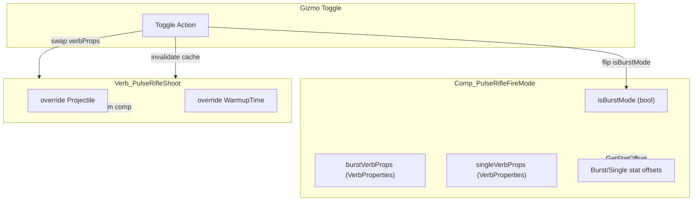

# Prototype Pulse Rifle 발사 모드 토글 구현

## 설계 개요

BFR의 `Comp_BFRAmmoToggle` + `Verb_BFRShoot` + `BFRGizmoPatch` 패턴을 참고하되, 이번에는 **탄환 + VerbProperties(range, burstShotCount, ticksBetweenBurstShots, warmupTime) + StatBases(Accuracy, Cooldown)** 까지 모드에 따라 변경해야 합니다.

## 핵심 기술 분석

림월드 엔진에서 각 값이 어디서 읽히는지:

- **Projectile**: `Verb_LaunchProjectile.Projectile` (virtual) -- Verb에서 override 가능
- **burstShotCount / ticksBetweenBurstShots**: `Verb.BurstShotCount` / `Verb.TicksBetweenBurstShots` -- **캐시됨**, 한 번 읽으면 null로 리셋되지 않음. Harmony Prefix로 우회하거나, 커스텀 Verb에서 `verbProps` 자체를 교체해야 함
- **range**: `VerbProperties.AdjustedRange()` 에서 `verbProps.range` 직접 참조
- **warmupTime**: `Verb.WarmupTime` (virtual) -- `Verb_LaunchProjectile`에서 override됨
- **AccuracyTouch/Short/Medium/Long, RangedWeapon_Cooldown**: `StatWorker`에서 `ThingComp.GetStatOffset()` 호출 -- Comp에서 override 가능

## 구현 전략

**verbProps 교체 방식**: 모드 전환 시 Verb의 `verbProps` 필드를 통째로 교체합니다. 두 벌의 `VerbProperties` 객체를 Comp에 보관하고, 토글 시 현재 Verb의 `verbProps`를 교체 + 캐시 무효화(Reflection으로 `cachedBurstShotCount`, `cachedTicksBetweenBurstShots`를 null로 설정).

## 파일별 작업 내역

### 1. 새 C# 파일: `Project/1.6/Source/PrototypePulseRifle/CompProperties_PulseRifleFireMode.cs`

CompProperties 정의 -- XML에서 두 모드의 설정값을 받음:

- `projectileBurst` / `projectileSingle`: 각 모드의 탄환 ThingDef
- `burstVerbProps` / `singleVerbProps`: 각 모드의 VerbProperties (range, burstShotCount, ticksBetweenBurstShots, warmupTime)
- `accuracyOffsetsBurst` / `accuracyOffsetsSingle`: 각 모드의 Accuracy/Cooldown stat offset 값들
- `iconPathBurst` / `iconPathSingle`: 아이콘 경로 (기존 `RK_Icon_BurstShot`, `RK_Icon_Snipe` 활용)

### 2. 새 C# 파일: `Project/1.6/Source/PrototypePulseRifle/Comp_PulseRifleFireMode.cs`

ThingComp 구현:

- `isBurstMode` 상태 저장/로드 (ExposeData)
- `CurrentProjectile` 프로퍼티
- `GetToggleGizmos()`: 모드 전환 Gizmo
  - 전환 시 Verb의 `verbProps` 교체
  - Reflection으로 `cachedBurstShotCount`, `cachedTicksBetweenBurstShots` null 처리
  - 조준 중이면 `CancelBusyStanceSoft()` 호출
- `GetStatOffset(StatDef stat)` override: 현재 모드에 따라 AccuracyTouch/Short/Medium/Long, RangedWeapon_Cooldown offset 반환
- `ShouldShowGizmo()`: BFR과 동일한 패턴
- `ApplyVerbProps()`: 현재 모드에 맞는 verbProps를 Verb에 적용하는 메서드 (PostSpawnSetup, 로드 후에도 호출)

### 3. 새 C# 파일: `Project/1.6/Source/PrototypePulseRifle/Verb_PulseRifleShoot.cs`

`Verb_Shoot` 상속:

- `override Projectile`: Comp에서 `CurrentProjectile` 가져오기 (BFR 패턴 동일)

### 4. 기존 파일 수정: `BFRGizmoPatch.cs` 확장 또는 별도 패치 생성

`CompEquippable.CompGetEquippedGizmosExtra`에 `Comp_PulseRifleFireMode`의 Gizmo도 추가되도록 패치. BFR 패치를 일반화하거나, 별도 패치 클래스 생성.

-> **별도 패치 클래스** `PulseRifleGizmoPatch.cs`를 만드는 것이 깔끔 (BFR 코드 변경 최소화)

### 5. XML 수정: `Weapon_Range.xml`

**RK_PrototypePulseRifle ThingDef 수정**:

- `<comps>` 섹션 추가: `Comp_PulseRifleFireMode` 등록 (두 모드의 설정값 포함)
- `<verbs>` 수정: `verbClass`를 `NewRatkin.Verb_PulseRifleShoot`로 변경
- 기존 `statBases`의 Accuracy/Cooldown 값은 **기본 모드(3점사)** 기준으로 설정

**탄환 ThingDef 추가**: 기존 `Bullet_RK_PrototypePulseRifleLight`를 복사하여 단발 모드용 `Bullet_RK_PrototypePulseRifleSingle` 생성 (데미지/관통력 조정은 나중에)

## 두 모드 스탯 설계 (초안)

| 항목                     | 3점사 (Burst)   | 단발 (Single)  |
| ---------------------- | ------------- | ------------ |
| burstShotCount         | 3 (기존 2에서 변경) | 1            |
| ticksBetweenBurstShots | 10            | 0            |
| range                  | 31            | 31           |
| warmupTime             | 1.5           | 2.0          |
| defaultProjectile      | Light (기존)    | Heavy (기존)   |
| AccuracyTouch          | 0.75 (base)   | offset -0.10 |
| AccuracyShort          | 0.85 (base)   | offset -0.10 |
| AccuracyMedium         | 0.65 (base)   | offset +0.15 |
| AccuracyLong           | 0.45 (base)   | offset +0.25 |
| RangedWeapon_Cooldown  | 1.5 (base)    | offset +0.5  |

(정확한 밸런스 값은 구현 후 조정 가능)

## 파일 목록 요약

| 작업  | 파일 경로                                                                         |
| --- | ----------------------------------------------------------------------------- |
| 신규  | `Project/1.6/Source/PrototypePulseRifle/CompProperties_PulseRifleFireMode.cs` |
| 신규  | `Project/1.6/Source/PrototypePulseRifle/Comp_PulseRifleFireMode.cs`           |
| 신규  | `Project/1.6/Source/PrototypePulseRifle/Verb_PulseRifleShoot.cs`              |
| 신규  | `Project/1.6/Source/PrototypePulseRifle/PulseRifleGizmoPatch.cs`              |
| 수정  | `Project/1.6/Defs/ThingsDefs/Weapon_Range.xml` (무기 Def + 탄환 복사)               |

