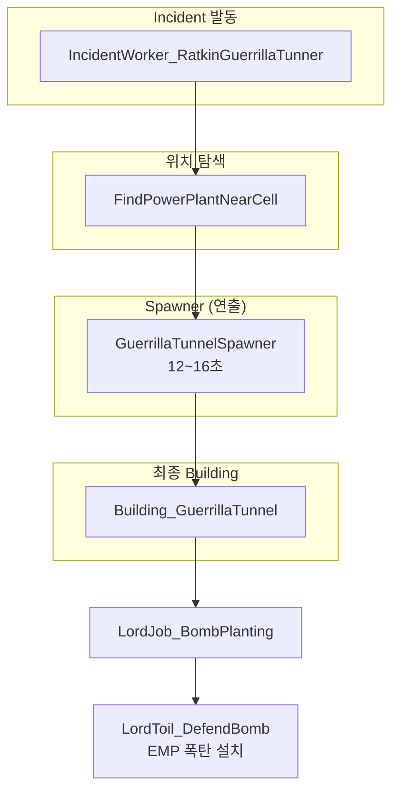
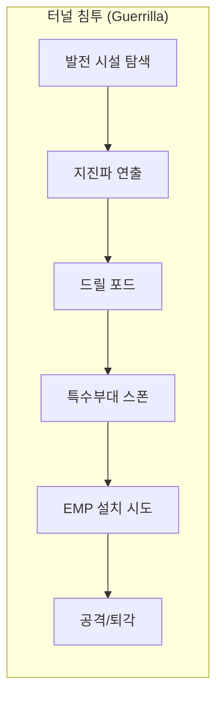
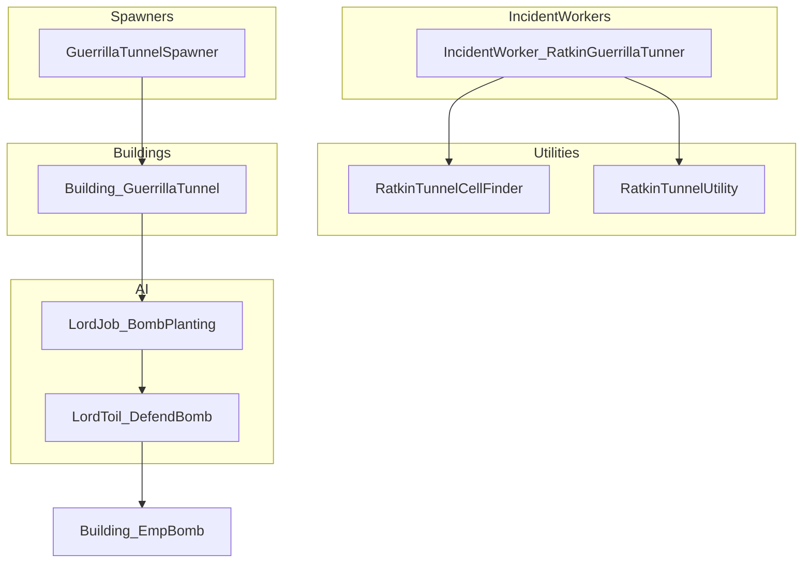
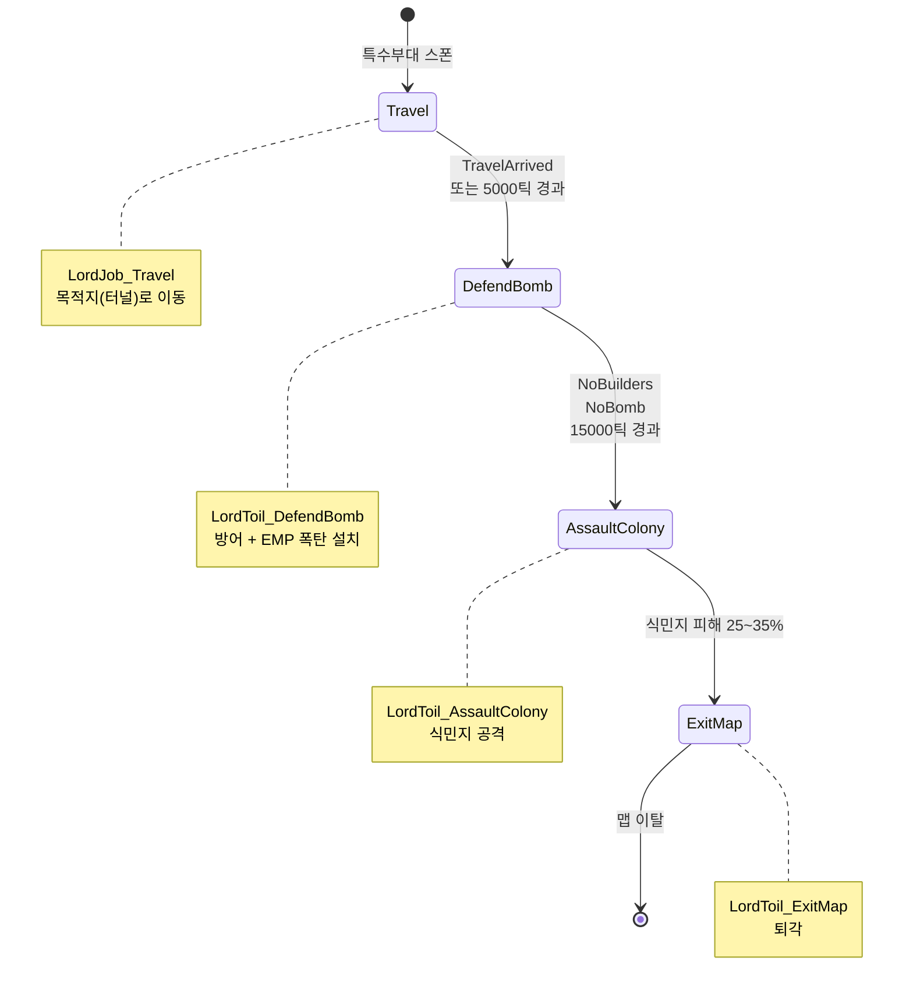
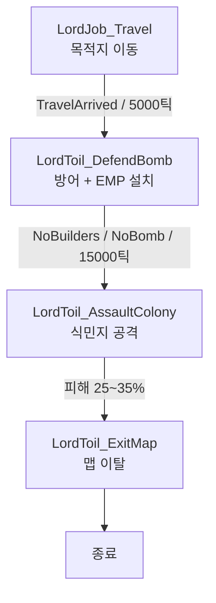

# Ratkin 게릴라 터널 이벤트 구성 보고서

## 개요

랫킨 모드의 터널 관련 이벤트는 **게릴라 터널**만 구성되어 있다.

- **터널 침투 (Guerrilla)**: 발전 시설 근처에 특수부대가 침투하여 EMP 폭탄 설치 시도

---

## 1. 이벤트(Incident) 구성

| IncidentDef              | Worker 클래스                             | 목표       | 발동 조건                          |
| ------------------------ | -------------------------------------- | -------- | ------------------------------ |
| `RatkinTunnel_Guerrilla` | `IncidentWorker_RatkinGuerrillaTunner` | 발전 시설 파괴 | 랫킨 적대 + 발전 시설 존재 + 기존 터널 2개 미만 |

---

## 2. 클래스/컴포넌트 관계도

### 2.1 Incident → Spawner → Building 플로우

### 2.2 전체 이벤트 흐름 (Guerrilla)

### 2.3 클래스 의존 관계

---

## 3. ThingDef ↔ 클래스 매핑

| ThingDef                    | thingClass                 | 역할                    |
| --------------------------- | -------------------------- | --------------------- |
| `RK_GuerrillaTunnelSpawner` | `GuerrillaTunnelSpawner`   | 지진파 연출 후 드릴 포드로 전환    |
| `RK_GuerrillaTunnel`        | `Building_GuerrillaTunnel` | 특수부대 스폰, LordJob 관리   |
| `RK_EmpBomb`                | `Building_EmpBomb`         | EMP 폭탄 (Guerrilla 전용) |

---

## 4. RatkinGuerrilla 폴더 파일 구성

| 파일                                        | 주요 클래스                                                             | 역할                                 |
| ----------------------------------------- | ------------------------------------------------------------------ | ---------------------------------- |
| `IncidentWorker_RatkinGuerrillaTunner.cs` | IncidentWorker                                                     | 터널 침투 이벤트 처리                       |
| `CellFinder.cs`                           | RatkinTunnelCellFinder                                             | 발전 시설 위치 탐색                  |
| `TunnelSpawner.cs`                        | GuerrillaTunnelSpawner                                             | 터널 스폰 연출 및 최종 건물 생성                |
| `Building_Tunnel.cs`                      | Building_GuerrillaTunnel                                            | 터널 건물 로직                           |
| `RatkinTunnelUtility.cs`                  | RatkinTunnelUtility                                                | 스폰 가능 PawnKind, Filth 타입, 유틸 함수    |
| `LordJob_DefendBomb.cs`                   | LordJob_BombPlanting                                               | 특수부대 AI 상태 그래프 (이동→방어/EMP설치→공격→퇴각) |
| `LordToil_DefendBomb.cs`                  | LordToil_DefendBomb, LordToilData_DefendBomb                       | EMP 폭탄 설치 및 방어 Toil                |
| `Building_EmpBomb.cs`                     | Building_EmpBomb, Comp_CountDown, Comp_Emp, GameComponent_EMPCheck | EMP 폭탄 및 후속 부대 이벤트                 |
| `Mote_CountDown.cs`                       | Mote_CountDown                                                     | 카운트다운 시각 효과                        |
| `Graphic_CountDown.cs`                    | Graphic_CountDown                                                  | 카운트다운 그래픽                          |
| `Verb_MeleeExplosion.cs`                  | (Verb 관련)                                                          | 근접 폭발 Verb                         |
| `IncidentWorker_AfterRaid.cs`             | IncidentWorker                                                     | EMP 폭발 후 후속 부대 이벤트                 |

---

## 5. LordJob_BombPlanting 상태 흐름

### 5.1 상태 다이어그램

### 5.2 플로우차트

---

## 6. 의존 Def 참조

| Def 타입      | 사용 Def                                                                                                     |
| ----------- | ---------------------------------------------------------------------------------------------------------- |
| FactionDef  | `RatkinFactionDefOf.Rakinia`                                                                               |
| PawnKindDef | `RatkinEliteSoldier`, `RatkinDemonMan`                                                                     |
| ThingDef    | `RK_GuerrillaTunnel`, `RK_GuerrillaTunnelSpawner`, `RK_EmpBomb` |
| IncidentDef | `RatkinTunnel_Guerrilla`, `RatkinFollowUpTroops`                                     |

---

## 7. Def 파일 위치

- **Incident**: `Project/1.6/Defs/Incident_Defs/Incident_Def.xml`
- **ThingDef (터널/EMP)**: `Project/1.6/Defs/ThingDefs_Building/Buildings_RatkinTunnel.xml`

---

## 8. 요약

- **Guerrilla**: 발전 시설 → 지진파 연출 → 드릴 포드 → 특수부대 스폰 → EMP 설치 시도 → 공격/퇴각
- `RatkinTunnelUtility.TotalSpawnedTunnelCount(map) < 2`로 동시 터널 수 제한

