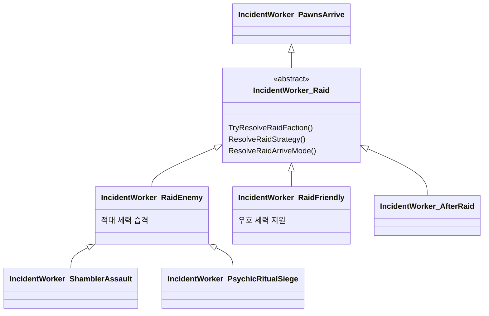

<!-- Raid Incident Types Analysis Report RimWorld 62_Raid_Incident_Flow -->

# Raid 관련 Incident 유형 보고서

## 개요

RimWorld 및 Ratkin 프로젝트에서 **Raid 관련 Incident**의 유형을 분류·정리한 보고서입니다.  
분석 대상: Core, Royalty, Ideology, Biotech, Anomaly, Odyssey DLC 및 Project Defs.

---

## 1. 핵심 Raid Incident (IncidentWorker_Raid 계열)

| defName | label | Worker | 출처 | 비고 |
|---------|-------|--------|------|------|
| **RaidEnemy** | enemy raid | IncidentWorker_RaidEnemy | Core | 적대 세력 습격 (기본형) |
| **RaidFriendly** | friendly raid | IncidentWorker_RaidFriendly | Core | 우호 세력 지원 |
| **ShamblerAssault** | shambler assault | IncidentWorker_ShamblerAssault | Anomaly | Shambler 습격 (RaidEnemy 상속) |
| **PsychicRitualSiege** | psychic ritual siege | IncidentWorker_PsychicRitualSiege | Anomaly | 사이킥 의식 공성 (RaidEnemy 상속) |
| **RatkinTunnel_Guerrilla** | ratkin tunnel guerrilla | IncidentWorker_RatkinGuerrillaTunner | Project | 랫킨 터널 게릴라 |
| **RatkinFollowUpTroops** | 후속 부대 | IncidentWorker_AfterRaid | Project | EMP 후 후속 부대 (Raid 상속) |

---

## 2. Raid 유사 Incident (적 공격형)

| defName | label | Worker | 출처 | 비고 |
|---------|-------|--------|------|------|
| **Ambush** | ambush | IncidentWorker_Ambush_EnemyFaction | Core (Caravan) | 상단 매복 (적 세력) |
| **ManhunterAmbush** | manhunter ambush | IncidentWorker_Ambush_ManhunterPack | Core (Caravan) | 상단 매복 (맹수) |

---

## 3. Raid 스타일 Entity 공격 (Anomaly DLC)

| defName | label | Worker | 비고 |
|---------|-------|--------|------|
| **ShamblerSwarm** | shambler swarm | IncidentWorker_ShamblerSwarm | Shambler 무리 |
| **ShamblerSwarmAnimals** | shambler swarm | IncidentWorker_ShamblerSwarmAnimals | 동물 Shambler |
| **SmallShamblerSwarm** | shambler swarm | IncidentWorker_ShamblerSwarmSmall | 소규모 Shambler |
| **SightstealerSwarm** | sightstealer swarm | IncidentWorker_SightstealerSwarm | Sightstealer 무리 |
| **GhoulAttack** | Ghoul attacking | IncidentWorker_GhoulAttack | 구울 공격 |
| **Revenant** | revenant | IncidentWorker_Revenant | 레버넌트 |
| **SightstealerArrival** | sightstealer arrival | IncidentWorker_SightstealerArrival | Sightstealer 도착 |
| **HateChanters** | hate chanters | IncidentWorker_HateChanters | 증오 찬송가 |
| **FleshbeastAttack** | fleshbeast attack | IncidentWorker_FleshbeastAttack | 플레시비스트 |
| **GorehulkAssault** | gorehulk assault | IncidentWorker_GorehulkAssault | 고어헐크 |
| **DevourerAssault** | devourer assault | IncidentWorker_DevourerAssault | 데바우어 |
| **DevourerWaterAssault** | (devourer water) | IncidentWorker_DevourerWaterAssault | 수중 데바우어 |
| **ChimeraAssault** | chimera assault | IncidentWorker_ChimeraAssault | 키메라 |

---

## 4. Raid와 연동되는 Incident

| 구분 | defName | 설명 |
|------|---------|------|
| **Quest/시나리오** | RaidEnemy | 퀘스트, TimedDetectionRaids, SitePartWorker_RaidSource 등에서 사용 |
| **Map_RaidBeacon** | RaidEnemy, RaidFriendly | 우주선 발사 등 특수 맵에서 습격 유도 |
| **능력** | CompAbilityEffect_RaidEnemy | 적 습격 유도 능력 |
| **퀘스트 스크립트** | Util_Raid, Util_RaidDelayRepeatable | 퀘스트 내 Raid 유틸리티 |

---

## 5. Worker 상속 구조

---

## 6. 유형별 요약

| 유형 | Incident 수 | 비고 |
|------|-------------|------|
| 핵심 Raid (Raid 계열) | 6 | RaidEnemy, RaidFriendly, ShamblerAssault, PsychicRitualSiege, RatkinTunnel_Guerrilla, RatkinFollowUpTroops |
| Raid 유사 (Ambush) | 2 | 상단 전용, Raid와 별도 Worker |
| Entity 공격 (Anomaly) | 13 | Raid 스타일 위협 |

---

## 7. 관련 문서

- [62_Raid_Incident_Flow_Analysis.md](../Archive/62_Raid_Incident_Flow_Analysis.md) - RaidEnemy 흐름 상세 분석
- [109_Guerrilla_Tunnel_Event_Structure_Report.md](109_Guerrilla_Tunnel_Event_Structure_Report.md) - Ratkin 게릴라 터널 이벤트 구성
