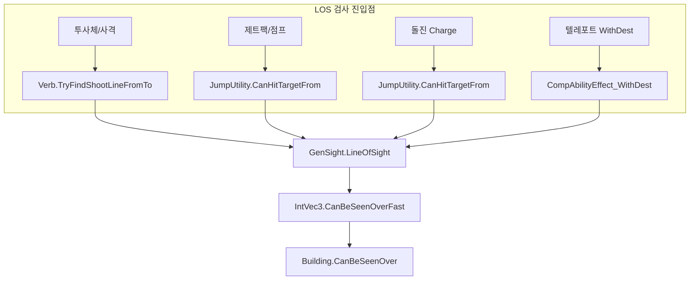

# LOS (Line of Sight) 관련 로직 분석 보고서

> **태그**: LOS LineOfSight GenSight 시야 투사체 Projectile Ability 점프 제트팩 Jump Verb CanHitTarget requireLineOfSight  
> **목적**: LOS 관련 함수·로직 정리 및 투사체/어빌리티 시전 시 시야 검증 흐름 파악  
> **분석 대상**: RimworldSource GenSight, Verb, JumpUtility, 제트팩·돌진·투사체 LOS 검사

---

## 1. 핵심 유틸리티 – GenSight (Verse/GenSight.cs)

LOS 판정의 기본 클래스. Bresenham 라인 알고리즘으로 두 지점 사이 경로를 검사하며, 각 셀에 대해 `CanBeSeenOverFast`로 차단 여부를 확인한다.

### 1.1 주요 함수


| 함수                                                                                 | 용도                                              |
| ---------------------------------------------------------------------------------- | ----------------------------------------------- |
| `LineOfSight(start, end, map, skipFirstCell, validator, halfXOffset, halfZOffset)` | 두 셀 간 LOS 여부 (경로 상 모든 셀 `CanBeSeenOverFast` 검사) |
| `LineOfSight(start, end, map, startRect, endRect, validator, forLeaning)`          | Rect 기반 LOS (기울기 사격 등)                          |
| `LineOfSightToThing(start, thing, map, skipFirstCell, validator)`                  | Thing의 OccupiedRect 전체에 대해 LOS 확인               |
| `LineOfSightToEdges(start, end, map, skipFirstCell, validator)`                    | 셀 모서리까지 LOS (4방향 오프셋 시도)                        |
| `PointsOnLineOfSight(start, end)`                                                  | LOS 경로 상 모든 셀 열거                                |
| `LastPointOnLineOfSight(start, end, validator, skipFirstCell)`                     | LOS 상 마지막 유효 지점 반환 (화염 확산 등)                    |


### 1.2 GenSight.LineOfSight 내부 동작

```csharp
// GenSight.cs - 핵심 검사
while (i > 1) {
    intVec.x = num3; intVec.z = num4;
    if (!skipFirstCell || intVec != start) {
        if (!intVec.CanBeSeenOverFast(map))  // ← 벽/건물 차단 여부
            return false;
        if (validator != null && !validator(intVec))
            return false;
    }
    // Bresenham 진행...
}
return true;
```

---

## 2. LOS 차단 판정 – GenGrid / Building

### 2.1 셀·건물 시야 통과 여부


| 함수                               | 위치         | 용도                         |
| -------------------------------- | ---------- | -------------------------- |
| `IntVec3.CanBeSeenOver(map)`     | GenGrid.cs | 셀 위를 볼 수 있는지 (InBounds 포함) |
| `IntVec3.CanBeSeenOverFast(map)` | GenGrid.cs | 빠른 버전 (InBounds 생략)        |
| `Building.CanBeSeenOver()`       | GenGrid.cs | 건물이 LOS를 막는지               |


### 2.2 Building.CanBeSeenOver 로직

```csharp
// GenGrid.cs
public static bool CanBeSeenOver(this Building b) {
    if (b.def.Fillage != FillCategory.Full)
        return true;  // 비어있거나 반채움 → 통과
    Building_Door door = b as Building_Door;
    return door != null && door.Open;  // 문은 열려있으면 통과
}
```

- `FillCategory.Full` 건물(벽 등) → LOS 차단
- 문은 열려 있으면 통과

---

## 3. 투사체 / 사격 – Verb.TryFindShootLineFromTo

**위치**: `Verse/Verb.cs` 916~971줄

### 3.1 호출 흐름

```
TryFindShootLineFromTo(root, targ, out resultingLine, ignoreRange)
  │
  ├─ verbProps.requireLineOfSight == false → 바로 true 반환
  │
  ├─ CasterIsPawn
  │   ├─ CanHitFromCellIgnoringRange(root, targ) → 직선 LOS
  │   └─ 실패 시 ShootLeanUtility.LeanShootingSourcesFromTo
  │       └─ 인접 셀에서 Lean 사격 가능 여부 시도
  │
  └─ CanHitCellFromCellIgnoringRange
       └─ GenSight.LineOfSight(sourceSq, targetLoc, map, true, null, 0, 0)
           또는 LineOfSightToEdges (Thing 크기 2x2 이상)
```

### 3.2 VerbProperties.requireLineOfSight

- **기본값**: `true` (VerbProperties.cs 49줄)
- `false`이면 LOS 검사 없이 사격 가능 (예: 포격, 터렛 일부)

### 3.3 사용하는 Verb 클래스


| Verb 클래스              | 용도              |
| --------------------- | --------------- |
| Verb_LaunchProjectile | 투사체 발사 전 LOS 확인 |
| Verb_ShootBeam        | 빔 사격            |
| Verb_Spray            | 스프레이 사격         |


### 3.4 TryStartCast 시 LOS 검사

```csharp
// Verb.cs 509줄 - Warmup 시작 시
if (!this.TryFindShootLineFromTo(this.caster.Position, castTarg, out newShootLine, false))
    return false;  // LOS 없으면 시전 불가
```

---

## 4. 점프 / 제트팩 – JumpUtility (RimWorld/JumpUtility.cs)

### 4.1 CanHitTargetFrom

```csharp
public static bool CanHitTargetFrom(Pawn pawn, IntVec3 root, LocalTargetInfo targ, float range) {
    float num = range * range;
    IntVec3 cell = targ.Cell;
    return (float)pawn.Position.DistanceToSquared(cell) <= num 
        && GenSight.LineOfSight(root, cell, pawn.Map);  // ← LOS 검사
}
```

- 사거리 제곱 + `GenSight.LineOfSight`로 시야 확인
- 벽 너머 셀은 LOS 실패 → 점프 불가

### 4.2 ValidJumpTarget (LOS 미검사)

- Impassable, Fogged, Walkable, 문 상태 등만 검사
- LOS는 `CanHitTargetFrom`에서만 검사

### 4.3 Verb_Jump / Verb_CastAbilityJump


| 항목               | 내용                                                                      |
| ---------------- | ----------------------------------------------------------------------- |
| DrawHighlight    | `GenSight.LineOfSight(caster.Position, c, map) && ValidJumpTarget(...)` |
| CanHitTargetFrom | `JumpUtility.CanHitTargetFrom(...)`                                     |
| OrderJump        | `ValidJumpTarget` + `CanHitTargetFrom` 둘 다 만족하는 셀만 선택                   |


**제트팩 점프**: 벽 너머는 LOS 실패 → 점프 불가.

---

## 5. 어빌리티 – requireLineOfSight (Def)

### 5.1 AbilityDef / VerbProperties

```xml
<verbProperties>
  <requireLineOfSight>true</requireLineOfSight>
</verbProperties>
```

- AbilityDef UI: `AbilityRequiresLOS` ("시야 필요")
- AbilityDef.cs 434줄: 스탯 표시용

### 5.2 CompAbilityEffect LOS 사용


| 컴포넌트                          | LOS 검사 방식                                                                       |
| ----------------------------- | ------------------------------------------------------------------------------- |
| CompAbilityEffect_WithDest    | `Props.requiresLineOfSight` → `GenSight.LineOfSight(target.Cell, intVec2, map)` |
| CompAbilityEffect_Chunkskip   | 텔레포트 시 `GenSight.LineOfSight(cell, target, map, true, null, 0, 0)`              |
| CompAbilityEffect_Waterskip   | `GenSight.LineOfSightToEdges(target.Cell, intVec, map, true, null)`             |
| CompAbilityEffect_FireSpew    | `verb.TryFindShootLineFromTo(pawn.Position, c, out shootLine, false)`           |
| CompAbilityEffect_SprayLiquid | `verb.TryFindShootLineFromTo(Pawn.Position, first2, out shootLine, true)`       |
| CompAbilityEffect_Burner      | `GenSight.LastPointOnLineOfSight(start, end, c.CanBeSeenOverFast(map), true)`   |


---

## 6. 프로젝트(Ratkin) 내 LOS 사용처


| 파일                                    | 용도                                                                   |
| ------------------------------------- | -------------------------------------------------------------------- |
| Verb_CastAbilityCharge.cs             | `JumpUtility.CanHitTargetFrom` → `GenSight.LineOfSight` (돌진 시야 검사)   |
| Verb_GunlanceFiring.cs                | `GenSight.LineOfSight(target, cell, map, true)` – 폭발 범위 내 LOS 필터     |
| CompAbilityEffect_WyvernFireBurner.cs | `GenSight.LastPointOnLineOfSight` + `CanBeSeenOverFast` validator    |
| LordJob_PrayerService.cs              | `GenSight.LineOfSight(x, spot, map, skipFirstCell: true)` – 기도 장소 선택 |


---

## 7. 요약 다이어그램




---

## 8. 정리


| 구분                       | LOS 검사 함수                         | 비고                           |
| ------------------------ | --------------------------------- | ---------------------------- |
| **투사체/사격**               | `Verb.TryFindShootLineFromTo`     | verbProps.requireLineOfSight |
| **제트팩/점프**               | `JumpUtility.CanHitTargetFrom`    | GenSight.LineOfSight         |
| **돌진(HeavyLanceCharge)** | `JumpUtility.CanHitTargetFrom`    | 동일                           |
| **텔레포트 WithDest**        | `CompAbilityEffect_WithDest`      | Props.requiresLineOfSight    |
| **화염/버너**                | `GenSight.LastPointOnLineOfSight` | CanBeSeenOverFast validator  |


제트팩 점프처럼 LOS가 필요한 어빌리티는 모두 `JumpUtility.CanHitTargetFrom` 또는 `Verb.TryFindShootLineFromTo`를 통해 `GenSight.LineOfSight`를 사용하며, 벽 너머는 기본적으로 타겟팅/이동이 불가능하다.