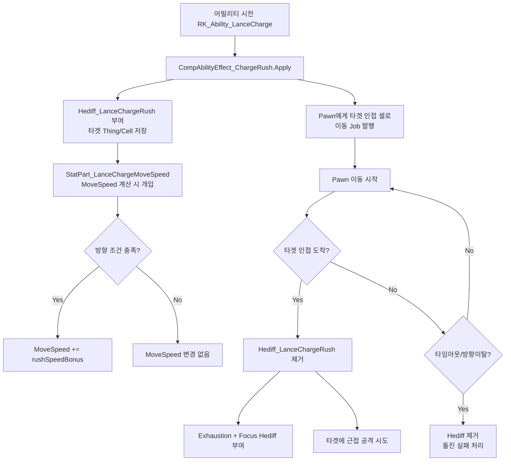

# HeavyLance 돌진 개선 제안서: 방향성 이동속도 증가 시스템

> **태그**: HeavyLance LanceCharge MoveSpeed Hediff DirectionalSpeed Ability Charge Proposal StatPart pather Destination  
> **목적**: PawnFlyer(비행) 방식 대신 "타겟 방향 이동속도 증가" 방식으로 돌진 로직 전면 개편  
> **관련 리포트**: 112, 113, 114

---

## 1. 현재 문제점

### 1.1 기존 구현 (PawnFlyer 방식)
- 어빌리티 시전 → `JumpUtility.DoJump` → `PawnFlyer` 생성 → 캐릭터가 "날아감"
- 비행 중 캐릭터가 `innerContainer`에 담겨 **무적 상태**가 됨
- 짧은 거리(2.9칸) 돌진인데 무적이 되는 것은 밸런스/연출 모두 부자연스러움
- `GetAbility(includeTemporary:false)` 문제로 착지 후 Hediff 적용 실패 (리포트 #112)

### 1.2 원하는 동작
- 어빌리티 시전 → **이동속도 대폭 증가** → 캐릭터가 직접 걸어서/달려서 돌진
- **타겟을 향해 이동할 때만** 속도 증가 (다른 방향 이동 시 효과 없음)
- 무적 없이 자연스러운 돌진 연출
- 도착 후 기존 Exhaustion/Focus Hediff 적용

---

## 2. 구현 방안 비교

### 방안 A: Hediff + StatPart 조합 (권장)

**개요**: 커스텀 Hediff에 타겟 정보를 저장하고, StatPart에서 MoveSpeed 계산 시 방향 조건을 검사하여 속도 증가를 적용.

**구조**:

```
어빌리티 시전
  → CompAbilityEffect에서 커스텀 Hediff 부여 (타겟 정보 포함)
  → Pawn에게 타겟 위치로 이동 명령
  → StatPart_LanceChargeMoveSpeed가 매 틱 MoveSpeed 계산 시:
      Hediff 존재 + pawn.pather.Destination이 타겟 방향 → 속도 증가
  → 타겟 인접 도착 시 Hediff 제거 + Exhaustion/Focus 부여
```

**필요 클래스**:

| 클래스 | 역할 |
|--------|------|
| `Hediff_LanceChargeRush` | 커스텀 Hediff. 타겟 Thing/Cell 저장, 도착 감지, 타임아웃 |
| `HediffComp_LanceChargeRush` | Tick 처리: 도착 판정, 타임아웃, 방향 이탈 감지 |
| `StatPart_LanceChargeMoveSpeed` | MoveSpeed StatDef에 연결. Hediff 존재 + 방향 조건 시 속도 증가 |
| `CompAbilityEffect_ChargeRush` | 어빌리티 시전 시 Hediff 부여 + 이동 명령 |

**방향 판정 로직**:

```csharp
// HediffComp 또는 StatPart 내부
bool IsMovingTowardTarget(Pawn pawn, LocalTargetInfo target)
{
    if (!pawn.pather.Moving)
        return false;
    
    // 방법 1: 목적지가 타겟 인접인지 확인
    IntVec3 dest = pawn.pather.Destination.Cell;
    if (dest.DistanceToSquared(target.Cell) <= 2)  // 타겟 인접 1칸 이내
        return true;
    
    // 방법 2: 다음 셀이 타겟 방향인지 벡터 내적으로 확인
    Vector3 toTarget = (target.Cell - pawn.Position).ToVector3();
    Vector3 toNext = (pawn.pather.nextCell - pawn.Position).ToVector3();
    return Vector3.Dot(toTarget.normalized, toNext.normalized) > 0.5f;
}
```

**장점**:
- RimWorld의 Stat 시스템을 정석적으로 활용
- StatPart는 `GetStatValue` 호출마다 자동 적용 → 별도 패치 불필요
- 방향 조건을 세밀하게 제어 가능
- Hediff에 타겟 정보를 저장하므로 세이브/로드 안전

**단점**:
- StatPart를 MoveSpeed StatDef에 Harmony 패치로 주입해야 함
- StatPart가 전체 Pawn에 대해 호출되므로 성능 고려 필요 (Hediff 없으면 즉시 return)

---

### 방안 B: Hediff + HediffComp에서 직접 이동속도 조작

**개요**: StatPart 없이 HediffComp의 Tick에서 `pawn.pather`를 직접 조작하거나, Hediff의 `statOffsets`를 동적으로 변경.

**구조**:

```
어빌리티 시전
  → 커스텀 Hediff 부여 (타겟 정보 + MoveSpeed statOffset 포함)
  → HediffComp.CompPostTick에서 매 틱:
      방향 확인 → 맞으면 Hediff severity 유지, 아니면 severity 0으로
  → Hediff의 stages[0].statOffsets에 MoveSpeed 증가 설정
  → severity에 따라 stage 전환 (속도 증가 / 효과 없음)
```

**필요 클래스**:

| 클래스 | 역할 |
|--------|------|
| `Hediff_LanceChargeRush` | 2단계 stage: [0] 속도 증가, [1] 효과 없음. severity로 전환 |
| `HediffComp_DirectionalSpeed` | Tick에서 방향 확인 → severity 조절 |
| `CompAbilityEffect_ChargeRush` | 어빌리티 시전 시 Hediff 부여 + 이동 명령 |

**장점**:
- Harmony 패치 불필요 (순수 XML + C# Hediff만으로 구현)
- StatPart 주입 없이 기존 Hediff stage 시스템 활용
- 구현이 상대적으로 단순

**단점**:
- severity 기반 stage 전환은 1틱 지연 가능 (Tick → severity 변경 → 다음 GetStatValue에서 반영)
- stage 전환 시 UI 깜빡임 가능성
- Hediff의 stage가 고정적이라 세밀한 속도 조절이 어려움

---

### 방안 C: Hediff + Harmony Transpiler로 TicksPerMove 직접 패치

**개요**: `Pawn.TicksPerMove` 계산 시점에 Harmony Transpiler로 개입하여, Hediff가 있고 방향 조건을 만족하면 결과값을 직접 수정.

**구조**:

```
어빌리티 시전
  → 커스텀 Hediff 부여 (타겟 정보)
  → Harmony Postfix on Pawn.TicksPerMoveCardinal/Diagonal:
      Hediff 존재 + 방향 조건 → TicksPerMove 값 감소
  → 도착 시 Hediff 제거
```

**장점**:
- MoveSpeed Stat 계산을 거치지 않고 최종 이동 틱을 직접 제어
- StatPart 주입 불필요

**단점**:
- Harmony 패치 의존도 높음
- 다른 모드와 충돌 가능성
- MoveSpeed 스탯 표시에 반영되지 않아 플레이어 혼란
- 유지보수 어려움

---

## 3. 권장 방안: A (Hediff + StatPart 조합)

### 3.1 세부 설계

#### 3.1.1 어빌리티 시전 흐름



#### 3.1.2 핵심 클래스 설계

**Hediff_LanceChargeRush**:
```csharp
public class Hediff_LanceChargeRush : HediffWithComps
{
    public LocalTargetInfo chargeTarget;  // 돌진 대상
    public int startTick;                 // 시작 틱 (타임아웃용)
    
    // ExposeData로 세이브/로드 지원
}
```

**HediffComp_LanceChargeRush**:
```csharp
public class HediffComp_LanceChargeRush : HediffComp
{
    // CompPostTick에서:
    // 1. 타겟 인접 도착 감지 → Hediff 제거 + 후속 Hediff 부여
    // 2. 타임아웃 감지 (maxDurationTicks 초과) → Hediff 제거
    // 3. 방향 이탈 감지 (선택적: 타겟 반대로 이동 시 제거)
    // 4. 타겟 사망/소멸 감지 → Hediff 제거
}
```

**StatPart_LanceChargeMoveSpeed**:
```csharp
public class StatPart_LanceChargeMoveSpeed : StatPart
{
    public override void TransformValue(StatRequest req, ref float val)
    {
        if (req.Thing is Pawn pawn)
        {
            var hediff = pawn.health?.hediffSet?.GetFirstHediffOfDef(RK_HediffDefOf.RK_Hediff_LanceChargeRush);
            if (hediff is Hediff_LanceChargeRush rush && IsMovingTowardTarget(pawn, rush.chargeTarget))
                val += rushSpeedBonus;  // 예: +8.0 → 총 11.0 c/s
        }
    }
}
```

#### 3.1.3 XML Def 구조

```xml
<!-- 돌진 러시 Hediff (이동속도 증가용, 타겟 방향 한정) -->
<HediffDef>
    <defName>RK_Hediff_LanceChargeRush</defName>
    <hediffClass>NewRatkin.Hediff_LanceChargeRush</hediffClass>
    <label>lance charge rush</label>
    <description>Charging toward the target with great speed.</description>
    <isBad>false</isBad>
    <comps>
        <li Class="NewRatkin.HediffCompProperties_LanceChargeRush">
            <maxDurationTicks>180</maxDurationTicks>  <!-- 3초 타임아웃 -->
            <rushSpeedBonus>8.0</rushSpeedBonus>       <!-- +8 c/s -->
            <exhaustionHediffDef>RK_Hediff_LanceChargeExhaustion</exhaustionHediffDef>
            <focusHediffDef>RK_Hediff_LanceChargeFocus</focusHediffDef>
            <arrivalRadius>1.5</arrivalRadius>         <!-- 도착 판정 반경 -->
        </li>
    </comps>
</HediffDef>
```

#### 3.1.4 StatPart 주입 (Harmony)

```csharp
// ModInit 또는 Harmony Postfix
[HarmonyPatch(typeof(StatDef), "PostLoad")]
// 또는 게임 초기화 시:
StatDef moveSpeed = StatDefOf.MoveSpeed;
moveSpeed.parts ??= new List<StatPart>();
moveSpeed.parts.Add(new StatPart_LanceChargeMoveSpeed());
```

### 3.2 방향 판정 상세

**"타겟을 향해 이동"의 정의 옵션**:

| 판정 방식 | 설명 | 엄격도 |
|-----------|------|--------|
| **목적지 일치** | `pawn.pather.Destination.Cell`이 타겟 인접 셀인지 | 높음 (가장 안전) |
| **벡터 내적** | 현재→타겟 방향과 현재→다음셀 방향의 내적 > 임계값 | 중간 |
| **경로 포함** | 타겟 셀이 `curPath` 경로 상에 있는지 | 낮음 |

**권장**: 목적지 일치 방식. 어빌리티가 직접 이동 Job을 발행하므로 Destination이 항상 타겟 인접 셀이 됨. 플레이어가 수동으로 다른 곳 이동 명령 시 자동으로 효과 해제.

### 3.3 이동 Job 발행

```csharp
// CompAbilityEffect_ChargeRush.Apply 내부
Job job = JobMaker.MakeJob(JobDefOf.Goto, bestAdjacentCell);
job.locomotionUrgency = LocomotionUrgency.Sprint;
pawn.jobs.StartJob(job, JobCondition.InterruptForced);
```

- `LocomotionUrgency.Sprint` → `CostToMoveIntoCell`에서 ×0.75 추가 적용
- Sprint + StatPart 속도 증가 = 매우 빠른 돌진 연출

### 3.4 엣지 케이스 처리

| 상황 | 처리 |
|------|------|
| 타겟이 돌진 중 사망 | HediffComp Tick에서 감지 → Hediff 제거, 돌진 중단 |
| 타겟이 이동하여 벗어남 | 목적지 재계산 또는 타임아웃으로 처리 |
| 플레이어가 수동 이동 명령 | Destination 변경 → 방향 조건 불충족 → 속도 증가 해제 |
| 돌진 중 스턴/다운 | Hediff 유지되나 이동 불가 → 타임아웃으로 자연 제거 |
| 벽에 막힘 | 경로 탐색 실패 → 이동 불가 → 타임아웃 |
| 세이브/로드 | Hediff_LanceChargeRush.ExposeData에서 타겟 저장/복원 |

---

## 4. 기존 코드 변경 범위

### 4.1 제거/수정 대상

| 파일 | 변경 |
|------|------|
| `Verb_CastAbilityCharge.cs` | PawnFlyer 점프 로직 제거, 이동 Job 발행으로 교체 |
| `CompAbilityEffect_ChargeOnJump.cs` | `ICompAbilityEffectOnJumpCompleted` 제거, 새 로직으로 교체 |
| `CompProperties_ChargeOnJump.cs` | `pawnFlyerDef` 제거, rushSpeedBonus 등 추가 |
| `AbilityDefs_LanceCharge.xml` | PawnFlyer ThingDef 제거, 새 Hediff 추가, AbilityDef 수정 |

### 4.2 신규 파일

| 파일 | 역할 |
|------|------|
| `Hediff_LanceChargeRush.cs` | 돌진 러시 Hediff 클래스 |
| `HediffComp_LanceChargeRush.cs` | 도착/타임아웃/방향 감지 HediffComp |
| `HediffCompProperties_LanceChargeRush.cs` | HediffComp Properties |
| `StatPart_LanceChargeMoveSpeed.cs` | MoveSpeed 조건부 증가 StatPart |

### 4.3 Harmony 패치

- StatDef.MoveSpeed에 StatPart 주입 (1개소)

---

## 5. 방안 비교 요약

| 항목 | A: Hediff+StatPart | B: Hediff Stage 전환 | C: TicksPerMove 패치 |
|------|:---:|:---:|:---:|
| **구현 난이도** | 중간 | 낮음 | 높음 |
| **Harmony 의존도** | StatPart 주입 1개소 | 없음 | Transpiler 필요 |
| **방향 조건 정밀도** | 높음 | 중간 (1틱 지연) | 높음 |
| **스탯 UI 반영** | O (MoveSpeed에 표시) | O (stage offset) | X (표시 안됨) |
| **다른 모드 호환성** | 좋음 | 좋음 | 위험 |
| **세이브/로드 안전성** | 좋음 | 좋음 | 좋음 |
| **성능** | 좋음 (Hediff 없으면 즉시 return) | 좋음 | 좋음 |
| **확장성** | 높음 (속도값 자유 조절) | 낮음 (stage 고정) | 중간 |
| **유지보수** | 좋음 | 좋음 | 어려움 |

---

## 6. 추가 연출 제안

### 6.1 시각 효과
- 돌진 중 Mote(잔상/먼지) 표시 → `HediffComp_LanceChargeRush.CompPostTick`에서 Mote 스폰
- 도착 시 충격파 Mote 또는 FleckDef 표시

### 6.2 사운드
- 돌진 시작 시 돌진 사운드 재생
- 도착 시 충돌 사운드

### 6.3 도착 시 추가 효과
- 타겟에 자동 근접 공격 (첫 타격 보너스 가능)
- 타겟 스턴 또는 넉백 효과

---

## 7. 결론

**방안 A (Hediff + StatPart 조합)**를 권장합니다.

- RimWorld의 Stat 시스템을 정석적으로 활용하여 안정적
- 방향 조건을 StatPart에서 실시간 판정하여 정밀한 제어 가능
- 기존 PawnFlyer 무적 문제를 완전히 해결
- StatPart 주입 Harmony 패치 1개소만 필요하여 모드 호환성 우수
- Hediff에 타겟 정보를 저장하므로 세이브/로드 안전

기존 `Verb_CastAbilityCharge` → `CompAbilityEffect_ChargeOnJump` 구조를 유지하면서 내부 로직만 PawnFlyer에서 이동 Job + StatPart로 교체하는 형태이므로, 변경 범위가 제한적이고 안정적입니다.
