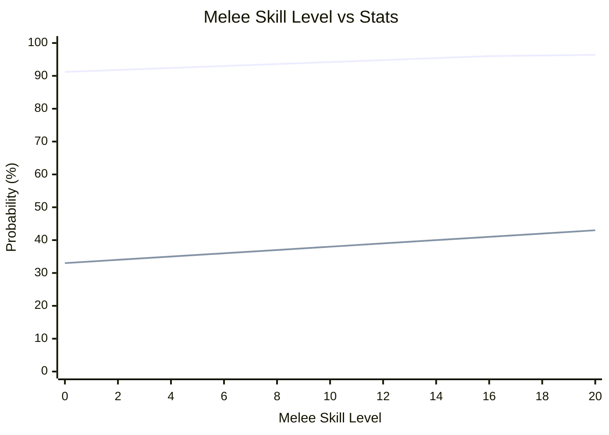
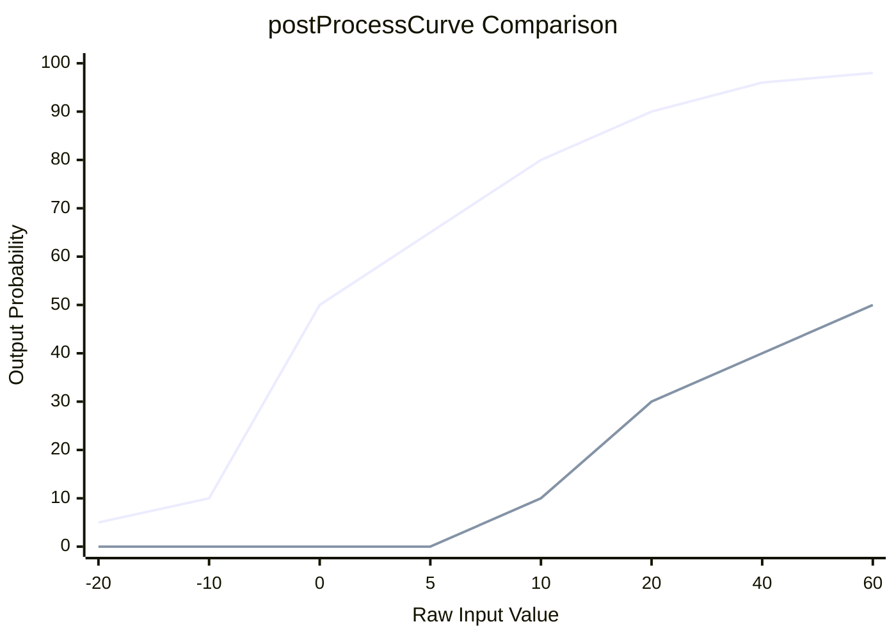

# Melee Skill Level Curve Analysis Report

> **Tags**: Melee Skill Level Curve MeleeHitChance MeleeDodgeChance MeleeDPS postProcessCurve SkillNeed_BaseBonus capacityOffsets StatDef  
> **작성일**: 2026-03-04  
> **분석 대상**: RimWorld Core StatDef (Melee 스킬 연동) + Ratkin 프로젝트 커스텀 오프셋

---

## 1. 개요

Melee 스킬 레벨(1 ~ 20)이 올라감에 따라 직접적으로 영향받는 스탯은 **2가지**입니다:

| StatDef | 설명 | 스킬 연동 방식 |
|---------|------|----------------|
| **MeleeHitChance** | 근접 명중 확률 | `skillNeedOffsets` (가산) |
| **MeleeDodgeChance** | 근접 회피 확률 | `skillNeedOffsets` (가산) |

이 두 스탯은 `SkillNeed_BaseBonus` 클래스를 사용하며, 레벨당 선형으로 raw값이 증가한 뒤 **postProcessCurve**를 거쳐 최종 확률로 변환됩니다.

**MeleeDPS**(근접 DPS)는 스킬과 직접 연동되지 않지만, 내부적으로 `MeleeHitChance`를 곱하므로 **간접 영향**을 받습니다.

---

## 2. 계산 공식 상세

### 2.1 MeleeHitChance (근접 명중 확률)

**소스**: `RimworldData/Core/Defs/Stats/Stats_Pawns_Combat.xml` (63 ~ 120행)

```
Raw값 = (baseValue + bonusPerLevel × skillLevel) + capacityOffsets + equippedStatOffsets
```

#### 구성 요소

| 항목 | 값 | 설명 |
|------|-----|------|
| baseValue | 0 | 기본값 |
| bonusPerLevel | 1 | 레벨당 +1 |
| noSkillOffset | 4 | 스킬 없는 폰(동물 등) |
| Manipulation offset | scale 12, max 1.5 | 100% → +12 |
| Sight offset | scale 12, max 1.5 | 100% → +12 |

**정상 인간형(능력치 100%) 기준**: `raw = skillLevel + 24`

#### postProcessCurve (raw → 최종 확률)

| raw 입력값 | 출력 확률 |
|-----------|-----------|
| -20 | 5% |
| -10 | 10% |
| 0 | 50% |
| 10 | 80% |
| 20 | 90% |
| 40 | 96% |
| 60 | 98% |

커브 포인트 사이는 **선형 보간(linear interpolation)**됩니다.

### 2.2 MeleeDodgeChance (근접 회피 확률)

**소스**: `RimworldData/Core/Defs/Stats/Stats_Pawns_Combat.xml` (122 ~ 160행)

```
Raw값 = (baseValue + bonusPerLevel × skillLevel) + capacityOffsets + equippedStatOffsets
```

#### 구성 요소

| 항목 | 값 | 설명 |
|------|-----|------|
| baseValue | 0 | 기본값 |
| bonusPerLevel | 1 | 레벨당 +1 |
| noSkillOffset | 0 | 스킬 없는 폰 |
| Moving offset | scale 18 | 100% → +18 |
| Sight offset | scale 8, max 1.4 | 100% → +8 |

**정상 인간형(능력치 100%) 기준**: `raw = skillLevel + 26`

#### postProcessCurve (raw → 최종 확률)

| raw 입력값 | 출력 확률 |
|-----------|-----------|
| 5 | 0% |
| 20 | 30% |
| 60 | 50% |

커브 포인트 사이는 **선형 보간**됩니다.

### 2.3 MeleeDPS (근접 DPS)

**소스**: `RimworldSource/RimWorld/StatWorker_MeleeDPS.cs`

```
MeleeDPS = (가중평균 데미지 × MeleeHitChance) / 가중평균 쿨다운
```

스킬 레벨이 올라가면 MeleeHitChance가 증가하므로 DPS도 비례하여 증가합니다.

---

## 3. 레벨별 상세 계산 테이블

### 전제 조건
- **능력치**: Manipulation 100%, Sight 100%, Moving 100% (정상 인간형)
- **장비 오프셋**: 없음 (순수 스킬만)
- **postProcessCurve 선형 보간** 적용

### 3.1 MeleeHitChance 레벨별 변화

| Melee Lv | Raw값 (Lv+24) | postProcessCurve 입력 | **최종 명중 확률** | 이전 대비 변화 |
|----------|---------------|----------------------|-------------------|---------------|
| 0 | 24 | 24 | **91.2%** | - |
| 1 | 25 | 25 | **91.5%** | +0.3%p |
| 2 | 26 | 26 | **91.8%** | +0.3%p |
| 3 | 27 | 27 | **92.1%** | +0.3%p |
| 4 | 28 | 28 | **92.4%** | +0.3%p |
| 5 | 29 | 29 | **92.7%** | +0.3%p |
| 6 | 30 | 30 | **93.0%** | +0.3%p |
| 7 | 31 | 31 | **93.3%** | +0.3%p |
| 8 | 32 | 32 | **93.6%** | +0.3%p |
| 9 | 33 | 33 | **93.9%** | +0.3%p |
| 10 | 34 | 34 | **94.2%** | +0.3%p |
| 11 | 35 | 35 | **94.5%** | +0.3%p |
| 12 | 36 | 36 | **94.8%** | +0.3%p |
| 13 | 37 | 37 | **95.1%** | +0.3%p |
| 14 | 38 | 38 | **95.4%** | +0.3%p |
| 15 | 39 | 39 | **95.7%** | +0.3%p |
| 16 | 40 | 40 | **96.0%** | +0.3%p |
| 17 | 41 | 41 | **96.1%** | +0.1%p |
| 18 | 42 | 42 | **96.2%** | +0.1%p |
| 19 | 43 | 43 | **96.3%** | +0.1%p |
| 20 | 44 | 44 | **96.4%** | +0.1%p |

> **계산 방법**: raw 20 ~ 40 구간은 `0.90 + (raw-20)/(40-20) × (0.96-0.90)` = `0.90 + (raw-20) × 0.003`  
> raw 40 ~ 60 구간은 `0.96 + (raw-40)/(60-40) × (0.98-0.96)` = `0.96 + (raw-40) × 0.001`

### 3.2 MeleeDodgeChance 레벨별 변화

| Melee Lv | Raw값 (Lv+26) | postProcessCurve 입력 | **최종 회피 확률** | 이전 대비 변화 |
|----------|---------------|----------------------|-------------------|---------------|
| 0 | 26 | 26 | **10.5%** | - |
| 1 | 27 | 27 | **11.3%** | +0.75%p |
| 2 | 28 | 28 | **12.0%** | +0.75%p |
| 3 | 29 | 29 | **12.8%** | +0.75%p |
| 4 | 30 | 30 | **13.5%** | +0.75%p |
| 5 | 31 | 31 | **14.3%** | +0.75%p |
| 6 | 32 | 32 | **15.0%** | +0.75%p |
| 7 | 33 | 33 | **15.8%** | +0.75%p |
| 8 | 34 | 34 | **16.5%** | +0.75%p |
| 9 | 35 | 35 | **17.3%** | +0.75%p |
| 10 | 36 | 36 | **18.0%** | +0.75%p |
| 11 | 37 | 37 | **18.8%** | +0.75%p |
| 12 | 38 | 38 | **19.5%** | +0.75%p |
| 13 | 39 | 39 | **20.3%** | +0.75%p |
| 14 | 40 | 40 | **21.0%** | +0.75%p |
| 15 | 41 | 41 | **21.8%** | +0.75%p |
| 16 | 42 | 42 | **22.5%** | +0.75%p |
| 17 | 43 | 43 | **23.3%** | +0.75%p |
| 18 | 44 | 44 | **24.0%** | +0.75%p |
| 19 | 45 | 45 | **24.8%** | +0.75%p |
| 20 | 46 | 46 | **25.5%** | +0.75%p |

> **계산 방법**: raw 20 ~ 60 구간은 `0.30 + (raw-20)/(60-20) × (0.50-0.30)` = `0.30 + (raw-20) × 0.005`  
> 따라서 레벨당 0.005 = 0.5%p 증가... 

**수정 계산**: 
- raw 5 ~ 20 구간: `0 + (raw-5)/(20-5) × 0.30` = `(raw-5) × 0.02`
- raw 20 ~ 60 구간: `0.30 + (raw-20)/(60-20) × 0.20` = `0.30 + (raw-20) × 0.005`

| Melee Lv | Raw값 (Lv+26) | 구간 | **최종 회피 확률** | 이전 대비 변화 |
|----------|---------------|------|-------------------|---------------|
| 0 | 26 | 20 ~ 60 | **33.0%** | - |
| 1 | 27 | 20 ~ 60 | **33.5%** | +0.5%p |
| 2 | 28 | 20 ~ 60 | **34.0%** | +0.5%p |
| 3 | 29 | 20 ~ 60 | **34.5%** | +0.5%p |
| 4 | 30 | 20 ~ 60 | **35.0%** | +0.5%p |
| 5 | 31 | 20 ~ 60 | **35.5%** | +0.5%p |
| 6 | 32 | 20 ~ 60 | **36.0%** | +0.5%p |
| 7 | 33 | 20 ~ 60 | **36.5%** | +0.5%p |
| 8 | 34 | 20 ~ 60 | **37.0%** | +0.5%p |
| 9 | 35 | 20 ~ 60 | **37.5%** | +0.5%p |
| 10 | 36 | 20 ~ 60 | **38.0%** | +0.5%p |
| 11 | 37 | 20 ~ 60 | **38.5%** | +0.5%p |
| 12 | 38 | 20 ~ 60 | **39.0%** | +0.5%p |
| 13 | 39 | 20 ~ 60 | **39.5%** | +0.5%p |
| 14 | 40 | 20 ~ 60 | **40.0%** | +0.5%p |
| 15 | 41 | 20 ~ 60 | **40.5%** | +0.5%p |
| 16 | 42 | 20 ~ 60 | **41.0%** | +0.5%p |
| 17 | 43 | 20 ~ 60 | **41.5%** | +0.5%p |
| 18 | 44 | 20 ~ 60 | **42.0%** | +0.5%p |
| 19 | 45 | 20 ~ 60 | **42.5%** | +0.5%p |
| 20 | 46 | 20 ~ 60 | **43.0%** | +0.5%p |

---

## 4. 종합 레벨별 변화표 (정상 능력치 기준)

| Melee Lv | 명중 확률 | 회피 확률 | 비고 |
|----------|----------|----------|------|
| **0** | 91.2% | 33.0% | 스킬 없는 신입 |
| **1** | 91.5% | 33.5% | |
| **2** | 91.8% | 34.0% | |
| **3** | 92.1% | 34.5% | |
| **4** | 92.4% | 35.0% | 일반 폰 평균 수준 |
| **5** | 92.7% | 35.5% | |
| **6** | 93.0% | 36.0% | |
| **7** | 93.3% | 36.5% | |
| **8** | 93.6% | 37.0% | 숙련 수준 |
| **9** | 93.9% | 37.5% | |
| **10** | 94.2% | 38.0% | 전문가 수준 |
| **11** | 94.5% | 38.5% | |
| **12** | 94.8% | 39.0% | |
| **13** | 95.1% | 39.5% | |
| **14** | 95.4% | 40.0% | |
| **15** | 95.7% | 40.5% | 마스터 수준 |
| **16** | 96.0% | 41.0% | 커브 변곡점 (명중) |
| **17** | 96.1% | 41.5% | 수확 체감 시작 (명중) |
| **18** | 96.2% | 42.0% | |
| **19** | 96.3% | 42.5% | |
| **20** | 96.4% | 43.0% | 최대 레벨 |

### 핵심 관찰

1. **명중 확률**: Lv0→20 = 91.2% → 96.4% (+5.2%p)
   - Lv0 ~ 16: 레벨당 +0.3%p (일정)
   - Lv16 ~ 20: 레벨당 +0.1%p (체감 구간)
   - 커브 변곡점: **Lv16 (raw=40)**에서 postProcessCurve 기울기 급감

2. **회피 확률**: Lv0→20 = 33.0% → 43.0% (+10.0%p)
   - 레벨당 +0.5%p (20 ~ 60 구간 내에서 일정)
   - 체감 구간 없이 꾸준히 증가

3. **DPS 영향**: 명중 확률이 이미 91%+ 수준이므로, 스킬 레벨 상승에 따른 DPS 증가는 미미함 (Lv0→20 약 +5.7% DPS 증가)

---

## 5. 커브 시각화 (Mermaid)



---

## 6. postProcessCurve 원본 비교 (Hit vs Dodge)



---

## 7. Ratkin 프로젝트 고유 수정 사항

Ratkin 프로젝트에서는 Melee 스킬 자체의 커브를 수정하지 않지만, 장비와 유전자를 통해 **최종 값에 오프셋/팩터**를 적용합니다:

### 7.1 종족 기본 스탯 (Ratkin)
| 스탯 | 값 | 출처 |
|------|-----|------|
| MeleeDodgeChance | ×1.15 (statFactor) | `Races_Rakinlike.xml` |
| AimingDelayFactor | ×1.15 | `Races_Rakinlike.xml` |

→ Ratkin 종족은 **기본 회피 확률이 15% 높습니다**.

### 7.2 유전자 (Gene)
| 유전자 | 효과 | 출처 |
|--------|------|------|
| RK_Gene_Nimble | MeleeDodgeChance ×1.25 | `CustomGeneDefs.xml` |

→ Nimble 유전자 적용 시 회피 확률이 **25% 추가 증가** (곱연산)

### 7.3 장비 equippedStatOffsets

#### MeleeHitChance 오프셋
| 장비 | 오프셋 | 파일 |
|------|--------|------|
| 랜스 계열 무기 | -2 ~ -4 | `Weapon_Melee.xml` |
| 건랜스 | -4 | `Weapon_HighTech.xml` |

#### MeleeDodgeChance 오프셋
| 장비 | 오프셋 | 파일 |
|------|--------|------|
| 쥐깃 코트 | +0.05 | `Apparel_Various.xml` |
| 닌자 코트 | +0.2 | `Apparel_Various.xml` |
| 투구 계열 | +0.05 | `Apparel_Various.xml` |
| 방탄 조끼 | -0.15 | `Apparel_Util.xml` |
| 헬멧(중) | -0.1 | `Apparel_Util.xml` |
| 헬멧(중)+파워 | -0.1, HitChance -0.1 | `Apparel_Util.xml` |
| 파워아머 | -0.2, HitChance -0.2 | `Apparel_Util.xml` |
| 갑옷 | -0.1 | `Apparel_Armor.xml` |

### 7.4 어빌리티 오프셋
| 어빌리티 | 효과 | 파일 |
|----------|------|------|
| 랜스 차지 | MeleeHitChance +0.4 | `AbilityDefs_LanceCharge.xml` |
| 전투 감각 강화 | MeleeDodgeChance +0.15 | `AbilityDefs.xml` |

---

## 8. Ratkin 적용 시 레벨별 실제 수치 (참고)

Ratkin 종족 (MeleeDodgeChance ×1.15) + Nimble 유전자 (×1.25) 적용 시:

| Melee Lv | 바닐라 명중 | 바닐라 회피 | Ratkin+Nimble 회피 |
|----------|-----------|-----------|-------------------|
| 0 | 91.2% | 33.0% | 47.4% |
| 5 | 92.7% | 35.5% | 51.0% |
| 10 | 94.2% | 38.0% | 54.6% |
| 15 | 95.7% | 40.5% | 58.2% |
| 20 | 96.4% | 43.0% | 61.8% |

> **주의**: `statFactor`는 postProcessCurve 적용 **후**의 최종값에 곱해집니다.  
> Ratkin+Nimble 회피 = 바닐라 회피 × 1.15 × 1.25 = 바닐라 회피 × 1.4375

---

## 9. 결론 및 시사점

### 명중 확률 (MeleeHitChance)
- 정상 능력치 기준 **이미 Lv0에서 91%**로 매우 높음
- Lv16 이후 체감 심화 (커브 변곡점)
- **총 변동폭이 5.2%p**로 스킬 레벨의 실질적 영향은 제한적
- 장비 오프셋(-2 ~ -4)이 스킬 10레벨 이상의 영향력을 가짐

### 회피 확률 (MeleeDodgeChance)
- **스킬 레벨의 실질적 영향이 더 큼** (총 +10%p)
- 체감 구간 없이 꾸준히 증가
- Ratkin 종족 보너스(×1.15)와 Nimble 유전자(×1.25)로 크게 증폭 가능
- **Ratkin Lv20 + Nimble = 61.8%** 로 매우 높은 회피율 달성

### DPS 관점
- 스킬 레벨 상승의 DPS 기여는 명중 확률 변동분만큼 → **약 5.7%** (Lv0→20)
- 무기 데미지/쿨다운, MeleeDamageFactor 등이 DPS에 훨씬 큰 영향

### 핵심 요약
| 관점 | 스킬 영향도 | 핵심 구간 |
|------|-----------|----------|
| 명중 확률 | 낮음 (5.2%p) | Lv0 ~ 16 균등, 이후 체감 |
| 회피 확률 | 중간 (10%p) | 전 구간 균등 증가 |
| DPS | 낮음 (약 5.7%) | 명중 확률에 비례 |

---

## 부록: 관련 소스코드 참조

| 파일 | 역할 |
|------|------|
| `RimworldData/Core/Defs/Stats/Stats_Pawns_Combat.xml` | MeleeHitChance, MeleeDodgeChance StatDef 정의 |
| `RimworldSource/RimWorld/StatWorker.cs` | skillNeedOffsets/Factors, postProcessCurve 처리 |
| `RimworldSource/RimWorld/StatWorker_MeleeDPS.cs` | DPS = 데미지 × 명중률 / 쿨다운 |
| `RimworldSource/RimWorld/SkillNeed_BaseBonus.cs` | baseValue + bonusPerLevel × level |
| `RimworldSource/Verse/SimpleCurve.cs` | postProcessCurve 선형 보간 |
| `RimworldSource/RimWorld/Verb_MeleeAttack.cs` | 실제 명중/회피 판정 |
| `Project/1.6/Defs/ThingDefs_Races/Races_Rakinlike.xml` | Ratkin 종족 MeleeDodgeChance ×1.15 |
| `Project/Biotech/Defs/GeneDefs/CustomGeneDefs.xml` | RK_Gene_Nimble (MeleeDodgeChance ×1.25) |
