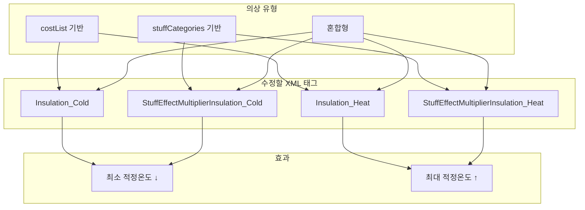

# Ratkin 의상별 최소/최대 적응 온도 수정 가이드

> **Tags**: Ratkin Apparel ComfyTemperature Insulation_Cold Insulation_Heat StuffEffectMultiplier 최소적정온도 최대적정온도  
> **작성일**: 2026-03-04  
> **분석 대상**: Ratkin 모드 의상 ThingDef 온도 관련 스탯

---

## 1. 개요

림월드에서 **착용자의 적응 온도**는 다음 공식으로 계산됩니다:


| 스탯                                 | 공식                         | 설명             |
| ---------------------------------- | -------------------------- | -------------- |
| **최소 적정 온도** (ComfyTemperatureMin) | `기본값 - Σ(Insulation_Cold)` | 값이 낮을수록 추위에 강함 |
| **최대 적정 온도** (ComfyTemperatureMax) | `기본값 + Σ(Insulation_Heat)` | 값이 높을수록 더위에 강함 |


**랫킨 기본값**: 최소 21°C, 최대 26°C (냉기에 약함 유전자 적용)

의상은 `Insulation_Cold` / `Insulation_Heat`를 제공하여 착용 시 **쾌적 온도 범위를 확장**합니다.

> **참고**: 아래 "착용 시 약" 값은 **해당 의상만** 착용했을 때의 대략적 범위입니다. 재료 의존 의상은 Leather(16,16) 기준 추정.

---

## 2. 수정 방법 요약


| 수정 대상             | XML 태그                                                                           | 위치        | 효과                       |
| ----------------- | -------------------------------------------------------------------------------- | --------- | ------------------------ |
| **냉기 단열 (고정)**    | `<Insulation_Cold>N</Insulation_Cold>`                                           | statBases | 최소 적정 온도를 N°C 낮춤         |
| **열기 단열 (고정)**    | `<Insulation_Heat>N</Insulation_Heat>`                                           | statBases | 최대 적정 온도를 N°C 높임         |
| **냉기 단열 (재료 의존)** | `<StuffEffectMultiplierInsulation_Cold>M</StuffEffectMultiplierInsulation_Cold>` | statBases | 실제 = StuffPower_Cold × M |
| **열기 단열 (재료 의존)** | `<StuffEffectMultiplierInsulation_Heat>M</StuffEffectMultiplierInsulation_Heat>` | statBases | 실제 = StuffPower_Heat × M |


- **Insulation_Cold/Heat**: costList 기반 의류(재료 영향 없음)에 사용
- **StuffEffectMultiplier**: stuffCategories(Fabric, Leathery 등) 기반 제작 의류에 사용

---

## 3. Ratkin 의상별 온도 스탯 목록

### 3.1 고정 단열값 (Insulation_Cold / Insulation_Heat)

재료와 무관하게 고정 단열을 제공하는 의상입니다.


| defName                     | label             | Insulation_Cold | Insulation_Heat | 착용 시 약   | 파일                   |
| --------------------------- | ----------------- | --------------- | --------------- | ------------ | -------------------- |
| RK_Apparel_VacsuitHelmet    | vacsuit helmet    | 6               | 4               | 15~30°C      | Apparel_Spacer.xml   |
| RK_Apparel_Vacsuit          | vacsuit           | 90              | 15              | -69~41°C     | Apparel_Spacer.xml   |
| RK_Apparel_VacsuitChildren  | kid vacsuit       | 90              | 15              | -69~41°C     | Apparel_Spacer.xml   |
| RK_Apparel_SpaceArmor       | cataphract armor  | 70              | 70              | -49~96°C     | Apparel_Spacer.xml   |
| RK_Apparel_SpaceArmorHelmet | cataphract helmet | 10              | 20              | 11~46°C      | Apparel_Spacer.xml   |
| RK_StrawHat                 | Straw Hat         | 2               | 6               | 19~32°C      | Apparel_Various.xml  |
| RK_Cardigan                 | cardigan          | 8               | —               | 13~26°C*     | Apparel_Various.xml  |
| RK_WinterRobe               | winter robe       | 8               | —               | 13~26°C*     | Apparel_Various.xml  |
| RK_RoyalRobe                | ratkin royal robe | 12              | —               | 9~26°C*      | Apparel_Royal.xml    |
| RK_SantaRobe                | santa robe        | 13              | —               | 8~26°C*      | Apparel_DropOnly.xml |
| RK_WhiteCoat                | ratkin white coat | 60              | 15              | -39~41°C     | Apparel_DropOnly.xml |

\* 고정값만 반영. 재료(Leather 등) 적용 시 냉기 단열 추가로 최소 온도 더 낮아짐.


**수정 예시** (냉기 단열 10 증가):

```xml
<statBases>
  <Insulation_Cold>18</Insulation_Cold>  <!-- 8 → 18 -->
  ...
</statBases>
```

---

### 3.2 재료 의존 단열 (StuffEffectMultiplier)

제작 시 사용한 재료(Fabric, Leathery 등)의 StuffPower에 배수를 곱해 실제 단열이 결정됩니다.


| defName               | label                  | Cold 배수 | Heat 배수 | 착용 시 약 (Leather기준) | 파일                   |
| --------------------- | ---------------------- | ------- | ------- | ------------------------ | -------------------- |
| RK_ApronSkirt         | apron skirt            | 0.20    | 0.10    | 18~28°C                  | Apparel_Various.xml  |
| RK_ApronSkirtChildren | kid skirt              | 0.20    | 0.10    | 18~28°C                  | Apparel_Various.xml  |
| RK_SummerDress        | summer dress           | 0.10    | 0.70    | 19~37°C                  | Apparel_Various.xml  |
| RK_Muffler            | muffler                | 0.65    | 0.25    | 11~30°C                  | Apparel_Various.xml  |
| RK_WoolenHat          | woolen hat             | 0.50    | —       | 13~26°C                  | Apparel_Various.xml  |
| RK_WorkerWear         | Ratkin red outfit      | 0.30    | 0.20    | 16~29°C                  | Apparel_Various.xml  |
| RK_Coif               | coif                   | 0.15    | 0.10    | 19~28°C                  | Apparel_Various.xml  |
| RK_ResearchGown       | research gown          | 0.30    | 0.15    | 16~28°C                  | Apparel_Various.xml  |
| RK_ExplorerWear       | explorer wear          | 0.20    | 0.40    | 18~32°C                  | Apparel_Various.xml  |
| RK_ExplorerHat        | explorer hat           | 0.15    | 0.25    | 19~30°C                  | Apparel_Various.xml  |
| RK_ChefSuit           | chef suit              | 0.25    | 0.25    | 17~30°C                  | Apparel_Various.xml  |
| RK_ChefHat            | chef hat               | 0.15    | 0.15    | 19~28°C                  | Apparel_Various.xml  |
| RK_GaurdenUniform     | gaurden uniform        | 0.40    | 0.25    | 15~30°C                  | Apparel_Various.xml  |
| RK_OrderUniform       | ratkin order uniform   | 0.40    | 0.40    | 15~32°C                  | Apparel_Various.xml  |
| RK_BulletProofHelmet  | Ratkin military helmet | 0.25    | 0.15    | 17~28°C                  | Apparel_Various.xml  |
| RK_FlatColorCoat      | flatcolor coat         | 0.40    | 0.35    | 15~32°C                  | Apparel_Various.xml  |
| RK_FrillOnepiece      | frill onepiece         | 0.35    | 0.40    | 15~32°C                  | Apparel_Various.xml  |
| RK_SistersDerss       | Sisters Dress          | 0.35    | 0.45    | 15~33°C                  | Apparel_Various.xml  |
| RK_SistersVeil        | Veil                   | 0.25    | 0.15    | 17~28°C                  | Apparel_Various.xml  |
| RK_BattleSuit         | ratkin battlesuit      | 0.55    | 0.45    | 12~33°C                  | Apparel_Various.xml  |
| RK_Apparel_GasMask    | mask helmet            | 0.55    | 0.45    | 12~33°C                  | Apparel_Various.xml  |
| RK_HeadBand           | Ratkin head band       | 0.15    | 0.15    | 19~28°C                  | Apparel_Various.xml  |
| RK_SantaHat           | santa hat              | 0.65    | —       | 11~26°C                  | Apparel_DropOnly.xml |


**수정 예시** (냉기 배수 0.1 증가):

```xml
<statBases>
  <StuffEffectMultiplierInsulation_Cold>0.35</StuffEffectMultiplierInsulation_Cold>  <!-- 0.25 → 0.35 -->
  ...
</statBases>
```

---

### 3.3 고정 + 재료 의존 혼합

고정 Insulation과 StuffEffectMultiplier를 동시에 가진 의상입니다.


| defName       | label             | Insulation_Cold | Cold 배수 | Heat 배수 | 착용 시 약 (Leather기준) | 파일                   |
| ------------- | ----------------- | --------------- | ------- | ------- | ------------------------ | -------------------- |
| RK_Cardigan   | cardigan          | 8               | 0.95    | 0.30    | -2~31°C                  | Apparel_Various.xml  |
| RK_WinterRobe | winter robe       | 8               | 1.20    | 0       | -6~26°C                  | Apparel_Various.xml  |
| RK_RoyalRobe  | ratkin royal robe | 12              | 1.40    | —       | -13~26°C                 | Apparel_Royal.xml    |
| RK_SantaRobe  | santa robe        | 13              | 1.30    | 0       | -13~26°C                 | Apparel_DropOnly.xml |


---

### 3.4 단열 없음 (온도 영향 없음)


| defName            | label                   | 착용 시 약 | 비고  | 파일                   |
| ------------------ | ----------------------- | ---------- | --- | -------------------- |
| RK_ResearchGlasses | ratkin glasses          | 21~26°C    | —   | Apparel_Various.xml  |
| RK_HairCorsage     | hair corsage            | 21~26°C    | —   | Apparel_Various.xml  |
| RK_RibbonHairBand  | ribbon hair band        | 21~26°C    | —   | Apparel_Various.xml  |
| RK_Apparel_Banner  | war banner              | 21~26°C    | —   | Apparel_Util.xml     |
| RK_CrossBack       | cross back              | 21~26°C    | —   | Apparel_Util.xml     |
| RK_Backpack        | backpack                | 21~26°C    | —   | Apparel_Util.xml     |
| RK_OutdoorBackpack | ratkin outdoor backpack | 21~26°C    | —   | Apparel_Util.xml     |
| RK_WoodenShield    | ratkin wooden Shield    | 21~26°C    | —   | Apparel_Util.xml     |
| RK_HeavyShield     | ratkin heavy Shield     | 21~26°C    | —   | Apparel_Util.xml     |
| RK_TowerShield     | ratkin Tower Shield     | 21~26°C    | —   | Apparel_Util.xml     |
| RK_RoyalCrown      | Ratkin royal crown      | 21~26°C    | —   | Apparel_Royal.xml    |
| RK_SantaSack       | santa package           | 21~26°C    | —   | Apparel_DropOnly.xml |
| RK_Sack            | ratkin package          | 21~26°C    | —   | Apparel_DropOnly.xml |


---

### 3.5 단열 0 (의도적 무효화)


| defName      | label              | Cold 배수 | Heat 배수 | 착용 시 약 | 비고       | 파일                |
| ------------ | ------------------ | ------- | ------- | ---------- | -------- | ----------------- |
| RK_Plate     | ratkin plate armor | 0.0     | 0.0     | 21~26°C    | 재료 영향 없음 | Apparel_Armor.xml |
| RK_PlateHelm | (inherited)        | 0.0     | 0.0     | 21~26°C    | 재료 영향 없음 | Apparel_Armor.xml |


---

## 4. 파일별 수정 위치


| 파일                   | 경로                           | 포함 의상 수 |
| -------------------- | ---------------------------- | ------- |
| Apparel_Spacer.xml   | Project/1.6/Defs/ThingsDefs/ | 5       |
| Apparel_Various.xml  | Project/1.6/Defs/ThingsDefs/ | 28      |
| Apparel_Util.xml     | Project/1.6/Defs/ThingsDefs/ | 7       |
| Apparel_Armor.xml    | Project/1.6/Defs/ThingsDefs/ | 2       |
| Apparel_Royal.xml    | Project/1.6/Defs/ThingsDefs/ | 2       |
| Apparel_DropOnly.xml | Project/1.6/Defs/ThingsDefs/ | 5       |


---

## 5. 재료(Stuff) 단열 기준값 참고

일반적인 Fabric/Leathery 재료의 StuffPower 예시 (RimWorld Core):


| 재료             | StuffPower_Insulation_Cold | StuffPower_Insulation_Heat |
| -------------- | -------------------------- | -------------------------- |
| Cloth          | 3                          | 0                          |
| Devilstrand    | 26                         | 10                         |
| Muffalo wool   | 30                         | 16                         |
| Megasloth wool | 34                         | 12                         |
| Heavy fur      | 38                         | 18                         |
| Lightleather   | 12                         | 12                         |
| Leather        | 16                         | 16                         |
| Bearskin       | 20                         | 20                         |


실제 의상 단열 = `StuffPower × StuffEffectMultiplier`

---

## 6. Mermaid 다이어그램 – 의상 유형별 수정 흐름




---

## 7. 요약

- **냉기 보강**: `Insulation_Cold` 또는 `StuffEffectMultiplierInsulation_Cold` 값 증가
- **열기 보강**: `Insulation_Heat` 또는 `StuffEffectMultiplierInsulation_Heat` 값 증가
- **수정 위치**: 각 ThingDef의 `<statBases>` 내부
- **랫킨 기본**: 21~26°C → 의상 착용 시 범위 확장

