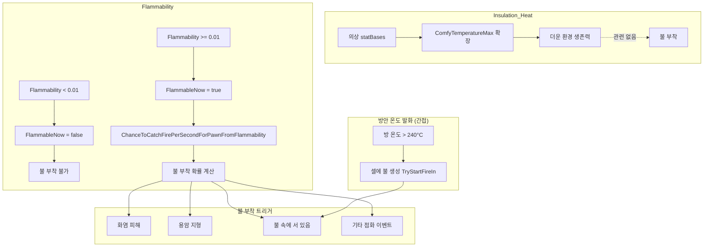

# Insulation_Heat / Flammability 불 부착 로직 조사 보고서

> **Tags**: Insulation_Heat Flammability Fire 불부착 화염 점화 자동발화 방안온도 AutoIgnition RimWorld  
> **작성일**: 2026-03-04  
> **분석 대상**: RimWorld 소스코드 - Insulation_Heat, Flammability 스탯과 불 부착 조건

---

## 1. 핵심 결론

| 스탯 | 불 부착과의 관계 |
|------|------------------|
| **Insulation_Heat** | **불 부착과 무관** – 의상의 열기 단열(방열) 스탯으로, 쾌적 온도 범위 확장용 |
| **Flammability** | **불 부착 확률에 직접 사용** – 값이 높을수록 화염 이벤트 시 불이 붙을 확률 증가 |

**Insulation_Heat는 "몇 도 이상이 되어야 불이 부착된다"는 식의 온도 임계값과는 전혀 관련이 없습니다.**  
불 부착은 **Flammability**와 **화염 이벤트 유형**에 의해 결정됩니다.

---

## 2. Insulation_Heat (방열 스탯)

### 2.1 정의

- **용도**: 의상의 **열기 단열** – 착용자의 최대 적응 온도(ComfyTemperatureMax)를 높임
- **범위**: -9999 ~ 9999 (기본 0)
- **표시**: `toStringStyle="TemperatureOffset"` – 온도 오프셋(예: +15°C)

### 2.2 코드상 사용처

- `ThingStuffPair.cs`: 의상+재료 조합 시 `cachedInsulationHeat` 계산
- `Stats_Apparel.xml`: `ComfyTemperatureMax` 확장에 사용
- **불 관련 로직**: **없음**

### 2.3 요약

Insulation_Heat는 **더운 환경에서의 생존력**을 높이는 스탯이며, **불이 붙는 조건과는 전혀 연결되지 않습니다.**

---

## 3. Flammability (가연성 스탯)

### 3.1 정의

- **범위**: 0 ~ 2 (1 = 나무, 0 = 돌, 2 = 매우 건조한 종이/휘발성 연료)
- **역할**: 물체가 얼마나 쉽게 불에 붙는지, 불이 얼마나 빨리 번지는지

### 3.2 FlammableNow 판정

```csharp
// Verse/Thing.cs
public bool FlammableNow
{
    get
    {
        if (this.GetStatValue(StatDefOf.Flammability, true, -1) < 0.01f)
            return false;  // 0.01 미만이면 절대 불에 붙지 않음
        // ... FireBulwark 등 추가 조건
        return true;
    }
}
```

- **Flammability < 0.01** → `FlammableNow = false` → 불 부착 불가

### 3.3 불 부착 확률 곡선

```csharp
// RimWorld/FireUtility.cs
private static readonly SimpleCurve ChanceToCatchFirePerSecondForPawnFromFlammability = new SimpleCurve
{
    { new CurvePoint(0f, 0f), true },
    { new CurvePoint(0.1f, 0.07f), true },   // 7% per second
    { new CurvePoint(0.3f, 1f), true },      // 100% per second
    { new CurvePoint(1f, 1f), true }
};
```

| Flammability | 곡선 출력 (초당) |
|--------------|------------------|
| 0 | 0% |
| 0.1 | 7% |
| 0.3 ~ 1.0 | 100% |

### 3.4 누적 확률 계산

```csharp
// FireUtility.ChanceToAttachFireCumulative(Thing t, float freqInTicks)
float baseChance = ChanceToCatchFirePerSecondForPawnFromFlammability.Evaluate(Flammability);
return 1f - Mathf.Pow(1f - baseChance, freqInTicks / 60f);
```

- `freqInTicks/60` = 초 단위
- 예: `freqInTicks=60` → `1 - (1 - baseChance)^1` = baseChance
- 예: `freqInTicks=150` → `1 - (1 - baseChance)^2.5`

### 3.5 Flammability별 대략적 불 부착 확률 (60틱 기준)

| Flammability | 60틱 기준 | 150틱 기준 |
|-------------|----------|------------|
| 0 | 0% | 0% |
| 0.1 | 7% | ~17% |
| 0.3 | 100% | 100% |
| 0.5 | 100% | 100% |
| 1.0 | 100% | 100% |

---

## 4. 불 부착 트리거 (소스코드 기준)

### 4.1 화염 피해 (DamageWorker_Flame)

```csharp
// Verse/DamageWorker_Flame.cs
if (!damageResult.deflected && Rand.Chance(FireUtility.ChanceToAttachFireFromEvent(victim)))
    victim.TryAttachFire(Rand.Range(0.15f, 0.25f), dinfo.Instigator);
```

- 화염 피해를 받을 때마다 `ChanceToAttachFireFromEvent(victim)` 확률로 불 부착
- `ChanceToAttachFireFromEvent` = `ChanceToAttachFireCumulative(t, 60f)`

### 4.2 용암 지형 (HediffGiver_Terrain)

```csharp
// Verse/HediffGiver_Terrain.cs
if (terrain.ignitePawnsIntervalTicks > 0f && Rand.MTBEventOccurs(terrain.ignitePawnsIntervalTicks, 1f, 60f)
    && Rand.Chance(FireUtility.ChanceToAttachFireFromEvent(pawn)))
    pawn.TryAttachFire(Rand.Range(0.15f, 0.25f), null);
```

- 용암 지형: `ignitePawnsIntervalTicks = 240` (Odyssey)
- MTB 240틱마다 `ChanceToAttachFireFromEvent(pawn)` 확률로 불 부착
- **온도가 아니라 지형 유형**에 의해 결정됨

### 4.3 불 속에 서 있을 때 (Fire.cs)

```csharp
// RimWorld/Fire.cs
if (this.parent == null && this.fireSize > 0.4f && list[i].def.category == ThingCategory.Pawn
    && Rand.Chance(FireUtility.ChanceToAttachFireCumulative(list[i], 150f)))
    list[i].TryAttachFire(this.fireSize * 0.2f, this.instigator);
```

- **조건**: `fireSize > 0.4`, 같은 셀에 있는 Pawn
- **확률**: `ChanceToAttachFireCumulative(pawn, 150f)` – Flammability 기반

### 4.4 방안 온도 (자동 발화) – SteadyEnvironmentEffects

**바로 부착되지 않음.** 방안 온도가 높아지면 → **셀에 불이 먼저 생김** → 그 불 속에 서 있으면 Pawn에 불 부착.

```csharp
// RimWorld/SteadyEnvironmentEffects.cs
private static readonly FloatRange AutoIgnitionTemperatureRange = new FloatRange(240f, 1000f);
private const float AutoIgnitionChanceFactor = 0.7f;

// DoCellSteadyEffects 내부 (room != null && !room.UsesOutdoorTemperature)
float temperature = room.Temperature;
if (temperature > AutoIgnitionTemperatureRange.min)  // 240°C
{
    float value = Rand.Value;
    if (value < AutoIgnitionTemperatureRange.InverseLerpThroughRange(temperature) * 0.7f
        && Rand.Chance(FireUtility.ChanceToStartFireIn(c, this.map, null)))
    {
        FireUtility.TryStartFireIn(c, this.map, 0.1f, null, null);
    }
}
```

#### 발화 조건

| 조건 | 설명 |
|------|------|
| **방** | 실내 방(room != null), `UsesOutdoorTemperature = false` |
| **온도** | `room.Temperature > 240°C` |
| **대상** | **셀(바닥/지형/물체)** – Pawn 직접 대상 아님 |

#### 발화 확률

- `InverseLerpThroughRange(240, 1000, temperature)` = 240°C에서 0, 1000°C에서 1
- `발화 확률 = InverseLerp(240, 1000, temp) × 0.7`
- 예: 500°C → 약 24%, 1000°C → 70%

#### 체크 주기

- 매 틱: `Area × 0.0006`개 셀만 검사 (예: 250×250 맵 ≈ 38셀/틱)
- 250×250 맵 기준: 한 셀당 약 27초 간격으로 체크

#### Pawn 불 부착 흐름

1. 방 온도 > 240°C → 셀에 발화 확률 체크
2. `TryStartFireIn` → 셀에 불 생성 (바닥/가구 등)
3. 셀의 불이 `fireSize > 0.4`일 때, 같은 셀의 Pawn에 `ChanceToAttachFireCumulative(pawn, 150f)` 확률로 불 부착 (Fire.cs)

즉, **Pawn은 직접 온도로 불이 붙는 것이 아니라, 불이 난 셀에 서 있을 때만** 불이 붙습니다.

### 4.5 기타

- **DamageDef.igniteChanceByTargetFlammability**: 특정 피해 유형에서 Flammability에 따른 점화 확률
- **Verb_ShootBeam.flammabilityAttachFireChanceCurve**: 빔 무기에서 Flammability 기반 점화 확률
- **FlameThrower**: `ChanceToAttachFireFromEvent` 사용

---

## 5. 요약 다이어그램



---

## 6. 참고 코드 경로

| 파일 | 내용 |
|------|------|
| `RimWorld/FireUtility.cs` | `ChanceToCatchFirePerSecondForPawnFromFlammability`, `ChanceToAttachFireCumulative`, `CanEverAttachFire` |
| `Verse/Thing.cs` | `FlammableNow`, `TryAttachFire` 호출 |
| `Verse/DamageWorker_Flame.cs` | 화염 피해 시 불 부착 |
| `Verse/HediffGiver_Terrain.cs` | 용암 지형에서 불 부착 |
| `RimWorld/Fire.cs` | 불 속 Pawn 인접 시 불 부착 |
| `RimWorld/SteadyEnvironmentEffects.cs` | 방안 온도 자동 발화 (240°C~) |
| `RimworldData/Core/Defs/Stats/Stats_Apparel.xml` | Insulation_Heat 정의 |
| `RimworldData/Core/Defs/Stats/Stats_Basics_General.xml` | Flammability 정의 |

---

## 7. 결론

- **Insulation_Heat**: 불 부착과 무관. 온도·열기 단열용 스탯.
- **Flammability**: 불 부착 가능 여부와 확률을 결정. 0.01 미만이면 절대 불에 붙지 않음.
- **불 부착 조건**: Flammability >= 0.01 + 화염 이벤트(화염 피해, 용암, 불 속 서 있기 등) 발생.
- **방안 온도 발화**: 방 온도 > **240°C**부터 셀 자동 발화. Pawn은 직접 대상이 아니라, **불이 난 셀에 서 있을 때** Fire.cs 로직으로 불 부착.
