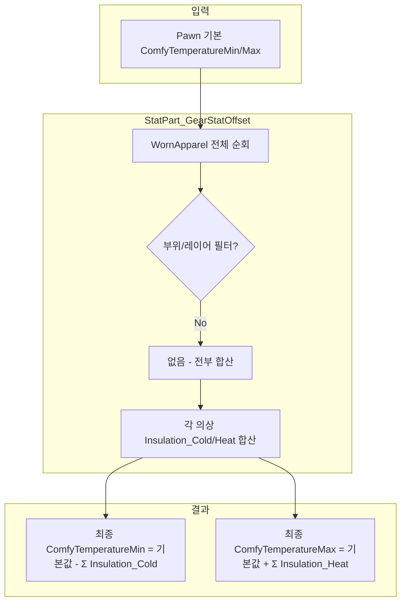

# 의상 단열(Insulation) 합산 로직 검토

> **Tags**: Ratkin Apparel Insulation ComfyTemperature 모자 머리 합산 StatPart_GearStatOffset  
> **작성일**: 2026-03-04  
> **관련 보고서**: [118_Ratkin_Apparel_ComfyTemperature_Report.md](118_Ratkin_Apparel_ComfyTemperature_Report.md), [119_Ratkin_Apparel_Leather_vs_Bluefur_Temperature_Report.md](119_Ratkin_Apparel_Leather_vs_Bluefur_Temperature_Report.md)

---

## 1. 질문

**모자와 머리 의상이 모두 단열에 합산되는가?**

---

## 2. 결론

**예. 모자, 머리, 몸통, 벨트 등 착용 중인 모든 의상의 Insulation_Cold/Heat가 전부 합산됩니다.**

부위(머리/몸통)나 레이어 구분 없이, `WornApparel`에 포함된 모든 의상이 합산 대상입니다.

---

## 3. 소스코드 근거

### 3.1 StatDef 정의

`RimworldData/Core/Defs/Stats/Stats_Pawns_General.xml`:

```xml
<StatDef>
  <defName>ComfyTemperatureMin</defName>
  ...
  <parts>
    <li Class="StatPart_GearStatOffset">
      <apparelStat>Insulation_Cold</apparelStat>
      <subtract>true</subtract>
    </li>
  </parts>
</StatDef>

<StatDef>
  <defName>ComfyTemperatureMax</defName>
  ...
  <parts>
    <li Class="StatPart_GearStatOffset">
      <apparelStat>Insulation_Heat</apparelStat>
    </li>
  </parts>
</StatDef>
```

`ComfyTemperatureMin`/`ComfyTemperatureMax`는 `StatPart_GearStatOffset`을 사용하며, 각각 `Insulation_Cold`, `Insulation_Heat`를 참조합니다.

### 3.2 StatPart_GearStatOffset 로직

`RimworldSource/RimWorld/StatPart_GearStatOffset.cs`:

```csharp
public override void TransformValue(StatRequest req, ref float val)
{
    // ...
    if (pawn.apparel != null)
    {
        for (int i = 0; i < pawn.apparel.WornApparel.Count; i++)
        {
            float num = pawn.apparel.WornApparel[i].GetStatValue(this.apparelStat, true, -1);
            num += StatWorker.StatOffsetFromGear(pawn.apparel.WornApparel[i], this.apparelStat);
            if (this.subtract)
            {
                val -= num;   // ComfyTemperatureMin: Insulation_Cold 빼기
            }
            else
            {
                val += num;   // ComfyTemperatureMax: Insulation_Heat 더하기
            }
        }
    }
    // ...
}
```

- `pawn.apparel.WornApparel` 전체를 순회합니다.
- `bodyPartGroups`, `layers`, `UpperHead`/`FullHead` 등으로 필터링하지 않습니다.
- 각 의상의 `Insulation_Cold` 또는 `Insulation_Heat`를 모두 합산합니다.

---

## 4. 합산 흐름 요약



---

## 5. 예시

| 착용 의상 | Insulation_Cold | Insulation_Heat |
|----------|-----------------|-----------------|
| RK_WoolenHat (모자) | 8 | 0 |
| RK_Muffler (머리) | 10.4 | 4 |
| RK_WorkerWear (몸통) | 4.8 | 3.2 |
| **합계** | **23.2** | **7.2** |

랫킨 기본값 21~26°C 기준:
- **ComfyTemperatureMin** = 21 - 23.2 = **-2.2°C**
- **ComfyTemperatureMax** = 26 + 7.2 = **33.2°C**

모자, 머리, 몸통 의상이 모두 합산되어 최종 온도 범위가 결정됩니다.

---

## 6. 정리

- 모자(hat), 머리(head), 몸통 등 **모든 착용 의상**이 단열에 합산됩니다.
- `StatPart_GearStatOffset`은 `WornApparel` 전체를 대상으로 하며, 부위·레이어 구분이 없습니다.
- 119 보고서의 엑셀 차트는 **단일 의상** 기준이므로, 실제 게임에서는 여러 의상을 동시에 착용할 때의 합산 효과를 별도로 고려해야 합니다.
