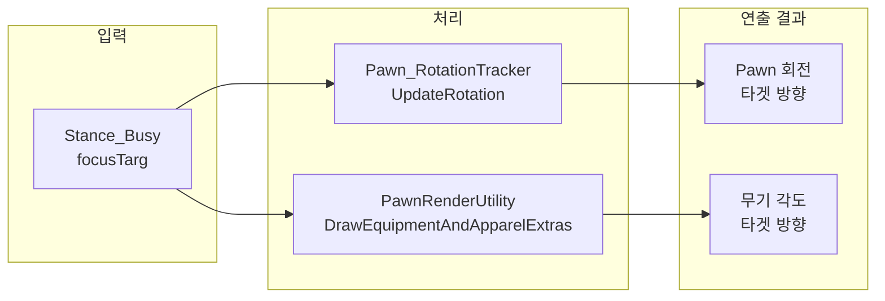

# 공격 연출 플로우 분석 보고서

> **Tags**: Attack 연출 조준 무기 타겟 Stance_Busy focusTarg PawnRenderUtility DrawEquipmentAiming  
> **작성일**: 2026-03-06  
> **분석 목적**: 대상이 사거리 이내일 때 공격 연출(무기 조준) 플로우 분석

---

## 1. 개요

본 보고서는 **대상이 사거리 이내**일 때, Pawn이 대상을 향해 **무기를 조준하는 연출**이 어떻게 동작하는지 플로우를 분석합니다.

**핵심 질문**: "쿨다운 중이던 뭐던 대상을 향해서 무기를 조준하고 있는 부분"은 어떻게 구현되는가?

---

## 2. 연출 관련 핵심 구조

### 2.1 Stance_Busy와 focusTarg

| 클래스 | 설명 | focusTarg |
|--------|------|-----------|
| **Stance_Busy** | 조준/쿨다운 등 바쁜 상태 베이스 | `LocalTargetInfo focusTarg` |
| **Stance_Warmup** | 조준/준비 중 (warmupTime > 0) | ✅ 타겟 저장 |
| **Stance_Cooldown** | 공격 후 쿨다운 중 | ✅ 타겟 저장 |

**핵심**: `Stance_Warmup`과 `Stance_Cooldown` 모두 `Stance_Busy`를 상속하며, **focusTarg**에 현재 조준/공격 대상이 저장됩니다.

```csharp
// Stance_Busy.cs
public LocalTargetInfo focusTarg;
public Stance_Busy(int ticks, LocalTargetInfo focusTarg, Verb verb)
{
    this.focusTarg = focusTarg;
}
```

---

## 3. 대상 사거리 이내 시 전체 플로우

```mermaid
flowchart TD
    subgraph 시작["1. 공격 시작"]
        A[대상 사거리 이내] --> B[Verb.TryStartCastOn(target)]
    end

    subgraph Warmup["2. Warmup (조준 준비)"]
        B --> C{WarmupTime > 0?}
        C -->|Yes| D[Stance_Warmup 생성<br/>focusTarg = target]
        C -->|No| E[WarmupComplete 호출]
    end

    subgraph Cast["3. 공격 실행"]
        D --> F[ticksLeft 감소]
        F --> G[Expire → WarmupComplete]
        G --> H[TryCastShot]
        E --> H
        H --> I[TryCastNextBurstShot]
    end

    subgraph Cooldown["4. Cooldown"]
        I --> J{burstShotsLeft > 0?}
        J -->|Yes| K[Stance_Cooldown<br/>TicksBetweenBurstShots]
        J -->|No| L[Stance_Cooldown<br/>AdjustedCooldownTicks]
        K --> M[focusTarg = currentTarget]
        L --> M
    end

    subgraph 연출["5. 연출 (매 프레임)"]
        M --> N[Pawn_RotationTracker.UpdateRotation]
        M --> O[PawnRenderUtility.DrawEquipmentAndApparelExtras]
        N --> P[Pawn이 타겟 방향으로 회전]
        O --> Q[무기가 타겟을 향해 그려짐]
    end
```

---

## 4. 무기 조준 연출 상세 플로우

### 4.1 연출이 적용되는 조건

**PawnRenderUtility.DrawEquipmentAndApparelExtras** (`PawnRenderUtility.cs:230-283`)

무기가 타겟을 향해 조준되려면 **모든** 조건을 만족해야 합니다:

| 조건 | 설명 |
|------|------|
| `pawn.equipment.Primary != null` | 주무기 장착 |
| `curJob.def.neverShowWeapon != true` | Job이 무기 숨김 아님 |
| `!flags.HasFlag(PawnRenderFlags.NeverAimWeapon)` | 렌더 플래그 |
| `stance_Busy != null` | Stance_Warmup 또는 Stance_Cooldown |
| `!stance_Busy.neverAimWeapon` | 조준 비활성화 아님 |
| `stance_Busy.focusTarg.IsValid` | **타겟이 유효함** |

### 4.2 조준 각도 계산

```csharp
// PawnRenderUtility.cs:254-267
if (!flags.HasFlag(PawnRenderFlags.NeverAimWeapon) && 
    stance_Busy != null && !stance_Busy.neverAimWeapon && 
    stance_Busy.focusTarg.IsValid)
{
    Vector3 a = stance_Busy.focusTarg.HasThing 
        ? stance_Busy.focusTarg.Thing.DrawPos 
        : stance_Busy.focusTarg.Cell.ToVector3Shifted();
    if ((a - pawn.DrawPos).MagnitudeHorizontalSquared() > 0.001f)
    {
        num = (a - pawn.DrawPos).AngleFlat();  // 타겟 방향 각도
    }
    // Verb.AimAngleOverride가 있으면 오버라이드
    if (currentEffectiveVerb?.AimAngleOverride != null)
        num = currentEffectiveVerb.AimAngleOverride.Value;
    
    drawPos += new Vector3(0f, 0f, 0.4f + equippedDistanceOffset).RotatedBy(num) * factor;
    PawnRenderUtility.DrawEquipmentAiming(pawn.equipment.Primary, drawPos, num);
}
```

**각도 계산 순서**:
1. `focusTarg`(Thing 또는 Cell)의 월드 좌표
2. `(타겟 - Pawn).AngleFlat()` → 타겟 방향 각도
3. `Verb.AimAngleOverride`가 있으면 해당 값으로 대체
4. `DrawEquipmentAiming(weapon, drawPos, aimAngle)` 호출

### 4.3 Pawn 회전 (몸이 타겟을 향함)

**Pawn_RotationTracker.UpdateRotation** (`Pawn_RotationTracker.cs:38-47`)

```csharp
Stance_Busy stance_Busy = this.pawn.stances.curStance as Stance_Busy;
if (stance_Busy != null && stance_Busy.focusTarg.IsValid)
{
    if (stance_Busy.focusTarg.HasThing)
        this.Face(stance_Busy.focusTarg.Thing.DrawPos);
    else
        this.FaceCell(stance_Busy.focusTarg.Cell);
    return;
}
```

**결과**: Pawn의 `Rotation`(Rot4)이 타겟 방향으로 갱신됨 → **몸이 타겟을 향함**

---

## 5. Stance 생성 시점 (focusTarg 설정)

### 5.1 Stance_Warmup (조준 중)

| 위치 | 코드 |
|------|------|
| `Verb.cs:516` | `SetStance(new Stance_Warmup(ticks, castTarg, this))` |

- **시점**: `TryStartCastOn` 호출 시, `WarmupTime > 0`일 때
- **focusTarg**: `castTarg` (공격 대상)

### 5.2 Stance_Cooldown (쿨다운 중)

| 위치 | 코드 |
|------|------|
| `Verb.cs:684` | `SetStance(new Stance_Cooldown(TicksBetweenBurstShots + 1, this.currentTarget, this))` |
| `Verb.cs:693` | `SetStance(new Stance_Cooldown(AdjustedCooldownTicks, this.currentTarget, this))` |

- **시점**: `TryCastShot` 후, burst 중간 또는 burst 완료 시
- **focusTarg**: `this.currentTarget` (방금 공격한 대상)

**핵심**: 쿨다운 중에도 `focusTarg`가 유지되므로, **쿨다운 동안에도 무기는 계속 타겟을 향해 조준된 상태**로 그려집니다.

---

## 6. 연출 관련 요약 다이어그램



---

## 7. 연출 비활성화 방법

| 방법 | 설명 |
|------|------|
| `verbProps.neverAimWeapon = true` | 해당 Verb 사용 시 무기 조준 안 함 |
| `Stance_Busy.neverAimWeapon = true` | Stance 생성 시 플래그 설정 (예: Pawn_PathFollower) |
| `PawnRenderFlags.NeverAimWeapon` | 렌더 시 플래그 전달 |
| `Verb.AimAngleOverride` | 조준은 하되, 각도를 고정값으로 오버라이드 |

---

## 8. 근접 공격(Melee)과의 차이

| 구분 | 원거리 (Ranged) | 근접 (Melee) |
|------|-----------------|--------------|
| WarmupTime | 보통 > 0 | 보통 0 |
| Stance_Warmup | ✅ 조준 중 생성 | ❌ 없음 (즉시 WarmupComplete) |
| Stance_Cooldown | ✅ 발사 후 생성, focusTarg 유지 | ✅ Tool cooldown 시 생성 |
| 무기 조준 연출 | Stance_Busy 중 타겟 향해 조준 | Stance_Busy 중 동일하게 적용 |
| Pawn 회전 | Stance_Busy 시 focusTarg 향함 | TryCastShot 내 `Face(target)` 호출 |

**근접 공격**: `Verb_MeleeAttack.TryCastShot` 내부에서 `rotationTracker.Face(targetThing.DrawPos)`를 직접 호출. Stance_Cooldown이 있으면 그 동안에도 `Pawn_RotationTracker`가 focusTarg를 향해 회전을 유지.

---

## 9. 참고 코드 위치

| 항목 | 파일:라인 |
|------|-----------|
| Stance_Busy (focusTarg) | `RimworldSource/Verse/Stance_Busy.cs:13-37` |
| Stance_Warmup 생성 | `RimworldSource/Verse/Verb.cs:516` |
| Stance_Cooldown 생성 | `RimworldSource/Verse/Verb.cs:684, 693` |
| Pawn 회전 (타겟 향함) | `RimworldSource/Verse/Pawn_RotationTracker.cs:38-47` |
| 무기 조준 그리기 | `RimworldSource/Verse/PawnRenderUtility.cs:230-283` |
| 조준 각도 계산 | `RimworldSource/Verse/PawnRenderUtility.cs:254-267` |
| DrawEquipmentAiming | `RimworldSource/Verse/PawnRenderUtility.cs:71-114` |
| Verb.AimAngleOverride | `RimworldSource/Verse/Verb.cs:378-383` |

---

## 10. 결론

1. **대상 사거리 이내** → `Verb.TryStartCastOn(target)` 호출
2. **Stance_Warmup** 또는 **Stance_Cooldown** 생성 시 `focusTarg = target` 저장
3. **매 틱/프레임**:
   - `Pawn_RotationTracker.UpdateRotation`: `focusTarg`가 유효하면 Pawn이 타겟 방향으로 회전
   - `PawnRenderUtility.DrawEquipmentAndApparelExtras`: `focusTarg`가 유효하면 무기를 타겟 방향 각도로 그림
4. **쿨다운 중에도** `Stance_Cooldown`에 `focusTarg`가 있으므로, **무기는 계속 타겟을 향해 조준된 상태**로 연출됨

**"대상을 향해 무기를 조준하고 있는 부분"**은 `Stance_Busy.focusTarg`를 기반으로 `PawnRenderUtility`와 `Pawn_RotationTracker`가 매 렌더/업데이트 시점에 처리합니다.
