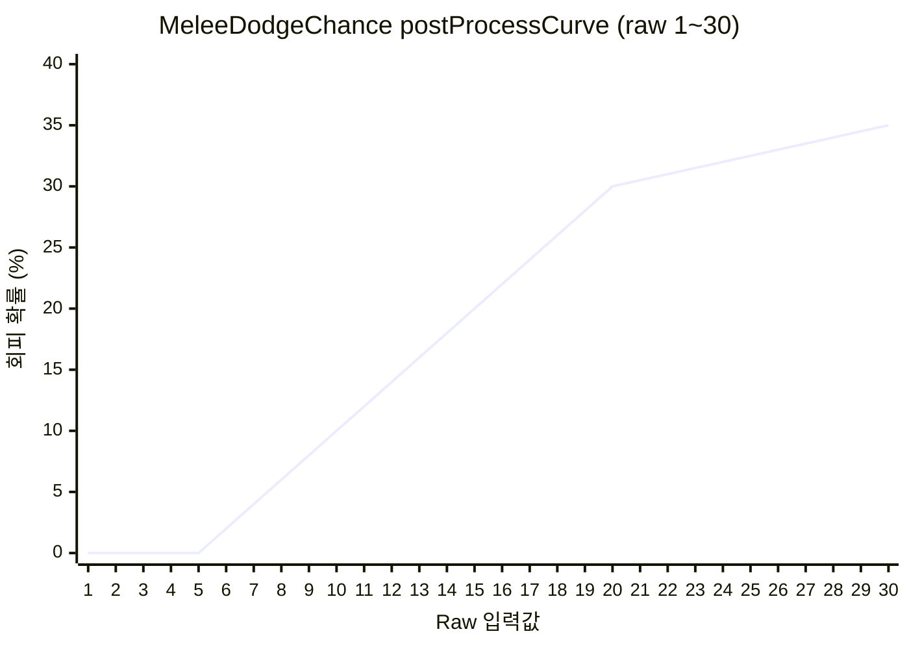
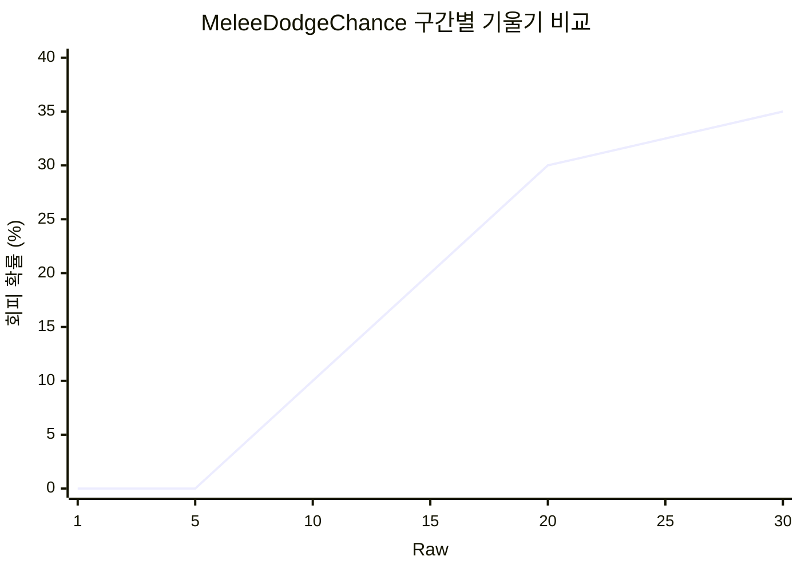
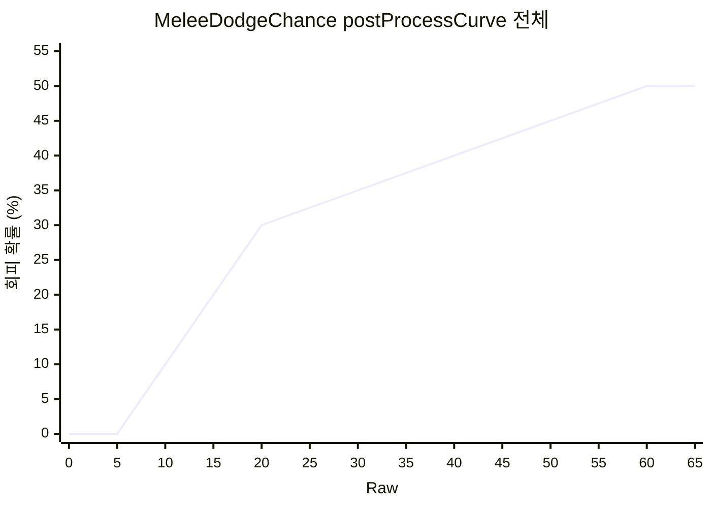
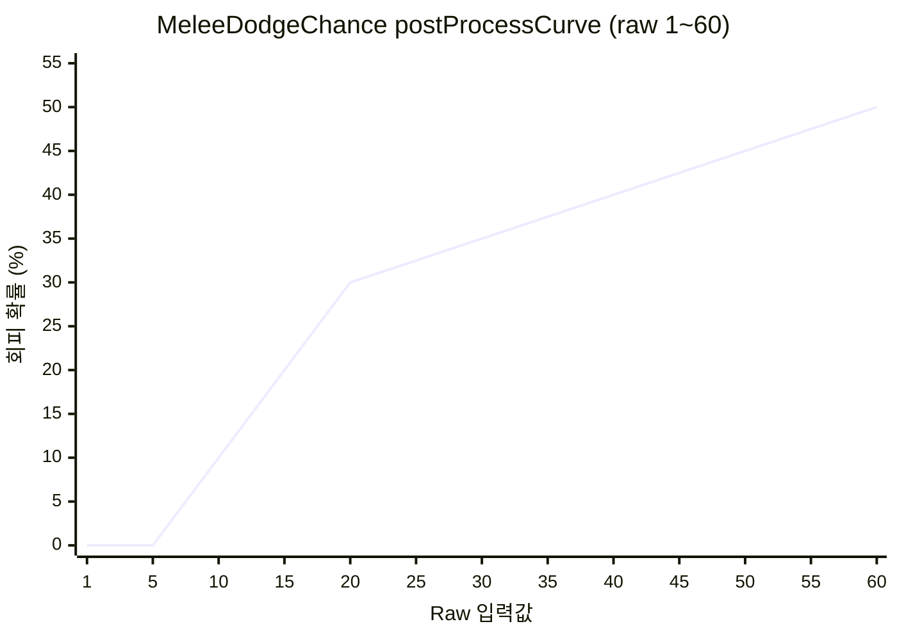
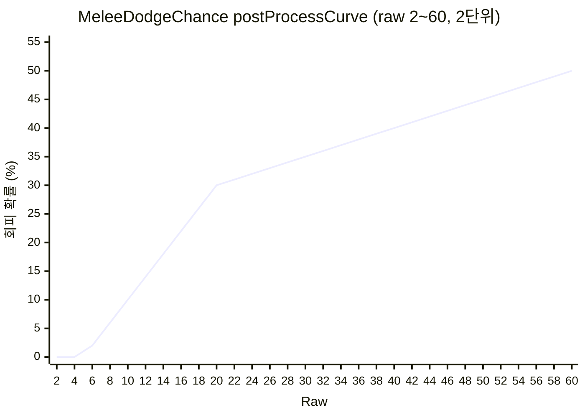

# MeleeDodgeChance postProcessCurve 시뮬레이션 보고서

> **Tags**: MeleeDodgeChance postProcessCurve 근접회피 시뮬레이션 SimpleCurve 선형보간 raw 1~30  
> **작성일**: 2026-03-13  
> **분석 대상**: RimWorld Core MeleeDodgeChance StatDef postProcessCurve (raw 1 ~ 30 구간)

---

## 1. 개요

**MeleeDodgeChance**(근접 회피 확률)는 raw값이 `postProcessCurve`를 거쳐 최종 확률(0~1)로 변환됩니다.  
본 보고서는 **raw 1부터 30까지** 1단위 구간에 대한 시뮬레이션 결과를 시각화합니다.

### 1.1 postProcessCurve 정의 (Stats_Pawns_Combat.xml)

**소스**: `RimworldData/Core/Defs/Stats/Stats_Pawns_Combat.xml` (150~156행)

```xml
<postProcessCurve>
  <points>
    <li>(5, 0)</li>
    <li>(20, 0.30)</li>
    <li>(60, 0.50)</li>
  </points>
</postProcessCurve>
```

| Raw 입력 | 출력 확률 |
|----------|-----------|
| 5 | 0% |
| 20 | 30% |
| 60 | 50% |

커브 포인트 사이는 **선형 보간(linear interpolation)** 적용.

---

## 2. 계산 공식

### 2.1 SimpleCurve.Evaluate 로직

| 조건 | 반환 |
|------|------|
| raw ≤ 5 | 0 (첫 점의 y) |
| raw ≥ 60 | 0.50 (마지막 점의 y) |
| 5 < raw < 20 | 선형 보간: `0 + (raw-5)/(20-5) × 0.30` |
| 20 < raw < 60 | 선형 보간: `0.30 + (raw-20)/(60-20) × 0.20` |

### 2.2 구간별 수식

| 구간 | 공식 | 기울기 |
|------|------|--------|
| raw ≤ 5 | `0` | 0 |
| 5 ~ 20 | `(raw - 5) × 0.02` | +2%p/raw |
| 20 ~ 60 | `0.30 + (raw - 20) × 0.005` | +0.5%p/raw |

---

## 3. Raw 1~30 전체 계산 결과

### 3.1 구간별 기울기

| 구간 | 기울기 | 설명 |
|------|--------|------|
| 1 ~ 5 | 0%p/raw | 0% 고정 (커브 하한) |
| 6 ~ 20 | +2.0%p/raw | 0% → 30% |
| 21 ~ 30 | +0.5%p/raw | 30% → 35% |

### 3.2 Raw별 회피 확률 테이블

| Raw | 회피 확률 | Raw | 회피 확률 |
|-----|----------|-----|----------|
| 1 | 0.0% | 16 | 22.0% |
| 2 | 0.0% | 17 | 24.0% |
| 3 | 0.0% | 18 | 26.0% |
| 4 | 0.0% | 19 | 28.0% |
| 5 | 0.0% | **20** | **30.0%** |
| 6 | 2.0% | 21 | 30.5% |
| 7 | 4.0% | 22 | 31.0% |
| 8 | 6.0% | 23 | 31.5% |
| 9 | 8.0% | 24 | 32.0% |
| 10 | 10.0% | 25 | 32.5% |
| 11 | 12.0% | 26 | 33.0% |
| 12 | 14.0% | 27 | 33.5% |
| 13 | 16.0% | 28 | 34.0% |
| 14 | 18.0% | 29 | 34.5% |
| 15 | 20.0% | 30 | 35.0% |

### 3.3 핵심 관찰

- **raw 1~5**: 0% 고정 (커브 하한 클램프)
- **raw 6~20**: 기울기 +2%p/raw로 급격히 상승
- **raw 20**: 30% 도달 (변곡점)
- **raw 21~30**: 기울기 급감 (+0.5%p/raw) → 체감 구간

---

## 4. 시각화

### 4.1 Mermaid 차트 (raw 1 ~ 30, 1단위)



### 4.2 구간별 시각화



### 4.3 postProcessCurve 전체 형태 (raw 0 ~ 65)



### 4.4 Raw 1 ~ 60 전체 시각화 (5단위)



### 4.5 Raw 1 ~ 60 상세 시각화 (2단위)



---

## 5. 계산 검증

### 5.1 구간별 수동 계산

**raw 6 (5~20 구간)**:
```
output = 0 + (6-5)/(20-5) × 0.30 = 1/15 × 0.30 = 0.02 = 2% ✓
```

**raw 20 (경계점)**:
```
output = 0.30 = 30% ✓
```

**raw 25 (20~60 구간)**:
```
output = 0.30 + (25-20)/(60-20) × 0.20 = 0.30 + 5/40 × 0.20 = 0.30 + 0.025 = 0.325 = 32.5% ✓
```

### 5.2 게임 내 Raw값 산출 (참고)

실제 게임에서 MeleeDodgeChance raw값은 다음으로 구성됩니다:

```
raw = baseValue + skillNeedOffsets + capacityOffsets + equippedStatOffsets + ...
```

- **baseValue**: 0
- **skillNeedOffsets**: Melee 스킬 레벨 × 1 (SkillNeed_BaseBonus)
- **capacityOffsets**: Moving(×18), Sight(×8, max 1.4)

**정상 인간형(능력치 100%) 기준**: `raw ≈ Melee Lv + 26`  
→ Melee Lv 0: raw 26, Lv 20: raw 46 (본 보고서 raw 1~30 구간은 스킬/능력치가 낮은 경우에 해당)

---

## 6. 요약

| 항목 | 내용 |
|------|------|
| **커브 포인트** | (5, 0%), (20, 30%), (60, 50%) |
| **raw 1~5** | 0% 고정 |
| **raw 6~20** | +2%p/raw (선형) |
| **raw 21~30** | +0.5%p/raw (선형) |
| **변곡점** | raw 20 (30%) |

---

## 7. 참고 자료

| 파일 | 역할 |
|------|------|
| `RimworldData/Core/Defs/Stats/Stats_Pawns_Combat.xml` | MeleeDodgeChance StatDef 정의 |
| `./117_postProcessCurve_Concise_Report.md` | postProcessCurve 계산 플로우 |
| `./116_Melee_Skill_Level_Curve_Analysis_Report.md` | Melee 스킬 레벨별 명중/회피 분석 |
