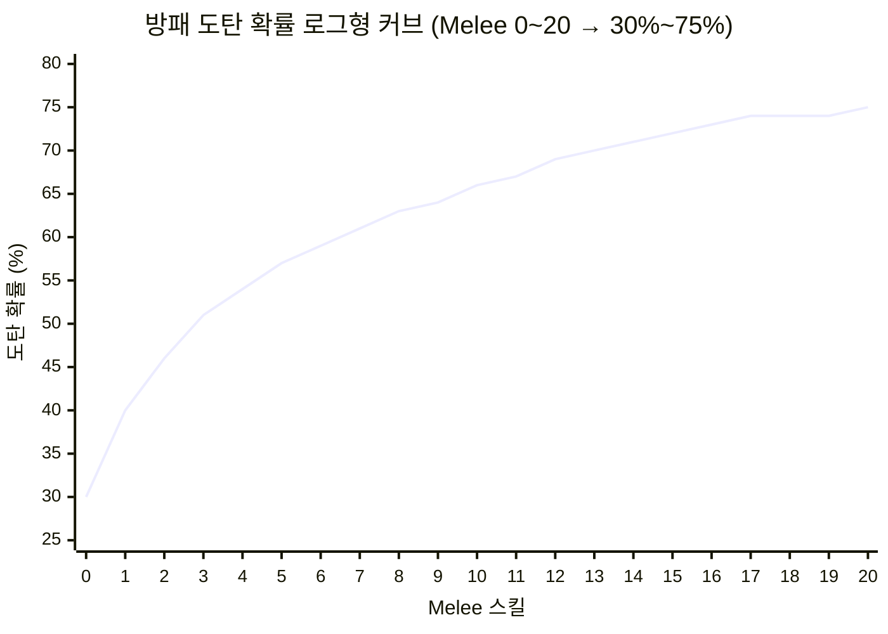
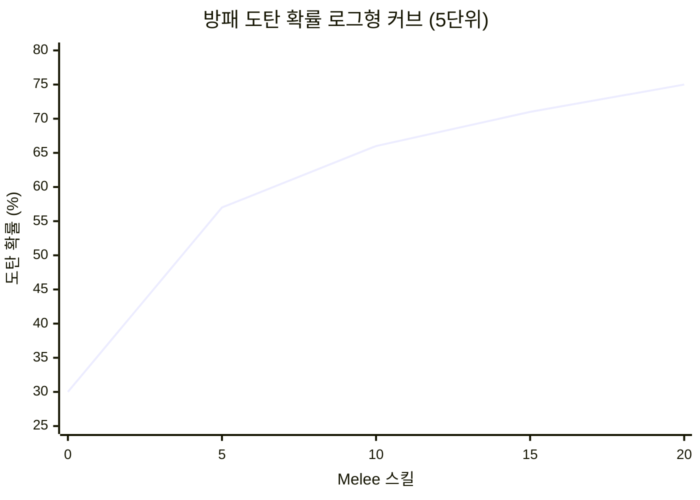

# 방패 도탄 확률 로그형 커브 보고서

> **태그**: Shield Deflection Chance LogCurve Melee Skill v2 TowerShield postProcessCurve 30 75  
> **작성일**: 2026-03-20  
> **목적**: v2 방패 원거리 도탄 확률용 로그형 커브 정의 및 구현 가이드

---

## 1. 개요

v2 방패(RK_TowerShield_Second) 개선안에서 **원거리 공격 도탄 확률**은 다음 식으로 계산됩니다.

> **[스탯] 튕겨낼 확률** = 방패 방어력 + melee 스킬 커브

실제 melee 스킬은 **0~20** 구간만 존재하므로, 20 기준 75%에 수렴하는 **로그형 커브**를 사용합니다.

---

## 2. 커브 스펙

### 2.1 목표 데이터 포인트

| Melee 스킬 (x) | 확률 (y) |
|----------------|----------|
| 0 | 30% |
| 5 | 60% |
| 10 | 70% |
| 20 | 75% |

### 2.2 로그형 공식

```
y = 30 + 45 × ln(1 + x) / ln(21)
```

- `ln(21) ≈ 3.044`
- x = 0 → y = 30%
- x = 20 → y = 75%
- 초반에 빠르게 상승, 후반에 완만하게 수렴 (로그형 특성)

### 2.3 구간별 계산값

| x | y (%) |
|---|-------|
| 0 | 30 |
| 2 | 42 |
| 4 | 51 |
| 6 | 57 |
| 8 | 62 |
| 10 | 65 |
| 12 | 68 |
| 14 | 70 |
| 16 | 72 |
| 18 | 73 |
| 20 | 75 |

---

## 3. 시각화

### 3.1 Mermaid XY 차트 (Melee 스킬 0~20, 1단위)



### 3.2 Mermaid XY 차트 (5단위 요약)



### 3.3 ASCII 커브

```
 75% |                              ●●●●●●●●●●
     |                         ●●●●
     |                    ●●●●
 65% |               ●●●●
     |          ●●●●
 55% |     ●●●●
     | ●●●●
 30% |●●
     +----+----+----+----+----+----+----+----
        0    2.5   5   7.5  10  12.5  15  17.5  20
```

---

## 4. 구현 가이드

### 4.1 C# (Unity/RimWorld)

```csharp
/// <summary>
/// melee 스킬(0~20) 기반 도탄 확률. 30%~75% 로그형 커브.
/// </summary>
public static float GetDeflectionChanceFromMeleeSkill(int skill)
{
    if (skill <= 0) return 0.3f;
    const float maxX = 20f;
    return 0.3f + 0.45f * Mathf.Log(1f + skill) / Mathf.Log(1f + maxX);
}
```

### 4.2 XML (postProcessCurve / SimpleCurve)

점 기반 선형 보간으로 근사할 경우:

```xml
<points>
  <li>(0, 0.30)</li>
  <li>(5, 0.56)</li>
  <li>(10, 0.65)</li>
  <li>(15, 0.71)</li>
  <li>(20, 0.75)</li>
</points>
```

---

## 5. 참고

| 항목 | 내용 |
|------|------|
| **관련 계획** | [v2_방패_개선_계획](.cursor/plans/v2_방패_개선_계획_ba191d9d.plan.md) |
| **관련 Def** | [Apparel_Shield.xml](Project/1.6/Defs/ThingsDefs/Apparel_Shield.xml) |
| **관련 소스** | [ApparelShieldTowerSecond.cs](Project/1.6/Source/ShieldOfRatkinia/ApparelShieldTowerSecond.cs) |
| **postProcessCurve** | [117_postProcessCurve_Concise_Report](117_postProcessCurve_Concise_Report.md) |
