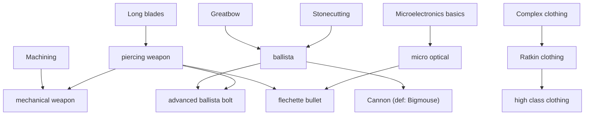

Ratkin 1.5 Research Tree ResearchProjectDef RatkinTech Unlock ThingDef RecipeMaker visualization mermaid 계통도 해금 목록

# Ratkin 1.5 연구 계통도·해금 목록

- **데이터 소스**: `Project/1.5/Defs/ResearchDefs/ResearchProjects.xml`, `Project/1.5/Defs/**/*.xml` 내 `researchPrerequisite` / `researchPrerequisites` (XML 주석 제거 후 스캔).
- **표기**: 연구·아이템 표기는 Def의 **`<label>`** 위주(게임 내 표시명). 바닐라 연구는 림월드 기본명(영문 Def명)으로 노드만 표기.
- **상속 주의**: `ThingDef`가 `ParentName`으로만 연구 조건을 물려받는 경우(추상 부모에만 `researchPrerequisites`가 있는 경우) 자동 스캔에 안 잡힐 수 있음. 본 보고서 하단 **「상속으로 Ballista / Bigmouse 걸림」**에 수동 보강.

---

## 1) 연구 계통도 (이름 중심, mermaid)

아래는 **랫킨 모드가 정의한 `ResearchProjectDef` 선행 관계**와, 그에 연결되는 **바닐라 선행 연구 노드**를 함께 그린 것입니다. (`PulseTech` 연구 블록은 XML에서 주석 처리되어 있어 제외.)

---

## 2) 연구별 해금 아이템 (`label` 열거)

스캔 기준: ThingDef 본문 또는 `recipeMaker` 블록에 명시된 연구 조건. 동일 `(연구, ThingDef)`는 한 번만 표기.

### RatkinTech 탭 연구 (`ResearchProjects.xml`)

piercing weapon
- ratkin heavy lance

mechanical weapon
- ratkin gunlance(normal)
- ratkin gunlance(spread)
- wyvern ammo(normal)
- wyvern ammo(spread)

ballista
- ballista bolt (normal)
- *(상속)* ballista — 건물 `RK_Ballista_Strait_Body` (부모 `RK_BaseArtilleryBuilding`에 `Ballista` 선행)
- *(상속)* ballista — 포탑 무기 `RK_Turret_Ballista_Strait` (동일 부모 계통)

advanced ballista bolt
- ballista bolt (HE)
- ballista bolt (AP)

Cannon *(연구 defName: Bigmouse, label: Cannon)*
- Ratkin Cannon Shell
- *(상속)* Ratkin Cannon — 건물 `RK_Cannon_Strait_Body` (부모 `RK_BaseArtilleryBuilding_Cannon`에 `Bigmouse` 선행)
- *(상속)* Cannon — 포탑 무기 `RK_Turret_Cannon_Strait` (동일 부모 계통)

micro optical
- ratkin sniper rifle

flechette bullet
- flechette rifle
- flechette sniper rifle
- ratkin shotgun

Ratkin clothing
- backpack
- chef hat
- chef suit
- coif
- explorer hat
- explorer wear
- gaurden uniform
- ratkin glasses
- research gown
- winter robe
- ratkin wooden Shield
- Ratkin red outfit

high class clothing
- Ratkin military helmet
- flatcolor coat
- frill onepiece
- hair corsage
- ratkin heavy Shield
- ratkin Big heavy Shield
- ratkin order uniform
- ratkin outdoor backpack
- ratkin plate armor
- Ratkin plate Helm *(RK_PlateHelmA)*
- Ratkin plate Helm *(RK_PlateHelmB)*
- Ratkin plate Helm *(RK_PlateHelmC)*
- ribbon hair band
- Ratkin royal crown
- ratkin royal robe
- Sisters Dress
- Veil

---

### 바닐라 연구에 매달린 랫킨 Thing (참고: 계통도 상단/옆 가지)

해당 연구는 `ResearchProjects.xml`에 없지만, 1.5 랫킨 Def에서 **`researchPrerequisite(s)`로 직접 참조**되는 항목입니다.

Complex clothing
- electric tailor bench
- hand tailor bench

Complex furniture
- pulpit

Electricity
- electric smithy
- electric tailor bench
- hamster wheel generator

Long blades
- ratkin two handed sword

Machining
- autocross bow

Smithing
- axe
- cleaver
- cross bow
- ratkin dagger
- electric smithy
- enhanced cross bow
- fork
- fueled smithy
- Halberd
- hoe
- ratkin wooden lance
- ratkin guardening sword
- ratkin Mace
- ratkin one handed sword
- Spear

---

## 3) 재현 스크립트

같은 폴더의 `_tmp_parse_research_15.py`로 주석 제거 후 ThingDef 단위 스캔을 재현할 수 있습니다.
