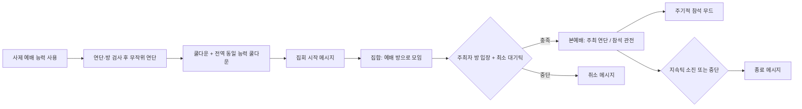

# Ratkin 기도회(예배) 기능·플로우 보고서

**태그:** Ratkin PrayerService Worship 기도회 예배 RK_PrayerService RK_Pulpit 연단 LordJob Priest 사제 무드 쿨다운 VoluntaryJoin

**대상 버전:** 프로젝트 1.6 기준 (`Project/1.6/Source/Priest`, `Defs` 동일 개념)

**작성 목적:** 랫킨 예배(기도회) 시스템의 게임플레이 의미와 단계별 흐름을 코드 단위 나열 없이 정리한다.

---

## 1. 기능 요약

| 항목 | 내용 |
|------|------|
| **트리거** | 사제 폰 종류가 능력 **예배** (`RK_PrayerService`)를 사용한다. |
| **전제** | 정착민 건설 **예배용 연단** (`RK_Pulpit`)이 맵에 있고, 도달·예약·금지·화재·위험·상호작용 칸 유효성·**방 크기(25칸 초과)** 등 검사를 통과한 연단이 최소 1개 있어야 한다. |
| **시전 결과** | 사용 가능한 연단 중 하나가 무작위로 선택되고, 그 **상호작용 칸**을 중심으로 **집회(Lord)** 가 시작된다. |
| **쿨다운** | 능력 정의상 약 **3~5일**(틱 랜덤). 시전 시 **동일 능력을 보유한 모든 맵의 자유 정착민·수감자**에게도 같은 쿨다운이 적용된다. |
| **주요 보상** | 집회에 참여 중인 폰들이 주기적으로 **「예배에 참석」** 기분(`RK_AttendPrayerMeetingMood`)을 얻는다. |

**구분:** 사제와의 **「기도」상호작용**은 사교·호감·별도 무드(`RK_PriestPray` / `RK_PriestPrayMood`) 트랙이며, **연단 기도회**와는 별개 기능이다.

---

## 2. 능력 부여 대상

- 생성·로드 시 **사제 폰 종류**(`RatkinPriest`, `RK_PawnKind_Priest`)에 예배 능력이 없으면 부여한다.
- 퀘스트 등으로 사제가 합류할 때 동일 능력을 줄 수 있다.

---

## 3. 플로우(단계)

1. **시전**  
   비소집, 쿨다운 없음, 유효 연단 존재 → 연단·집회 기준 칸(`spot`) 확정 → **즉시 쿨다운**(전역 공유) → 집회 작업 시작, **「기도회를 열었습니다」** 류 메시지.

2. **집합 단계**  
   집회 소속 폰은 예배가 열리는 방·모임 구역 쪽으로 모인다 (`RK_JoinPrayerService`).

3. **본예배로 전환**  
   주최자가 `spot`이 속한 **방**에 들어온 상태가 유지되며, **약 1500틱** 수준의 조건을 만족하면 본 단계로 넘어간다.

4. **본예배 단계**  
   - 주최자: 연단 쪽 **조직** 듀티 (연단 상호작용 칸으로 이동 후 기도 행동).  
   - 참석자: 연단 주변에 계산된 **관람 구역**에서 **관전** 듀티.  
   - 이 단계에서 **랜덤 간격(대략 400~600틱)** 마다 집회 소속 전원에게 **예배 참석 무드**가 부여된다.

5. **정상 종료**  
   본예배가 **약 3000~4000틱**(랜덤) 지나면 종료 메시지 후 집회 해산.

6. **조기 종료·취소**  
   주최자 무효(사망·다운·소집 등), 연단 무효(파괴·금지·화재 등), 방 소실, **피해 트리거** 등 → 집합 중이면 **취소**, 본예배 중이면 **종료** 메시지.

---

## 4. 참가(자발적 참여)

- **주최자**는 집회에 포함된다.
- **같은 세력의 인간형**이고, 게임의 모임 참석 규칙을 통과하면 자발적으로 붙을 수 있다.
- **「신앙」 특성**이 있으면 참여 우선순위가 높다.
- 집회가 **끝나기 약 300틱 전**에는 새 참가자가 붙지 않는다.
- 관람 가능한 칸이 없으면 참여하지 않는다.

---

## 5. 무드(기도회 본편)

- **예배에 참석** (`RK_AttendPrayerMeetingMood`): 기본 **+2** 기분, **3일** 지속, 최대 **5스택**.

---

## 6. 참고 다이어그램

---

## 7. 관련 리소스 위치 (참고용)

- C#: `Project/1.6/Source/Priest/` — `LordJob_PrayerService`, `LordToil_*`, `Command_AbilityPrayService`, `ConstPriest` 등  
- Def: `Project/1.6/Defs/AbilityDefs/AbilityDefs.xml`, `DutyDefs/DutyDefs.xml`, `ThoughtDefs/ThoughtDefs.xml`  
- 번역: `Project/Contents/Languages/Korean/Keyed/mnkexg.xml` 등

---

*본 문서는 설계·밸런스·기획 검토용이며, 림월드 버전에 따라 바닐라 동작과의 차이는 별도 확인이 필요하다.*
