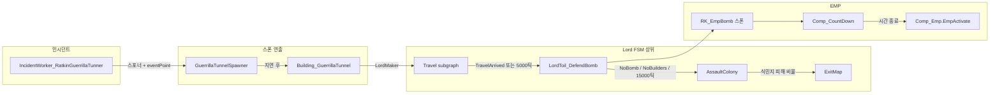
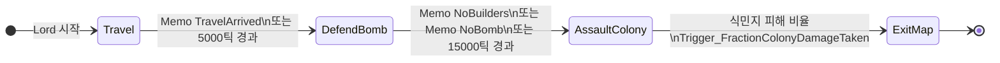
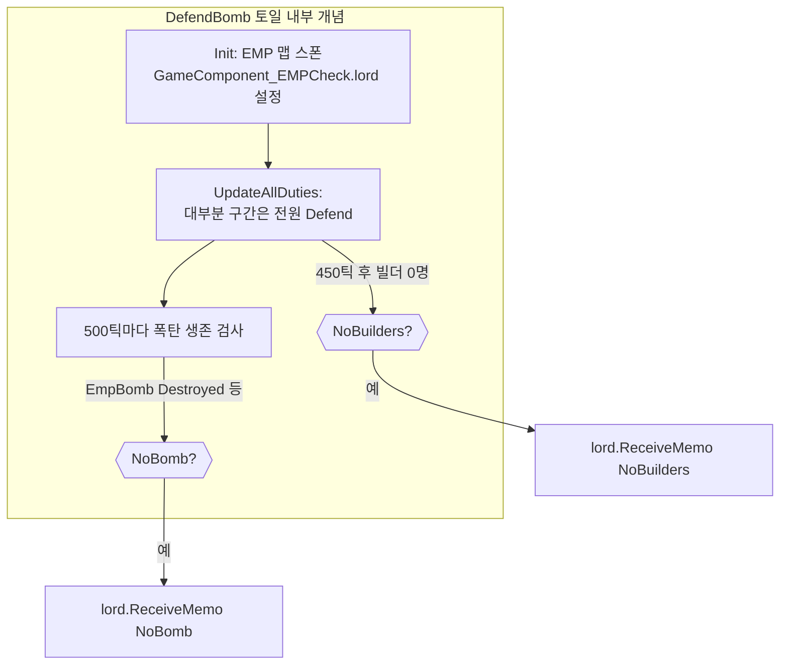

<!--
TAGS: RatkinGuerrillaTunnel, 게릴라터널, EMP, RK_EmpBomb, LordJob_BombPlanting, LordToil_DefendBomb, IncidentWorker_RatkinGuerrillaTunner, FSM, 이벤트플로우, 예외, NoBomb, NoBuilders
-->

# Ratkin 게릴라 터널 이벤트 — 실행 플로우 · 예외(FSM) 보고서

버전 기준: 프로젝트 **1.6** 소스·Def (`IncidentWorker_RatkinGuerrillaTunner`, `GuerrillaTunnelSpawner`, `Building_GuerrillaTunnel`, `LordJob_BombPlanting`, `LordToil_DefendBomb`, `Building_EmpBomb` / `Comp_Emp`).

---

## 1. 이벤트 실행 플로우 (큰 그림)

| 단계 | 무엇이 일어나는지 |
|------|-------------------|
| A | 스토리텔러가 인시던트 실행 → `parms.points` 등과 함께 맵이 타깃 |
| B | 발전 시설 근처 셀 탐색 성공 시 `RK_GuerrillaTunnelSpawner` 스폰, 스포너에 `eventPoint` 저장 |
| C | 12~16초 연출 후 스포너 제거, 동일 위치에 `RK_GuerrillaTunnel` + `eventPoint` 전달, `SpawnInitialPawns()` |
| D | 폰이 스폰되며 `LordJob_BombPlanting(Faction, 터널.Position, eventPoint)` Lord 생성·가입 |
| E | Lord: **이동 서브그래프**로 터널 위치까지 이동 → 도착 메모 또는 최대 5000틱으로 **방어 토일** 진입 |
| F | `LordToil_DefendBomb.Init`: `RK_EmpBomb` 생성·세력 설정·`Comp_Emp.eventPoint` 설정 후 **거점 근처 5칸 내** 맵 스폰 |
| G | (현 구현) 미니파이/청사진 경로 미연결 → 병력은 주로 **거점 방어**; 폭탄은 `Comp_CountDown`으로 카운트다운 후 `EmpActivate` → 레터·후속 위협·EMP 폭발 등 |

---

## 2. 예외·분기 — Lord 상태 기계(FSM)

`LordJob_BombPlanting`이 정의하는 **토일(상태)** 과 **전이 트리거**만 요약한다. (림월드 `Lord` / `Transition` 용어 그대로.)

### 2.1 정상 상위 전이

- **TravelArrived**: `LordJob_Travel` 서브그래프가 목적지 도착 시 보내는 메모.
- **15000틱**: 방어 단계가 너무 길면 공격 단계로 강제 전환.

### 2.2 `DefendBomb` 토일 안에서의 예외 신호

| 메모 / 조건 | 발생 원인(코드 기준) | DefendBomb 이후 Lord 반응 |
|-------------|----------------------|---------------------------|
| **NoBomb** | `LordToilTick`에서 약 500틱마다: `EmpBomb`가 파괴·소멸됐거나, 미니파이 분기에서 폭탄이 맵에 없고 미니파이만 깨진 경우 등 | `AssaultColony`로 전이 (위 다이어그램) |
| **NoBuilders** | 토일 진입 **450틱 이후**, 건설 가능 폰이 없어 `DutyDefOf.Build` 담당을 못 잡을 때 | 동일 |
| (시간) | **15000틱** 경과 | 동일 |

**플레이 관점 해석**

- **폭탄을 중간에 파괴**하면 `EmpBomb.Destroyed`가 되어 주기 검사에서 **NoBomb** → 부대가 **정착지 강습(Assault)** 단계로 넘어갈 수 있다.
- **폭탄이 카운트다운 끝에 스스로 `Vanish`로 제거**되는 경우도 `Destroyed`에 해당할 수 있어, 같은 메모 경로로 **강습 전환**이 이어질 수 있다(코드 조건상 폭발 직후 폭탄 Thing은 없음).

### 2.3 터널 건물 쪽 메모 (참고)

`Building_GuerrillaTunnel`은 **DeSpawn / 외부 폭력 피해 / 비붕괴 Kill** 시 맵의 **모든 Lord**에 `TunnelDeSpawned`, `TunnelAttacked`, `TunnelDestroyedNonRoofCollapse` 등 메모를 보낸다.

다만 **`LordJob_BombPlanting`의 `CreateGraph()`에는 위 메모를 듣는 `Transition`이 없다.**  
즉 이 이벤트 전용 그래프만 놓고 보면 **터널 파괴가 곧바로 “퇴각”으로 이어지는 FSM 연결은 없다**; 실제 전이는 **NoBomb / NoBuilders / 시간·피해 트리거** 쪽이 중심이다.

---

## 3. EMP 폭발 자체(`EmpActivate`)와 Lord의 관계 (한 줄)

- `Comp_Emp.EmpActivate`는 `GameComponent_EMPCheck.DoEmpIncident`를 호출한다.  
- `LordToil_DefendBomb.Init`에서 **현재 이 Lord**를 `GameComponent_EMPCheck.lord`에 넣어 두지만, **후속 레이드 실행과 별개로** 폭탄 Thing 제거 후 **NoBomb**가 뜨면 상위 FSM은 **Assault**로 갈 수 있다.

---

## 4. 세부는 코드로

- 인시던트·스포너: `IncidentWorker_RatkinGuerrillaTunner.cs`, `TunnelSpawner.cs`  
- Lord 그래프: `LordJob_DefendBomb.cs`  
- 방어 토일·폭탄 스폰·NoBomb/NoBuilders: `LordToil_DefendBomb.cs`  
- 폭탄 틱·폭발: `Building_EmpBomb.cs`  
- 터널 메모 브로드캐스트: `Building_Tunnel.cs`  

(미니파이·청사진 기반 “설치” 분기는 데이터 필드만 존재하고, 현 C#에서 `minifiedEmpBomb`/`blueprint`를 채우는 경로는 없음 — 상세는 기존 EMP 생성 설명 참고.)
