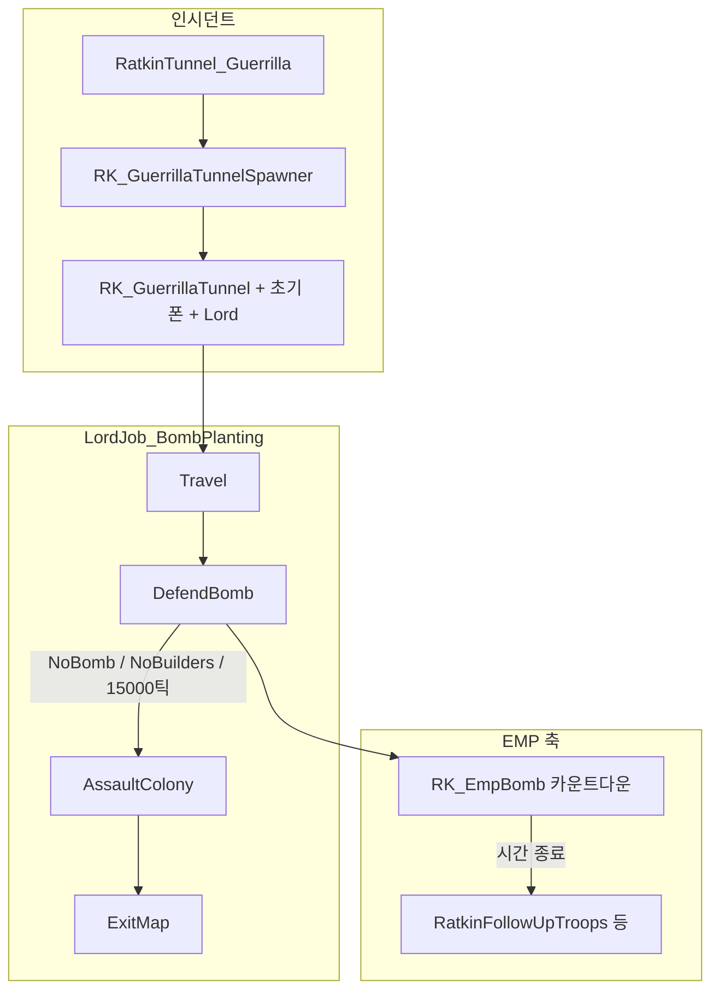

<!--
TAGS: RatkinGuerrilla, RatkinTunnel_Guerrilla, 게릴라습격, 터널침투, 조건, FindPowerPlantNearCell, GameComponent_EMPCheck, IncidentWorker_RatkinGuerrillaTunner, GuerrillaTunnelSpawner, Building_GuerrillaTunnel, LordJob_BombPlanting, LordToil_DefendBomb, RK_EmpBomb, RatkinFollowUpTroops, 이벤트플로우
-->

# 랫킨 게릴라(터널) 습격 — 플로우 전용 보고서

**범위**: 코드·Def 기준 **실행 순서와 분기만** (클래스 상세·밸런스·예외 해설 최소화). 프로젝트 **1.6**.

**구성 앵커**: `IncidentDef` `RatkinTunnel_Guerrilla` → `RK_GuerrillaTunnelSpawner` → `RK_GuerrillaTunnel` → `LordJob_BombPlanting` → `RK_EmpBomb` → (선택) `RatkinFollowUpTroops`.

---

## 0. 액션별 조건 (코드·Def 기준)

플레이 감각과 다를 수 있는 부분은 **코드가 실제로 검사하는 것**만 적음.

### 0.1 `RatkinTunnel_Guerrilla` 인시던트가 **지금 발동 가능**한지 (`CanFireNowSub` + Def)

| 조건 | 출처 |
|------|------|
| `IncidentWorker` 공통 선행 조건 통과 | `base.CanFireNowSub(parms)` |
| 맵이 플레이어 홈 등 `IncidentDef`의 `targetTags`에 맞음 | `Incident_Def.xml` (`Map_PlayerHome`) |
| Rakinia 세력이 존재하고 **플레이어와 적대** | `FirstFactionOfDef(Rakinia).HostileTo(OfPlayer)` |
| 맵에 `RK_GuerrillaTunnel`이 **2개 미만** | `RatkinTunnelUtility.TotalSpawnedTunnelCount` |
| 아래 **0.2 스폰 칸 탐색 성공** | `FindPowerPlantNearCell` |

Def 쪽으로는 같은 파일에 **`minThreatPoints` 400**, **`minRefireDays` 20**, `ThreatBig` 카테고리, `pointsScaleable` 등이 붙어 있어 스토리텔러가 줄 **위협 포인트·재발화 간격**에 영향을 줌(정확한 가중은 바닐라 스토리텔러 쪽과 함께 봐야 함).

### 0.2 지진파 진원지 / 드릴 포드 **생성 위치** (`FindPowerPlantNearCell`)

코드는 **“지금 전력이 흐른다”를 직접 검사하지 않음.** 대신 다음을 만족하는 셀만 후보로 씀.

| 조건 | 설명 |
|------|------|
| 맵의 **모든 `PowerNet`**을 순회 | `map.powerNetManager.AllNetsListForReading` |
| 각 망의 **`CompPowerTrader`**마다, 그 `parent.Position` 기준 **맨해튼 반경 3** 이내에서 셀 탐색 | 발전기·배터리·소비자 등 **트레이더가 달린 건물** 근처 |
| 후보 셀: **`UsesOutdoorTemperature(map)`이 거짓** | 통상적으로 **실내(온도가 실내 규칙을 씀)** 로 잡히는 칸 |
| 후보 셀: **`Standable(map)` 참** | 폰이 설 수 있음 |
| 위 후보가 **1개 이상**이면 그중 무작위 1칸 반환 | 없으면 인시던트 실패·터널 미생성 |

즉 “전기망에 붙은 건물 근처의 실내·통과 가능 칸”이지, **정격 출력·스위치 On** 같은 것은 이 함수에서 보지 않음.

### 0.3 `RK_GuerrillaTunnelSpawner` → `RK_GuerrillaTunnel` 전환

| 조건 | 설명 |
|------|------|
| 스포너가 스폰된 뒤 **실시간 12~16초** 경과 | `ResultSpawnDelay` → `TicksGame`에 더한 `secondarySpawnTick` 도달 |
| `spawnTunnel == true` (기본 true) | 저장된 값이 false면 터널만 스킵 가능 |

### 0.4 초기 특수부대 스폰 종료 (`SpawnInitialPawns`)

| 조건 | 설명 |
|------|------|
| 스폰된 폰 전투력 합 ≥ **`eventPoint * 0.24`** | `SpawnPawnsUntilPoints` 루프 종료 |
| `TrySpawnPawn` 실패 시 중단 | 남은 포인트로 뽑을 수 있는 `spawnableElitePawnKinds`가 없으면 루프 탈출 |
| `canSpawnPawns == false`면 스폰 안 함 | 기본은 true |

### 0.5 Travel → DefendBomb

| 전이 | 조건 |
|------|------|
| `TravelArrived` | 이동 서브그래프가 터널 목적지 도착 메모 발행 |
| **5000틱** 경과 | 도착 메모 없이도 이 시간이면 DefendBomb로 강제 전이 |

### 0.6 DefendBomb 토일 안

| 액션 | 조건 |
|------|------|
| EMP 스폰 위치 | 거점(터널 칸)에서 **`RandomClosewalkCellNear(..., radius: 5)`** 로 잡힌 맵 셀 |
| 전원 Defend (450틱 미만) | `lord.ticksInToil < 450` 분기에서 전원 `DutyDefOf.Defend` |
| 빌더 1명 배정 (450틱 이상) | `Construction`·`Firefighter` 작업 금지 아님 등 `CanBeBuilder`; 이미 `Build` duty인 폰이 있으면 그대로, 없으면 후보 중 무작위 1명 |
| **`NoBuilders` 메모** | 450틱 이후인데 위 방식으로 **빌더 0명**이면 `ReceiveMemo` |
| **`NoBomb` 주기 검사** | `lord.ticksInToil > 450` 이고, **전역** `TicksGame % 500 == 0`일 때: `EmpBomb`가 파괴됨, 또는 미니파이 분기에서 미니파이 파괴+맵에 폭탄 없음 등 코드에 적힌 복합 조건 |
| **15000틱** | DefendBomb 토일에 너무 오래 머물면 강습으로 전이 |

### 0.7 DefendBomb → AssaultColony

`LordJob_BombPlanting`: 위 **`NoBomb` / `NoBuilders` / 15000틱`** 중 하나가 트리거되면 전이(전이 시 위협 큰 메시지·`WakeAll` 포스트 액션).

### 0.8 AssaultColony → ExitMap

| 조건 | 설명 |
|------|------|
| 식민지 피해 비율 | 전이 생성 시 **0.25~0.35 사이 무작위** 한 값(`FloatRange`)을 `Trigger_FractionColonyDamageTaken`에 사용 |
| 시간 창 | 바닐라 트리거 인자 **1200틱** |

### 0.9 EMP 카운트다운 끝 → 고장·후속 습격·폭발

| 단계 | 조건 |
|------|------|
| 카운트다운 | `RK_EmpBomb`의 `CompProperties_CountDown` **`timeLimit` 50** → 스폰 시 **50초(게임 시간)** 로 틱 환산 후 매 틱 감소 |
| `EmpActivate`의 고장 | **항상** 실행: 각 `PowerNet`에서 `CompBreakdownable` 있는 송전기 중 최대 **`(int)(eventPoint * 0.004f)`**개까지 `DoBreakdown` |
| `DoEmpIncident` (레터·`RatkinFollowUpTroops`·맵 EMP 폭발) | **`operableNextTick < TicksGame`일 때만** 실행. 통과 시 **`operableNextTick = TicksGame + 60000`** 으로 갱신 |
| 60000틱 의미 | 림월드 상수로 **게임 내 1일** 길이와 동일한 틱 수. **“폭탄 터진 뒤 30초 뒤 습격”이 아님** — 폭발 처리와 후속 습격 시도는 **카운트다운이 끝난 그 틱**에 묶여 있고, **짧은 실시간 지연은 없음**. 다만 **이전 EMP 사고 처리로부터 1일이 안 지났으면** 레터·후속 레이드·폭발 블록 전체가 **이번 `DoEmpIncident` 호출에서 스킵**(고장 처리는 그 전에 `EmpActivate`에서 이미 수행). |
| 후속 습격 파라미터 | `parms.faction` Rakinia, **`parms.points *= 0.4f`**, 전략 **`ImmediateAttackSappers`**, 도착 **`EdgeWalkIn`**, 스토리텔러 컴포넌트가 만든 `ThreatBig` 파람 사용 |

---

## 1. 인시던트 발동 ~ 터널·병력 등장

| 순서 | 단계 |
|------|------|
| 1 | 스토리텔러가 `RatkinTunnel_Guerrilla` 실행 → `IncidentWorker_RatkinGuerrillaTunner.TryExecuteWorker` |
| 2 | `CanFireNowSub`: 랫킨(Rakinia)이 플레이어와 적대, 맵에 게릴라 터널 **2개 미만**, 발전 시설 인근 셀 탐색 성공 |
| 3 | 발전 시설 근처에 `RK_GuerrillaTunnelSpawner` 스폰, `eventPoint` = 인시던트 `parms.points` |
| 4 | 표준 레터 발송, 짧게 정상 속도 강제 |
| 5 | 스포너 **12~16초(실시간)** 연출 후 제거 → 동일 칸에 `RK_GuerrillaTunnel` 스폰, `eventPoint` 전달, `SpawnInitialPawns()` |
| 6 | 초기 폰: 전투력 합이 `eventPoint * 0.24`에 도달할 때까지 엘리트 종류로 스폰; 최초 폰부터 `LordJob_BombPlanting(랫킨 세력, 터널 위치, eventPoint)` Lord에 편입(없으면 Lord 생성) |

---

## 2. Lord 상위 플로우 (이동 → 방어 거점 → 강습 → 퇴각)

- **Travel**: `LordJob_Travel` 서브그래프, 목적지는 터널 `Position`.
- **DefendBomb 진입 직후**: `LordToil_DefendBomb.Init`에서 `RK_EmpBomb`를 거점(터널 위치) **주변 5칸 이내**에 스폰, `Comp_Emp.eventPoint` 설정, `GameComponent_EMPCheck.lord`에 현재 Lord 등록.

---

## 3. DefendBomb 단계와 EMP·후속 습격(병렬 축)

**폰 배치(요약)**  
- 토일 진입 직후~**450틱**까지: 전원 `Defend` 거점 방어.  
- **450틱 이후**: 건설 가능 폰 1명을 `Build` 담당으로 두고 나머지 `Defend`; 건설 담당을 줄 수 없으면 **`NoBuilders`** 메모 → 상위 그래프가 **AssaultColony**로 전환.

**폭탄 상태 → 강습 전환**  
- **500틱 주기**(전역 틱 기준 구간)마다 EMP 폭탄이 파괴되었거나(설치 분기 데이터는 있으나 현 스폰 경로는 맵 직접 스폰 중심), 조건상 “폭탄 없음”이면 **`NoBomb`** → **AssaultColony**.

**EMP 카운트다운 종료 시(별 축)**  
- `Comp_CountDown`이 0 이하 → `Comp_Emp.EmpActivate()` → 송전기 `CompBreakdownable` 다수 고장 + `GameComponent_EMPCheck.DoEmpIncident` → (쿨다운 통과 시) 레터, `RatkinFollowUpTroops` 습격 실행(포인트 축소·공성 전략·가장자리 진입), 맵 EMP 폭발 → 폭탄 Thing 제거로 **NoBomb** 경로와 겹칠 수 있음.

---

## 4. 한 장 요약 다이어그램

---

## 5. 참고(플로우 외 한 줄)

`Building_GuerrillaTunnel`은 디스폰·피해·킬 시 맵의 Lord들에게 터널 관련 **메모**를 보내지만, `LordJob_BombPlanting` 그래프에는 그 메모를 소비하는 **Transition이 없음** → 실제 단계 전이는 위 **2~3절** 트리거가 본류.
