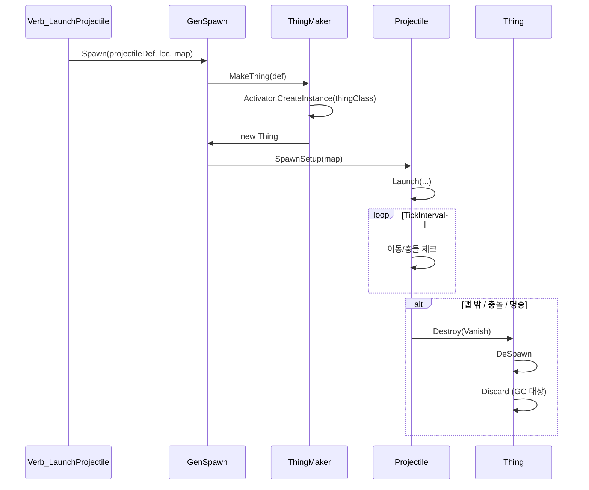

# RimWorld 탄환/투사체 생명주기 및 풀링 분석 보고서

<!-- Projectile Ammunition Lifecycle Pool Spawn Destroy RimWorld 탄환 관리 -->

## 요약

| 항목 | 결론 |
|------|------|
| **탄환 관리 방식** | **생성·삭제 방식** (매번 새로 생성, 사용 후 완전 제거) |
| **풀링 사용 여부** | **미사용** — Projectile/Thing에 대한 Object Pool 없음 |
| **생성 경로** | `ThingMaker.MakeThing` → `Activator.CreateInstance` |
| **삭제 방식** | `Destroy(DestroyMode.Vanish)` → `DeSpawn` → `Discard` |

---

## 1. 생성 흐름

### 1.1 발사 시점

```
Verb_LaunchProjectile.WarmupComplete()
  → GenSpawn.Spawn(projectile, shootLine.Source, map, WipeMode.Vanish)
```

```133:134:RimworldSource/Verse/Verb_LaunchProjectile.cs
Projectile projectile2 = (Projectile)GenSpawn.Spawn(projectile, shootLine.Source, this.caster.Map, WipeMode.Vanish);
```

### 1.2 GenSpawn.Spawn 내부

- `ThingDef`만 전달 시: `ThingMaker.MakeThing(def, null)` 호출 후 `Spawn` 진행
- `Thing` 인스턴스 전달 시: 해당 인스턴스를 그대로 맵에 배치

### 1.3 ThingMaker.MakeThing — 매번 새 인스턴스 생성

```41:46:RimworldSource/Verse/ThingMaker.cs
Thing thing = (Thing)Activator.CreateInstance(def.thingClass);
thing.def = def;
thing.SetStuffDirect(stuff);
thing.PostMake();
thing.PostPostMake();
return thing;
```

- `Activator.CreateInstance`로 **매번 새 객체** 생성
- 풀에서 꺼내는 로직 없음

---

## 2. 삭제 흐름

### 2.1 Projectile 제거 시점

| 상황 | 호출 위치 |
|------|-----------|
| 맵 밖으로 나감 | `Projectile.TickInterval` |
| 지면/벽 등에 충돌 | `Projectile.ImpactSomething` |
| 목표물에 명중 | `Projectile.Impact` |
| 방패에 막힘 | `Projectile.Impact(null, true)` |

### 2.2 Projectile.Impact — 공통 종료 처리

```650:656:RimworldSource/Verse/Projectile.cs
protected virtual void Impact(Thing hitThing, bool blockedByShield = false)
{
	GenClamor.DoClamor(this, 12f, ClamorDefOf.Impact);
	if (!blockedByShield && this.def.projectile.landedEffecter != null)
	{
		this.def.projectile.landedEffecter.Spawn(base.Position, base.Map, 1f).Cleanup();
	}
	this.Destroy(DestroyMode.Vanish);
}
```

### 2.3 Thing.Destroy — 풀 반환 없음

```1183:1213:RimworldSource/Verse/Thing.cs
public virtual void Destroy(DestroyMode mode = DestroyMode.Vanish)
{
	// ... 검증 ...
	if (this.Spawned)
	{
		this.DeSpawn(mode);
	}
	this.mapIndexOrState = -2;  // Destroyed 상태
	if (this.def.DiscardOnDestroyed)
	{
		this.Discard(false);  // 참조 해제 → GC 대상
	}
	// ... leavings, 예약 해제 등 ...
}
```

- `DeSpawn`으로 맵에서 제거
- `DiscardOnDestroyed == true`(Projectile 포함 대부분 Thing) → `Discard` 호출
- `Discard`는 참조를 끊어 GC가 수거할 수 있게 하는 용도이며, **풀에 반환하는 동작은 없음**

---

## 3. 풀링 사용 여부 검증

### 3.1 검색 결과

- `ProjectilePool`, `ThingPool`, `GenericPool`(Thing/Projectile용): **없음**
- `ObjectPool`(Thing/Projectile용): **없음**

### 3.2 RimWorld에서 풀링하는 대상

| 대상 | 용도 |
|------|------|
| `MaterialPool` | Material 재사용 |
| `MeshPool` | Mesh 재사용 |
| `WorldPathPool` | 월드 경로 |
| `PathPool` / `ReleaseToPool` | Pawn 경로 |
| `PortraitsCache.renderTexturesPool` | 렌더 텍스처 |
| `JobDriver.Toil` | `ReturnToPool` |

→ **Thing/Projectile 계열은 풀링 대상이 아님**

---

## 4. 생명주기 다이어그램



---

## 5. 결론 및 시사점

### 5.1 현재 방식

- **생성**: 발사마다 `Activator.CreateInstance`로 새 Projectile 생성
- **삭제**: `Destroy` → `DeSpawn` → `Discard`로 완전 제거
- **풀링**: 사용하지 않음

### 5.2 성능 관점

- 발사 빈도가 높은 전투에서 Projectile 생성/GC 부담이 있을 수 있음
- 풀 도입 시 메모리 할당·해제를 줄일 수 있으나, Projectile 상태 초기화·동기화 복잡도가 증가함

### 5.3 모드 개발 시 참고

- Projectile을 상속한 커스텀 투사체도 동일한 생명주기를 따름
- 풀링을 도입하려면 `Verb_LaunchProjectile`/`GenSpawn`/`ThingMaker` 경로를 우회하는 별도 구현이 필요함

---

*분석 기준: RimworldSource (Verse, RimWorld 네임스페이스)*
