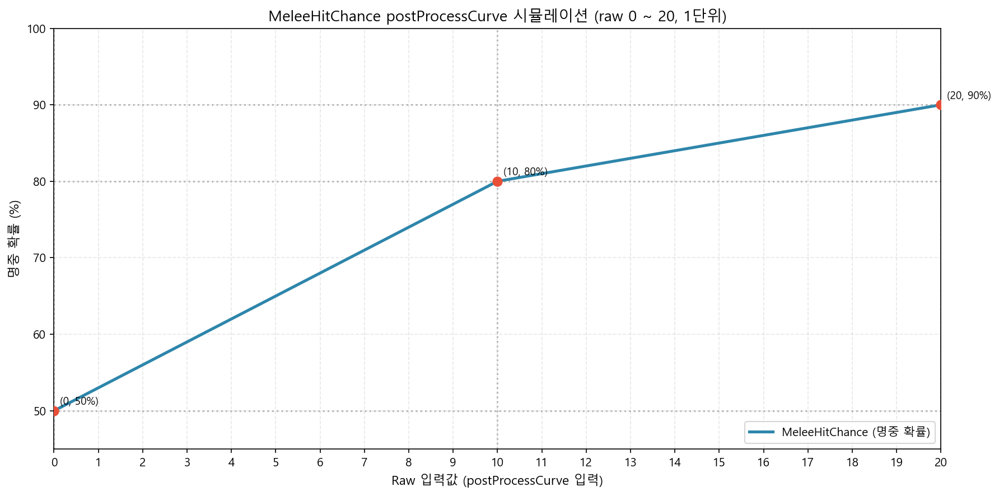
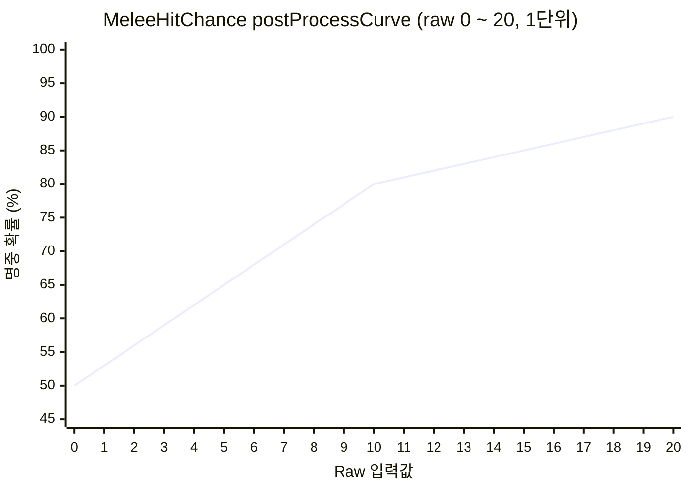
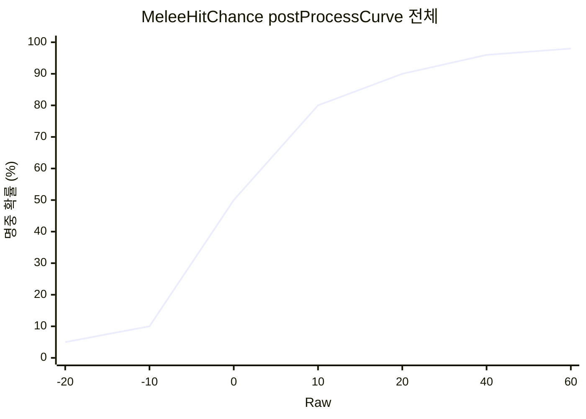

# MeleeHitChance postProcessCurve 시뮬레이션 보고서

> **Tags**: MeleeHitChance postProcessCurve 근접명중 시뮬레이션 SimpleCurve 선형보간 raw 0~25  
> **작성일**: 2026-03-05  
> **분석 대상**: RimWorld Core MeleeHitChance StatDef postProcessCurve (raw 0 ~ 25 구간)

---

## 1. 개요

**MeleeHitChance**(근접 명중 확률)는 raw값이 `postProcessCurve`를 거쳐 최종 확률(0~1)로 변환됩니다.  
본 보고서는 **raw 0부터 20 이상** 구간에 대한 시뮬레이션 결과를 시각화합니다.

### 1.1 postProcessCurve 정의 (Stats_Pawns_Combat.xml)

| Raw 입력 | 출력 확률 |
|----------|-----------|
| -20 | 5% |
| -10 | 10% |
| 0 | 50% |
| 10 | 80% |
| 20 | 90% |
| 40 | 96% |
| 60 | 98% |

커브 포인트 사이는 **선형 보간(linear interpolation)** 적용.

---

## 2. 시뮬레이션 결과 (raw 0 ~ 25)

### 2.1 구간별 기울기

| 구간 | 기울기 | 설명 |
|------|--------|------|
| 0 ~ 10 | +3.0%p/raw | 50% → 80% |
| 10 ~ 20 | +1.0%p/raw | 80% → 90% |
| 20 ~ 40 | +0.3%p/raw | 90% → 96% |
| 40 ~ 60 | +0.1%p/raw | 96% → 98% |

### 2.2 Raw별 명중 확률 테이블

| Raw | 명중 확률 | Raw | 명중 확률 |
|-----|----------|-----|----------|
| 0 | 50.0% | 13 | 83.0% |
| 1 | 53.0% | 14 | 84.0% |
| 2 | 56.0% | 15 | 85.0% |
| 3 | 59.0% | 16 | 86.0% |
| 4 | 62.0% | 17 | 87.0% |
| 5 | 65.0% | 18 | 88.0% |
| 6 | 68.0% | 19 | 89.0% |
| 7 | 71.0% | **20** | **90.0%** |
| 8 | 74.0% | 21 | 90.3% |
| 9 | 77.0% | 22 | 90.6% |
| 10 | 80.0% | 23 | 90.9% |
| 11 | 81.0% | 24 | 91.2% |
| 12 | 82.0% | 25 | 91.5% |

### 2.3 핵심 관찰

- **raw 20**: 90% 확률 도달 (변곡점)
- **raw 20 ~ 25**: 기울기 급감 (raw당 +0.3%p) → 체감 구간
- **raw 25 이후**: 40까지 0.3%p/raw, 40 이후 0.1%p/raw로 더 완만하게

---

## 3. 시각화

### 3.1 시뮬레이션 그래프 (matplotlib)

### 3.2 Mermaid 차트 (raw 0 ~ 20, 1단위)

### 3.3 전체 커브 포인트 비교 (Mermaid)

---

## 4. 게임 내 적용 예시

### 4.1 정상 인간형 기준

- **raw = skillLevel + 24** (Manipulation 100%, Sight 100%)
- Melee Lv0 → raw 24 → **91.2%**
- Melee Lv20 → raw 44 → **96.4%**

### 4.2 Ratkin 랜스 계열 (MeleeHitChance -4)

- raw 24 - 4 = 20 → **90.0%**
- raw 25 - 4 = 21 → **90.3%**

→ raw 20 이하 구간에서는 스킬 레벨 상승에 따른 명중률 증가가 더 큼 (raw당 +1%p).

---

## 5. 결론

| 구간 | 특성 |
|------|------|
| **0 ~ 10** | 가장 가파른 상승 (raw당 +3%p) |
| **10 ~ 20** | 중간 상승 (raw당 +1%p) |
| **20 ~ 25** | 체감 시작 (raw당 +0.3%p) |
| **25 이상** | 점점 완만해짐 |

**raw 20**이 변곡점으로, 이 이후부터는 명중률 상승이 크게 둔화됩니다.

---

## 부록: 시뮬레이션 스크립트

- **경로**: `Report/create_melee_hitchance_curve_chart.py`
- **실행**: `python create_melee_hitchance_curve_chart.py`
- **출력**: `Report/MeleeHitChance_postProcessCurve_Simulation.png`
