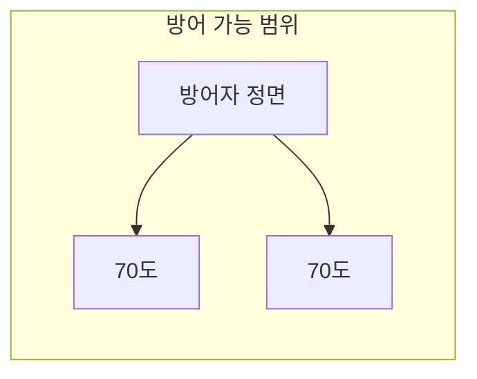

# 1.5 기준 랫킨 방패 도탄 로직 분석 보고서

> **태그**: Ratkin Shield Deflection Block CheckPreAbsorbDamage 1.5 WoodenShield HeavyShield 도탄 방어  
> **작성일**: 2026-03-20  
> **목적**: 1.5 버전 랫킨 방패의 공격 도탄(튕겨내기) 메커니즘 상세 분석

---

## 1. 개요

1.5 버전 랫킨 방패는 `Apparel.CheckPreAbsorbDamage()`를 오버라이드하여 **정면 공격을 확률적으로 튕겨내는** 도탄 시스템을 구현합니다. RK_WoodenShield, RK_HeavyShield, RK_HeavyShield_Big 세 종류 모두 동일한 `NewRatkin.Shield` 클래스를 사용합니다.

---

## 2. 호출 흐름

```
피해 발생 (근접/원거리)
  → Pawn_HealthTracker.ApplyDamageToPart()
  → wornApparel[i].CheckPreAbsorbDamage(dinfo)  // 착용 중인 의류 순회
  → Shield.CheckPreAbsorbDamage()  // true 반환 시 데미지 완전 차단
```

- **호출 위치**: `RimworldSource/Verse/Pawn_HealthTracker.cs` 323~336행
- **동작**: `true` 반환 시 해당 데미지는 **완전히 흡수**되며, Pawn에게 적용되지 않음

---

## 3. 도탄 판정 조건

### 3.1 기본 전제 조건

| 조건 | 설명 |
|------|------|
| `!pawn.Dead` | 착용자가 살아 있음 |
| `!pawn.Downed` | 기절/쓰러짐 상태 아님 |

위 조건을 만족하지 않으면 도탄 로직 자체가 실행되지 않습니다.

### 3.2 방향(각도) 조건

**공격 방향이 착용자가 바라보는 방향 기준 ±70도 이내**일 때만 도탄 시도가 가능합니다.

#### 각도 계산

```csharp
// 공격자 방향 (데미지가 들어오는 방향의 반대 = 공격자가 있는 방향)
attackerAngle = dinfo.Angle + 180;
if (attackerAngle >= 360) attackerAngle -= 360;

// 방어자가 바라보는 방향 (0/90/180/270 중 하나)
defenderAngle = pawn.Rotation.AsAngle;
```

- **`dinfo.Angle`**: 데미지가 **진행하는 방향**의 각도 (0~360도)
- **`attackerAngle`**: 공격자가 있는 방향 (반대편)
- **`defenderAngle`**: Pawn의 `Rot4`에 따른 각도
  - North(0): 0°
  - East(1): 90°
  - South(2): 180°
  - West(3): 270°

#### 방어 가능 범위

```
defenderAngle - attackerAngle >= -70  AND  defenderAngle - attackerAngle <= 70
```

즉, **총 140도(±70도)** 범위 내의 공격만 도탄 대상입니다.



- **범위 밖**: 측면/후면 공격 → 도탄 시도 없음, 데미지 그대로 적용
- **범위 내**: 정면 공격 → 도탄 확률 계산 후 랜덤 판정

---

## 4. 도탄 확률 계산

### 4.1 공식

```
totalDeflectChance = blockRateBySkill + clampedBlockRateFromStuff
```

두 요소가 **가산**됩니다.

### 4.2 스킬 기반 확률 (blockRateBySkill)

```csharp
private const float BLOCK_RATE_FACTOR_BY_SKILL = 0.02f;

blockRateBySkill = MeleeSkillLevel × 0.02
```

| 근접 스킬 레벨 | 스킬 기반 도탄 확률 |
|----------------|---------------------|
| 0 | 0% |
| 5 | 10% |
| 10 | 20% |
| 15 | 30% |
| 20 | 40% |

### 4.3 소재 기반 확률 (clampedBlockRateFromStuff)

```csharp
// 공격 타입별 방어력 확인
Sharp  → ArmorRating_Sharp
Blunt  → ArmorRating_Blunt
Heat   → ArmorRating_Heat

// 소재 방어력 → 도탄 확률 변환 (최대 50% 제한)
clampedBlockRateFromStuff = GetDeflectChanceByArmorRate(armorBlockRateByStuff)
GetDeflectChanceByArmorRate(armorRate) = Mathf.Clamp01(armorRate / 2) / 2
```

- **목적**: 괴물 소재로 인한 과도한 방어력 제한
- **최대값**: 50% (armorRate 200% 이상일 때)
- **예시**:
  - ArmorRating 0.2 → 0.2/2=0.1 → Clamp01=0.1 → 0.2/2 = **10%**
  - ArmorRating 0.5 → 0.5/2=0.25 → 0.25/2 = **12.5%**
  - ArmorRating 1.0 → 1.0/2=0.5 → 0.5/2 = **25%**
  - ArmorRating 2.0 → 2.0/2=1.0 → 1.0/2 = **50%** (상한)

### 4.4 최종 판정

```csharp
if (Rand.Value <= totalDeflectChance)
{
    // 도탄 성공
    MoteMaker.ThrowText(...);           // "ShieldBlock" 텍스트
    EffecterDefOf.Deflect_Metal.Spawn().Trigger(...);  // 이펙트
    return true;  // 데미지 차단
}
return false;  // 데미지 적용
```

---

## 5. DamageInfo.Angle의 의미

### 5.1 설정 방식

- **근접 공격**: `Verb_MeleeAttackDamage`에서 `direction = (target.Position - caster.Position).ToVector3()`로 계산 후 `SetAngle(direction)` 호출
- **원거리 공격**: 발사체가 목표에 도달할 때의 진행 방향으로 설정됨

### 5.2 각도 해석

- `dinfo.Angle`: **데미지가 들어오는 방향** (진행 방향)
- `dinfo.Angle + 180`: **공격자가 있는 방향** (반대편)
- 방패는 "착용자가 바라보는 방향"과 "공격자가 있는 방향"의 차이로 정면 여부를 판단합니다.

---

## 6. 적용 대상 방패 (1.5 Def)

| DefName | thingClass | 설명 |
|---------|------------|------|
| RK_WoodenShield | NewRatkin.Shield | 목재 방패 |
| RK_HeavyShield | NewRatkin.Shield | 철제 방패 |
| RK_HeavyShield_Big | NewRatkin.Shield | 대형 철제 방패 |

모두 동일한 `Shield` 클래스와 `CheckPreAbsorbDamage` 로직을 사용합니다. 소재(Stuff)에 따라 `ArmorRating_Sharp/Blunt/Heat`가 달라져 도탄 확률만 차이가 납니다.

---

## 7. ShieldPatch (별도 기능)

`ShieldPatch.cs`는 **도탄 로직과는 별개**입니다.

- **대상**: `ThingDef.IsShieldThatBlocksRanged` Getter
- **역할**: `CompRKShield`를 가진 방패를 원거리 무기 차단 방패로 인식
- **도탄**: `CheckPreAbsorbDamage`에서 처리되며, ShieldPatch는 이와 무관

---

## 8. 1.5 vs 1.6 차이점 (참고)

| 항목 | 1.5 | 1.6 |
|------|-----|-----|
| AllowVerbCast | `!(verb is Verb_LaunchProjectile)` → 원거리 발사 차단 | `return true` → 원거리 발사 허용 |
| 방패 종류 | WoodenShield, HeavyShield, HeavyShield_Big | 1.6에는 RK_TowerShield_Second 등 추가 |
| 도탄 로직 | 동일한 ±70도, 스킬+소재 기반 | 1.6 ApparelShield도 동일 구조 유지 |

---

## 9. 도탄 확률 계산 예시

**예시**: RK_HeavyShield (철제), Steel 소재, 10레벨 근접 스킬, Sharp 공격

- 스킬: 10 × 0.02 = **20%**
- 소재: Steel 기준 ArmorRating_Sharp 가정 0.3 → Clamp01(0.15)/2 = **7.5%**
- **합계**: 27.5% 도탄 확률

**예시**: RK_WoodenShield (목재), 15레벨 근접, Blunt 공격

- 스킬: 15 × 0.02 = **30%**
- 소재: Wood 기준 ArmorRating_Blunt 낮음 → 소재 기여도 낮음
- **합계**: 30% + α

---

## 10. 요약

| 구분 | 내용 |
|------|------|
| **트리거** | Pawn이 피해를 받을 때 `CheckPreAbsorbDamage` 호출 |
| **방향 조건** | 바라보는 방향 기준 ±70도 이내 (총 140도) |
| **상태 조건** | 살아있고, 기절/쓰러짐 아님 |
| **확률 계산** | 근접 스킬(레벨×2%) + 소재 방어력(최대 50%) |
| **성공 시** | 데미지 완전 차단, "ShieldBlock" 모트, Deflect_Metal 이펙트 |

---

## 11. 참조 파일

| 파일 | 역할 |
|------|------|
| `Project/1.5/Source/ShieldOfRatkinia/WoodenShield.cs` | Shield 클래스, CheckPreAbsorbDamage 구현 |
| `Project/1.5/Source/ShieldOfRatkinia/ShieldPatch.cs` | IsShieldThatBlocksRanged 패치 |
| `RimworldSource/Verse/Pawn_HealthTracker.cs` | CheckPreAbsorbDamage 호출부 |
| `RimworldSource/Verse/DamageInfo.cs` | Angle 구조 |
| `RimworldSource/Verse/Rot4.cs` | AsAngle (0/90/180/270) |
| `Project/1.5/Defs/ThingsDefs/RK_Apparel.xml` | RK_WoodenShield, RK_HeavyShield, RK_HeavyShield_Big Def |
