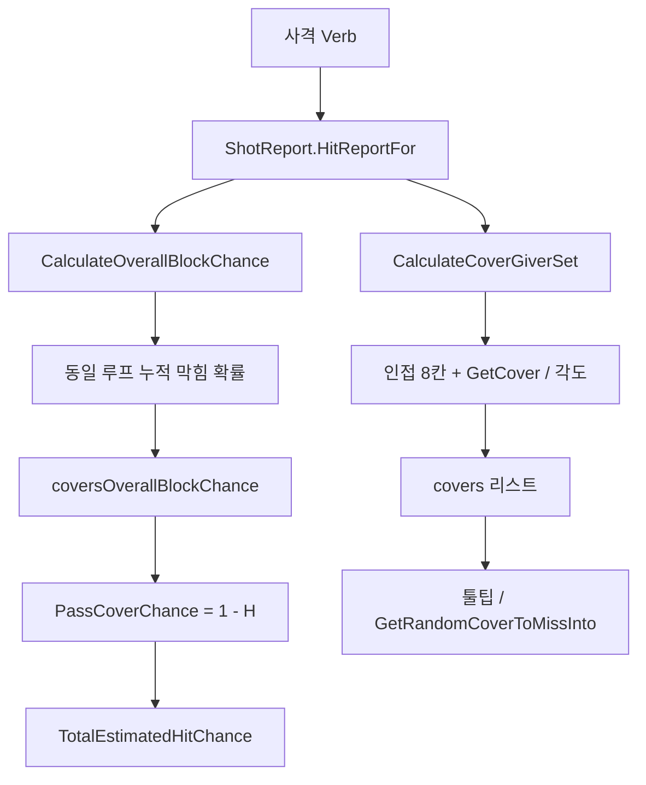

# 림월드 엄폐(Cover) 시스템 및 방패병 인접 엄폐 부여 검토 보고서

> **태그**: Cover CoverUtility ShotReport coverGrid PassCoverChance TryFindAdjustedCoverInCell GetCover GenAdj AdjacentCells CanBenefitFromCover Fillage fillPercent 방패 Shield TowerShield Harmony Verb_LaunchProjectile GetRandomCoverToMissInto Pawn Rotation 엄폐물 기둥 Ratkin  
> **목적**: 원거리 피격 시 엄폐 계산·`coverGrid` 갱신 방식을 소스 기준으로 정리하고, **방패 든 폰이 아군에게만 인접 엄폐 혜택을 주는** 기능을 넣을 때의 구현 후보와 주의점을 기록한다.  
> **분석 대상**: `RimworldSource` — `CoverUtility.cs`, `CoverGrid.cs`, `ShotReport.cs`, `Verb_LaunchProjectile.cs`, `ThingDef.CanBenefitFromCover`, `Thing` 스폰·`coverGrid` 연동

---

## 1. 원거리 사격에서 엄폐가 쓰이는 위치

| 단계 | 설명 |
|------|------|
| `ShotReport.HitReportFor(caster, verb, target)` | 타깃까지 거리, 조준 확률, **`CoverUtility.CalculateCoverGiverSet` / `CalculateOverallBlockChance`** 호출 |
| `PassCoverChance` | `1f - coversOverallBlockChance` — 엄폐에 **막히지 않을** 확률 |
| `TotalEstimatedHitChance` | `AimOnTargetChance * PassCoverChance` (클램프) |

엄폐는 **명중률(조준)** 과는 별도 계수로 곱해진다.

---

## 2. 피격자 기준: 주변 8칸 + 사수 방향

### 2.1 후보 칸

- 기준은 **`target.Cell`** (피격 Thing이 차지하는 타깃 칸).
- 인접 **`GenAdj.AdjacentCells` 8방향**만 검사한다. 사격선을 따라 모든 칸을 훑는 방식이 **아니다**.

### 2.2 `CanBenefitFromCover`

- `ThingDef.CanBenefitFromCover`: **폰** 또는 **포탑 건물**일 때만 true (`ThingDef.cs`).
- false면 엄폐 목록·전체 막힘 확률이 0으로 유지된다.

### 2.3 인접 칸에서 엄폐물 가져오기

- 각 인접 칸 `adjCell`에 대해 `adjCell.GetCover(map)` → **`map.coverGrid[adjCell]`** 한 칸에 저장된 Thing.
- `TryFindAdjustedCoverInCell`에서:
  - 사수 위치·타깃·인접 칸의 **방위각 차이**로 막힘 확률을 조정(대각 인접은 각도에 1.75배 패널티 등).
  - 각도가 너무 벌어지면(코드상 **65° 이상**) 그 인접 칸 엄폐는 **무효**.
  - 사수와 인접 칸(엄폐물 칸) 사이 **거리**에 따라 추가 감쇠.

### 2.4 여러 엄폐가 겹칠 때

`CalculateOverallBlockChance`:

- 누적식: `num += (1f - num) * coverInfo.BlockChance` — 독립 합이 아니라 **겹쳐 막힐 확률**에 가깝게 합성.

---

## 3. `coverGrid`에 무엇이 올라가는지

### 3.1 셀당 하나

`CoverGrid.RecalculateCell`:

- 해당 칸의 `thingGrid.ThingsListAtFast(c)`를 돌며, **파괴되지 않았고 스폰된 Thing** 중 **`fillPercent`가 가장 큰 Thing 하나**를 그 칸의 엄폐로 저장한다.
- **지형 타일 자체**는 `thingGrid` Thing이 아니므로, 이 루프만으로는 **바닥 지형만**으로 엄폐가 잡히지 않는다. 엄폐는 **그 칸에 있는 Thing**(벽, 모래주머니, 식물, 바위 등) 기준이다.

### 3.2 언제 재계산되나

- `Thing` 스폰·디스폰·**위치 변경** 시 `coverGrid.Register` / `DeRegister` 호출.
- 단, **`t.def.Fillage == FillCategory.None`이면 즉시 return** — 재계산을 **트리거하지 않는다**.
- `Fillage != None`인 Thing이 자신의 `OccupiedRect` 안 **각 칸**에 대해 `RecalculateCell`을 호출한다.

### 3.3 폰과 `coverGrid`

- 폰은 보통 `Fillage == None`이라, **스폰만으로는** 이 경로에서 엄폐 그리드가 갱신되지 않는다.
- 같은 칸에 다른 Thing이 바뀔 때 `RecalculateCell`이 돌면, 그 칸에 폰이 있고 `fillPercent`가 경쟁에서 이기면 이론상 올라갈 수 있으나, **의도한 “방패 = 엄폐” 제어**에는 부적합하다.

---

## 4. 방패병이 아군에게만 인접 엄폐를 주는 설계 (제안)

### 4.1 요구사항 정리

| 항목 | 내용 |
|------|------|
| 효과 | 피격 **타깃**이 방패병과 **인접**할 때, 방패병이 **기둥·엄폐물과 유사한** 막힘 확률 기여 |
| 제외 | 방패병 **본인**이 피격자일 때는, “이 인접 방패 보너스”로 **스스로에게** 유리해지지 않게 할 것(아래 4.3) |
| 이동 | 스폰 고정이 아니라 **움직여도** 매 샷마다 재계산 가능해야 함 |

### 4.2 `coverGrid`에 올리는 방식은 비추천

- 이동 폰을 가짜 건물/Thing으로 박아 넣으면 **동기화·다른 Thing과의 fillPercent 경쟁·스폰 수명** 관리 부담이 큼.
- 바닐라 엄폐는 이미 **8칸 + 각도**로 정의되어 있으므로, **같은 공간에 별도 그리드 등록**보다 **엄폐 계산 단계 개입**이 맞다.

### 4.3 권장: Harmony로 `CoverUtility` 보강

**후킹 대상(둘 다 일치시킬 것):**

1. `CalculateCoverGiverSet` — 툴팁·`GetRandomCoverToMissInto` 가중치용 리스트
2. `CalculateOverallBlockChance` — 실제 `PassCoverChance`에 쓰이는 `coversOverallBlockChance`

바닐라는 두 함수가 **별도로** 비슷한 루프를 돌므로, **한쪽만 패치하면** UI/표시와 실제 확률이 어긋난다.

**Postfix 예시 로직(개념):**

- 기존 계산 후, 타깃 `target.Cell` 주변 8칸을 다시 순회(또는 바닐라와 동일 루프에 합류).
- 인접 칸에 **아군 방패병 폰**이 있고, **방패/방위 조건**(예: `Rotation`이 사수 쪽을 향함, 또는 `TryFindAdjustedCoverInCell`과 동일한 각도 규칙)을 만족하면:
  - `CoverInfo(방패병 Thing, blockChance)` 추가
  - `CalculateOverallBlockChance` 쪽 누적에도 **동일한** `blockChance`를 `num += (1f - num) * blockChance` 형태로 반영

**“본인은 혜택 없음”:**

- 인접 엄폐는 **피격자 중심 8칸**만 보므로, 피격자가 방패병일 때 **자기 칸은 인접 8칸에 포함되지 않는다**.  
- 따라서 **“인접에 있는 방패병만 보너스”** 모델이면, 방패병이 **자기 방패로 이 보너스를 받는 경우는 구조상 없다.**
- 향후 “방패가 앞 칸까지 가상 확장” 같은 규칙을 넣으면, 그때는 `target == 방패병` 분기로 보너스를 제외해야 한다.

**방패 판별:**

- 모드별로 `weaponTags`, `ThingDef`, `Comp` 등 **프로젝트 단일 규칙**으로 “방패 장비”를 정의하는 것이 유지보수에 유리하다.

**방향 고정 커맨드:**

- 별도 `coverGrid` 등록/해제 없이, **Job/Comp로 회전만 고정**하면 매 발사의 `ShotReport`에서 동일 조건으로 판정 가능 (`Report/Shield_FaceDirection_Command_Analysis.md` 등과 연계 검토).

### 4.4 연쇄 동작: 빗나감 목표

`Verb_LaunchProjectile`은 엄폐에 막힐 때 `shotReport.GetRandomCoverToMissInto()`로 **빗나감** 위치를 고른다. `CoverInfo.Thing`에 방패병을 넣으면 **빗나간 탄이 방패병 쪽으로 기울어질** 수 있어, 연출·밸런스 의도에 맞는지 확인이 필요하다.

---

## 5. 흐름 요약 (mermaid)

---

## 6. 소스 파일 참조

| 파일 | 내용 |
|------|------|
| `Verse/CoverUtility.cs` | 8칸 루프, `TryFindAdjustedCoverInCell`, 전체 막힘 확률 합성 |
| `Verse/CoverGrid.cs` | `Register`/`DeRegister`, `RecalculateCell`, `fillPercent` 최대 Thing |
| `Verse/ShotReport.cs` | `HitReportFor`, `PassCoverChance`, `GetRandomCoverToMissInto` |
| `Verse/GridsUtility.cs` | `GetCover` → `coverGrid[c]` |
| `Verse/Thing.cs` | 스폰·위치 변경 시 `coverGrid.Register`/`DeRegister` |
| `Verse/ThingDef.cs` | `CanBenefitFromCover` |
| `Verse/Verb_LaunchProjectile.cs` | 엄폐 실패 시 투사체 목표·빗나감 처리 |

---

## 7. 관련 Ratkin 보고서

- `Report/Shield_FaceDirection_Command_Analysis.md` — 방패 방향·커맨드
- `Report/130_RK_TowerShield_v2_Armor_Deflection_Formula_Report.md` — 방패 방어/편향 수식
- `Report/128_Ratkin_Shield_Deflection_Logic_1.5_Analysis_Report.md` — 방패 편향 로직

---

*작성: 코드베이스 `RimworldSource` 기준. 게임 버전에 따라 소스 라인·상수는 차이가 있을 수 있음.*
