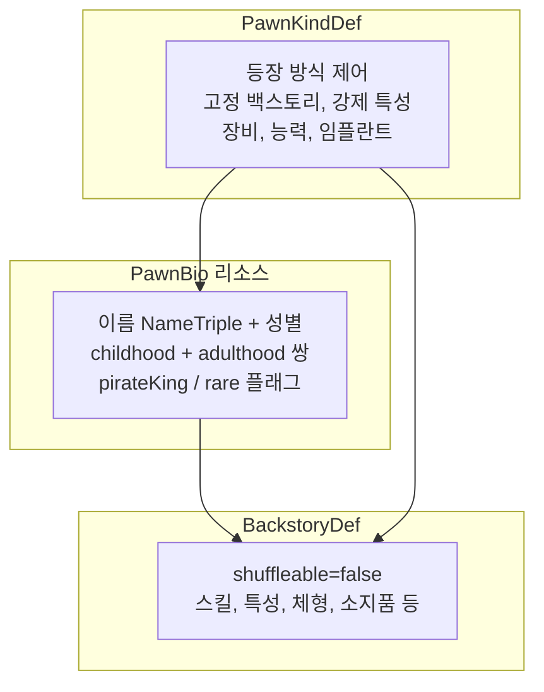
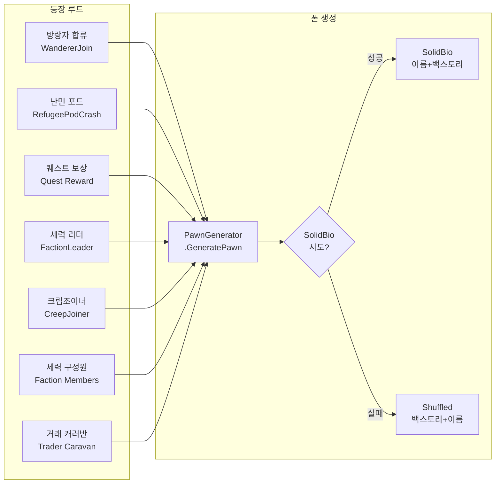

# 유니크 Pawn 시스템 분석 보고서

`Unique Pawn` `Solid Bio` `BackstoryDef` `PawnKindDef` `PawnBio` `Named Character` `Spawn Route` `WorldPawnGC`

---

## 1. 데이터 구성 — 3개 레이어

유니크 Pawn은 단일 Def가 아니라 **3개 레이어의 조합**으로 구성된다.



### 1-1. BackstoryDef

`shuffleable=false`로 설정하면 일반 랜덤 풀에서 제외되어 "고유" 백스토리가 된다.

| 분류 | 필드 | 설명 |
|------|------|------|
| 슬롯 | `slot` | Childhood / Adulthood |
| 직함 | `title`, `titleShort` (+Female 변형) | 표시되는 직함 |
| 서사 | `description` (또는 `baseDesc`) | PAWN_nameDef 등 치환 지원 |
| 스킬 | `skillGains` | `<Intellectual>5</Intellectual>` 형태 |
| 작업 제한 | `workDisables` | Violent, Social 등 태그 |
| 작업 필수 | `requiredWorkTags` | 반드시 가능해야 하는 작업 |
| 체형 | `bodyTypeGlobal` / `bodyTypeMale` / `bodyTypeFemale` | 체형 고정 |
| 강제 특성 | `forcedTraits` | 특성 + degree |
| 금지 특성 | `disallowedTraits` | 이 특성은 부여 안 됨 |
| 소지품 | `possessions` | ThingDef + 수량, MayRequire 지원 |
| 출현 분류 | `spawnCategories` | Pirate, Offworld, Tribal 등 |
| 이름 규칙 | `nameMaker` | RulePackDef 참조 |
| 셔플 여부 | `shuffleable` | false면 고유 백스토리 |

**BackstoryDef에 없는 것**: 이름 고정, 성별 고정, 장비 강제, 능력(Ability) → 다른 레이어에서 처리

### 1-2. PawnBio (솔리드 바이오)

`Resources/Backstories/Solid` 리소스에 정의. Def XML이 아닌 별도 XML 리소스.

| 필드 | 설명 |
|------|------|
| `Name` (First/Nick/Last) | 고정 이름 (NameTriple) |
| `Gender` | Male / Female / Either |
| `Childhood` / `Adulthood` | BackstoryDef defName 참조 |
| `PirateKing` | true → 팩션 리더 전용 |
| `Rare` | true → 뽑혀도 추가 50% 확률로 거부 (등장 확률 절반) |

### 1-3. PawnKindDef

등장 방식, 장비, 능력 등 "어떤 폰을 어떻게 생성할지" 제어.

| 분류 | 필드 | 설명 |
|------|------|------|
| 백스토리 | `fixedChildBackstories` / `fixedAdultBackstories` | 백스토리 고정 (리스트→랜덤1) |
| 백스토리 필터 | `backstoryFiltersOverride` / `backstoryFilters` | 카테고리 필터 |
| 특성 | `forcedTraits` / `disallowedTraits` | 강제/금지 특성 |
| 성별 | `fixedGender` | 성별 고정 |
| 능력 | `abilities` | AbilityDef 목록 |
| 외모 | `forcedHair` / `forcedHairColor` / `skinColorOverride` | 외모 고정 |
| 의상 | `apparelRequired` | 필수 의상 ThingDef 목록 |
| 의상 상세 | `specificApparelRequirements` | 부위별 태그/색상 조건 |
| 임플란트 | `techHediffsRequired` | 필수 바이오닉/임플란트 |
| 무기 | `weaponMoney` / `weaponTags` | 무기 범위·태그 |
| 이름 | `nameMaker` / `nameMakerFemale` | 이름 생성 규칙 |
| 역할 | `factionLeader` | 세력 지도자 여부 |
| 제노타입 | `xenotypeSet` | Biotech 제노타입 |
| 헤딤프 | `startingHediffs` | 시작 시 부여 |
| 인벤토리 | `inventoryOptions` / `fixedInventory` | 소지품 (확률/고정) |

---

## 2. DLC별 유니크 Pawn 실사용 예시

| DLC | 예시 | 사용 필드 |
|-----|------|-----------|
| **Royalty** | Stellarch (세력 수장) | `factionLeader`, `titleRequired`, `specificApparelRequirements` |
| **Royalty** | Bestower | `techHediffsRequired`, `specificApparelRequirements` (BestowerHood) |
| **Biotech** | Mechanitor | `apparelRequired`, `techHediffsRequired` (Mechlink), `forcedTraits` |
| **Anomaly** | CreepJoiner | `fixedChildBackstories`, `fixedAdultBackstories`, `fixedInventory`, `forcedTraits` |
| **Anomaly** | Nociosphere | `abilities` (EntitySkip, Heatspikes 등), `preventIdeo` |
| **Odyssey** | CrewMember | `specificApparelRequirements` (Vacsuit 태그) |

---

## 3. 등장 경로



### 경로별 SolidBio 확률

| 경로 | SolidBio 확률 | 비고 |
|------|---------------|------|
| 세력 리더 | **100% 시도** | pirateKing 바이오만 대상. 없으면 셔플 폴백 |
| 일반 생성 (세력원, 방랑자, 난민 등) | **25%** | rare 바이오는 추가 50% 거부 |
| CreepJoiner | **0%** | OnlyUseForcedBackstories로 스킵, 고정 백스토리 사용 |
| fixedBackstories 있는 PawnKind | 셔플 경로이나 **고정** | 리스트에서 랜덤 1개 |

### SolidBio 선택 과정

1. SolidBio 풀에서 **무작위 20개** 샘플링
2. `BackstoryCategoryFilter` 매칭, 성별, 작업태그 호환성 검사
3. `UsedThisGame` 체크 — 이미 사용된 이름/바이오 제외
4. 가중치 적용: 작업 제한이 많을수록 낮은 가중치
5. `rare=true`인 바이오는 뽑힌 후에도 50% 확률로 거부

---

## 4. 사망 후 재등장 가능성

### 결론: 동일 게임 내 재등장은 사실상 불가

| 단계 | 동작 |
|------|------|
| 사망 직후 | 폰이 `WorldPawns.AllPawnsDead`에 등록 |
| 이름 체크 | `Name.UsedThisGame` → 사망 목록 포함하여 검사 |
| SolidBio 선택 | `bio.name.UsedThisGame`이면 **무조건 제외** |
| WorldPawnGC | 주기적으로 "불필요한" 월드 폰 제거 |

**WorldPawnGC 보존 사유** (이 중 하나라도 해당하면 폰 유지):
- 식민지원 경험이 있는 휴먼라이크
- 세력 리더, 납치된 폰, 캐러반 멤버
- 퀘스트 예약, 시체 존재
- 전투/플레이 로그에 남음, 관계 보유

**재등장 시나리오:**
- GC로 **완전히 제거**된 경우에만 이론적으로 같은 SolidBio 이름+백스토리가 다시 뽑힐 수 있음
- 이것은 같은 캐릭터의 "부활"이 아니라 **새 인스턴스** 생성
- 식민지원 경험이 있으면 GC에서 보존되므로 실질적으로 재등장 없음

---

## 5. 랫킨 현황

| 항목 | 현재 상태 |
|------|-----------|
| Solid 백스토리 | 미사용 (AlienBackstoryDef로 자체 운용) |
| PawnBio 리소스 | 미사용 |
| 고정 이름 | 미사용 (종족 nameGenerator 의존) |
| forcedTraits | 백스토리의 `forcedTraitsChance`로 확률 기반 사용 |
| 고정 백스토리 (PawnKindDef) | `fixedChildBackstories`/`fixedAdultBackstories` 미사용 |
| abilities | AbilityDef 존재 (예배, 란스 돌진 등), C#에서 부여 |
| PawnKindDef | 세력 리더/트레이더/순례자 등 역할별 정의 있음 |
| 유니크 네임드 캐릭터 | **없음** |

---

## 6. 유니크 랫킨 구현 시 필요 구성 요약

유니크 캐릭터 1명을 만들려면 아래 조합:

```
BackstoryDef (shuffleable=false)  ← 고유 서사, 스킬, 특성, 체형
  + PawnKindDef                    ← 고정 백스토리, 장비, 능력, 외모
  + (선택) PawnBio 리소스           ← 고정 이름+성별 묶음
```

| 요소 | 어디서 설정 | 필수 여부 |
|------|-------------|-----------|
| 고유 배경 서사 | BackstoryDef | 권장 |
| 스킬 보정 | BackstoryDef.skillGains | 선택 |
| 강제 특성 | BackstoryDef.forcedTraits 또는 PawnKindDef.forcedTraits | 선택 |
| 체형 | BackstoryDef.bodyType* | 선택 |
| 소지품 | BackstoryDef.possessions | 선택 |
| 고정 이름 | PawnBio (리소스) 또는 PawnKindDef.nameMaker | 권장 |
| 성별 고정 | PawnBio.gender 또는 PawnKindDef.fixedGender | 선택 |
| 고정 의상 | PawnKindDef.apparelRequired / specificApparelRequirements | 선택 |
| 고정 임플란트 | PawnKindDef.techHediffsRequired | 선택 |
| 능력 | PawnKindDef.abilities | 선택 |
| 외모 | PawnKindDef.forcedHair / forcedHairColor / skinColorOverride | 선택 |
| 등장 빈도 | PawnBio.rare / spawnCategories / 전용 PawnKindDef | 설계에 따라 |
